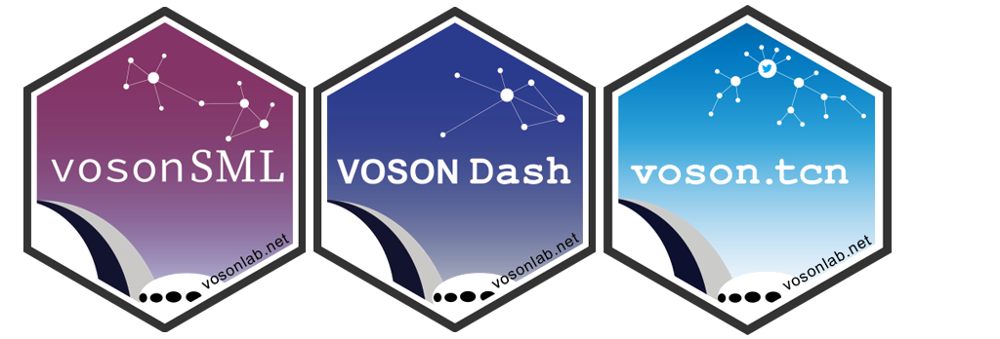

Welcome to the [VOSON Lab](http://vosonlab.net/) Code Blog! We have created this space to share methods, tips, examples and code. It's also a place where we will demonstrate constructing and analyzing networks from various API and other online data sources. 

Most of our posts will cover techniques around the tools we have developed at the Lab: `vosonSML`, `VOSONDash` and `voson.tcn`, which are available on both [CRAN](https://cran.r-project.org/package=vosonSML) and [GitHub](https://github.com/vosonlab). But we also plan to use this space to cover other complementary R packages and open-source software, such as fantastic R packages within the [`tidyverse`](https://www.tidyverse.org/), RStudio's [`shiny`](https://www.rstudio.com/products/shiny/) for web apps, and visualization tools such as [`igraph`](https://igraph.org/r/) and [`Gephi`](https://gephi.org/).

### VOSON Lab Open Source Tools

`vosonSML` is a R package for social media data collection (currently twitter, youtube, and reddit), hyperlink collection and network generation. `VOSONDash` is a `Shiny` app that integrates tools for visualizing and manipulating network graphs, performing network and text analysis, as well as an interface for collecting data with `vosonSML`.

More information on these packages, their development and code can be found on our [`vosonSML`](https://github.com/vosonlab/vosonSML), [`VOSONDash`](https://github.com/vosonlab/VOSONDash) and [`voson.tcn`](https://github.com/vosonlab/voson.tcn) github pages. 

We also have some other guides for using the packages. Check the [vosonSML Vignette](https://vosonlab.github.io/vosonSML/articles/Intro-to-vosonSML.html) and the [VOSON Dash Userguide](https://vosonlab.github.io/VOSONDashDocs/) for some practical examples and feature reference. 

We hope you find this content useful!

The VOSON Lab team.

*Virtual Observatory for the Study of Online Networks [VOSON Lab](http://vosonlab.net/), School of Sociology, The Australian National University.*
