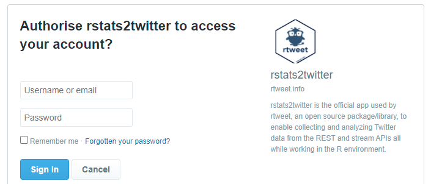

## Introduction

Social media platforms are a rich resource for Social Network data. Twitter is a highly popular public platform for social commentary that, like most social media supporting third-party applications, allow software to access and retrieve it's data via Application Programming Interfaces or [API's](https://en.wikipedia.org/wiki/API). Because of its popularity with individuals and communities around the world, the ready availability of its data, and low barrier for entry, Twitter has become of great interest as a data source for online empirical research.

{ style='float:right;width:180px !important;height:208px !important;' }There have been many pieces of software developed across programming languages and environments to access the [Twitter API](https://developer.twitter.com/en/products/twitter-api). Within the R ecosystem the most comprehensive and well supported of Twitter packages is [rtweet](https://cran.r-project.org/web/packages/rtweet) developed by Michael Kearney and part of the [rOpenSci](https://ropensci.org/) initiative. The `rtweet` package provides R functions to both authenticate and collect timelines, tweets and other metadata using Twitter's v1.1 standard and premium API's.

{ style='float:right;width:180px !important;height:208px !important;' }The [VOSON Lab](http://vosonlab.net) develops and maintains the open source R packages `vosonSML` and `VOSONDash`. These were created to integrate online data collection, network generation and analysis into a consistent and easy to use work flow across many popular web and social media platforms. For Twitter, the `vosonSML` package provides an interface to rtweet's collection features through which tweets can be searched for and retrieved, and then uses this data to produce networks. There may be cases however, such as in the collection of streaming data or analysis of previously collected twitter data where you haven't used vosonSML's collection function but instead simply wish to produce `vosonSML` generated networks from your `rtweet` data. Because `vosonSML` uses `rtweet` this is easily achievable and with minimal R coding.

### API Authentication

Accessing the Twitter API to collect tweets requires authentication via a Twitter app. There are generally two ways this can be achieved, you can apply for a Twitter Developer account and create your own app (and access keys) or you can authorize another persons app to access the API on your behalf (using their keys). The latter still requires your own Twitter user account but you do not need to go through the Developer application or app creation process. The `vosonSML` package requires users to create their own app and use their own keys but the `rtweet` package supports both methods, and you can collect tweets after a simple one-time web authorization step of their embedded `rstats2twitter` app.

## Twitter Data Collection with rtweet

The following simple example will demonstrate how to use the `rtweet` package to collect some tweet data using built-in authentication via the `rtweet` app.

### Search Collection

A fairly standard tweet collection usually involves using the Twitter Search API endpoint to `search` for past tweets that meet a certain criteria. This can be done with `rtweet` and the `search_tweets` function with the criteria set by passing additional parameters. In our example we will direct the API to search and return 100 tweets (`n = 100`) containing the hashtag `#auspol` and excluding any retweets (`include_rts = FALSE`). By default only the most recent tweets within the last 7 days will be returned by the API.

```{r echo=FALSE, eval=TRUE}
library(rtweet)

# perform the rtweet collection and save to file
# token <- readRDS("~/.rtweet_oauth1a")
# auspol_tweets <- search_tweets("#auspol", n = 100, include_rts = FALSE, token = token)
# saveRDS(auspol_tweets, "./rtweet_tweets.rds")

auspol_tweets <- readRDS("./auspol_tweets.rds")
```
```{r echo=TRUE, eval=FALSE}
library(rtweet)

# recent tweet search collection
auspol_tweets <- search_tweets("#auspol", n = 100, include_rts = FALSE)
```
The first time `rtweet` collection functions are run they will open a Twitter web page on your default web browser asking permission to authorize `rstats2twitter`.

```{r, echo=FALSE, fig.cap="rstats2twitter app authorization", out.width = NA}

```

If API authentication and search succeeds then the `search_tweets` function will return a data frame of tweet data. The data frame will have up to 100 rows, one for each tweet collected and 90 columns for associated tweet metadata:

```{r tweets-data, echo=TRUE, eval=FALSE}
library(tibble)

# print the first 2 rows
print(auspol_tweets, n = 2)
# # A tibble: 100 x 90
#   user_id  status_id  created_at          screen_name text      source
#   <chr>    <chr>      <dttm>              <chr>       <chr>     <chr> 
# 1 27007685 136400068~ 2021-02-22 23:54:39 ronth~      "@janeen~ Twitt~
# 2 1359301~ 136400067~ 2021-02-22 23:54:37 Injur~      "When th~ Twitt~
```
```{r tweets-data-tibble, echo=TRUE, eval=FALSE, code_folding="Show additional columns"}
# # ... with 98 more rows, and 84 more variables:
# #   display_text_width <dbl>, reply_to_status_id <chr>,
# #   reply_to_user_id <chr>, reply_to_screen_name <chr>,
# #   is_quote <lgl>, is_retweet <lgl>, favorite_count <int>,
# #   retweet_count <int>, quote_count <int>, reply_count <int>,
# #   hashtags <list>, symbols <list>, urls_url <list>,
# #   urls_t.co <list>, urls_expanded_url <list>, media_url <list>,
# #   media_t.co <list>, media_expanded_url <list>, media_type <list>,
# #   ext_media_url <list>, ext_media_t.co <list>,
# #   ext_media_expanded_url <list>, ext_media_type <chr>,
# #   mentions_user_id <list>, mentions_screen_name <list>, lang <chr>,
# #   quoted_status_id <chr>, quoted_text <chr>,
# #   quoted_created_at <dttm>, quoted_source <chr>,
# #   quoted_favorite_count <int>, quoted_retweet_count <int>,
# #   quoted_user_id <chr>, quoted_screen_name <chr>,
# #   quoted_name <chr>, quoted_followers_count <int>,
# #   quoted_friends_count <int>, quoted_statuses_count <int>,
# #   quoted_location <chr>, quoted_description <chr>,
# #   quoted_verified <lgl>, retweet_status_id <chr>,
# #   retweet_text <chr>, retweet_created_at <dttm>,
# #   retweet_source <chr>, retweet_favorite_count <int>,
# #   retweet_retweet_count <int>, retweet_user_id <chr>,
# #   retweet_screen_name <chr>, retweet_name <chr>,
# #   retweet_followers_count <int>, retweet_friends_count <int>,
# #   retweet_statuses_count <int>, retweet_location <chr>,
# #   retweet_description <chr>, retweet_verified <lgl>,
# #   place_url <chr>, place_name <chr>, place_full_name <chr>,
# #   place_type <chr>, country <chr>, country_code <chr>,
# #   geo_coords <list>, coords_coords <list>, bbox_coords <list>,
# #   status_url <chr>, name <chr>, location <chr>, description <chr>,
# #   url <chr>, protected <lgl>, followers_count <int>,
# #   friends_count <int>, listed_count <int>, statuses_count <int>,
# #   favourites_count <int>, account_created_at <dttm>,
# #   verified <lgl>, profile_url <chr>, profile_expanded_url <chr>,
# #   account_lang <lgl>, profile_banner_url <chr>,
# #   profile_background_url <chr>, profile_image_url <chr>
```

This contains all of the data necessary for `vosonSML` to construct Twitter networks.

### Save the Data

There are a few methods of saving data depending on where and how it will be used. Two common methods are to use a text-based file format such as a [CSV](https://en.wikipedia.org/wiki/Comma-separated_values), or alternatively if the data will be used within `R` we can save the `dataframe` object to a binary compressed `RDS` (R data object) file using [`saveRDS`](https://stat.ethz.ch/R-manual/R-devel/library/base/html/readRDS.html) instead. Conveniently, the `rtweet` package has a method to save Twitter data to file in `CSV` format with the [`write_as_csv`](https://docs.ropensci.org/rtweet/reference/write_as_csv.html) function that takes care of Twitter nested data and conversion issues, and saving an RDS file is also very easy as follows.

```{r echo=TRUE, eval=TRUE}
# save data using rtweet write csv
write_as_csv(auspol_tweets, "auspol_tweets.csv")

# save data to file as an R data object
saveRDS(auspol_tweets, "auspol_tweets.rds")
```

## Creating Networks with vosonSML

### Read the Data

If the data was saved to file with the `rtweet` function `write_as_csv` it can be read again using `read_twitter_csv` or `readRDS` if from an `RDS` file.

```{r echo=TRUE, eval=TRUE}
auspol_tweets <- read_twitter_csv("auspol_tweets.csv")

auspol_tweets <- readRDS("auspol_tweets.rds")
```

### Prepare the Data

For `vosonSML` to recognize the previously collected data as a Twitter data source and be able to internally route it to the appropriate network functions a minor change needs to be made to the data frame first. This involves adding two attributes `datasource` and `twitter` to the class list of the `auspol_tweets` data frame object as follows:

```{r echo=TRUE, eval=TRUE}
# original class list
class(auspol_tweets)

# add to the class list
class(auspol_tweets) <- append(c("datasource", "twitter"), class(auspol_tweets))

# modified class list
class(auspol_tweets)
```

The order of classes is important and for the data frame to be compatible with [dplyr](https://dplyr.tidyverse.org/) - a very common data manipulation package in R, and subsequently usable in the [tidyverse](https://www.tidyverse.org/) and `vosonSML`, then the new attributes need to be added to the beginning of the list.

For versions of `vosonSML` more recent than `0.29.13` this can now all be managed by using the `ImportData` function. This method is preferable as it is easier, works for both files and data frames, and will support any future updates to `vosonSML` without breaking your code.

```{r echo=FALSE, eval=TRUE}
auspol_tweets <- readRDS("./auspol_tweets.rds")
```
```{r echo=TRUE, eval=TRUE}
library(vosonSML)

# use the import data function
auspol_tweets <- ImportData(auspol_tweets, "twitter")
```

Please note that modifying data frame attributes or importing data is only required for `rtweet` data and not a necessary step for Twitter data collected using the `vosonSML` Twitter `Collect` function. 

Object classes in R are a more advanced topic and not required knowledge to use `vosonSML` but if you would like to learn more a good introduction can be found in the [Object-oriented programming chapter](https://adv-r.hadley.nz/oo.html) of Advanced R by Hadley Wickham.

### Create the Network

The tweet data can now be used to create the nodes and edges network data, and a graph by using the `vosonSML` `Create` and `Graph` functions:

```{r echo=TRUE, eval=TRUE}
# create the network data
auspol_actor_network <- Create(auspol_tweets, "actor")
```

```{r echo=TRUE, eval=TRUE}
# create an igraph
auspol_actor_graph <- Graph(auspol_actor_network)
```

That's all there is to it, and now the resulting `igraph` network can be plotted.

```{r vsml-actor-graph, echo=TRUE, eval=TRUE, fig.cap="Actor network graph for collected #auspol tweets"}
library(igraph)

# set plot margins
par(mar = c(0, 0, 0, 0))

# auspol actor network with fruchterman-reingold layout
plot(auspol_actor_graph, layout = layout_with_fr(auspol_actor_graph),
     vertex.label = NA, vertex.size = 6, edge.arrow.size = 0.4)
```

For further information about `rtweet`, its features and how to use it to collect twitter data please refer to the [package site](https://github.com/ropensci/rtweet) and introductory [rtweet vignette](https://cran.r-project.org/web/packages/rtweet/vignettes/intro.html). For creating different types of networks such as the `activity`, `2-mode` and `semantic` types with `vosonSML` see the [package documentation](https://vosonlab.github.io/vosonSML) and introductory [vosonSML vignette](https://cran.r-project.org/web/packages/vosonSML/vignettes/Intro-to-vosonSML.html). 
