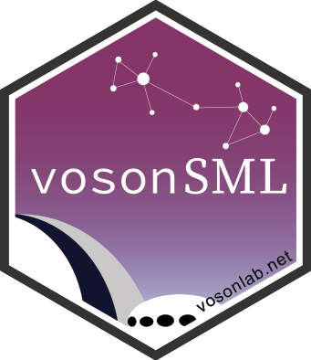
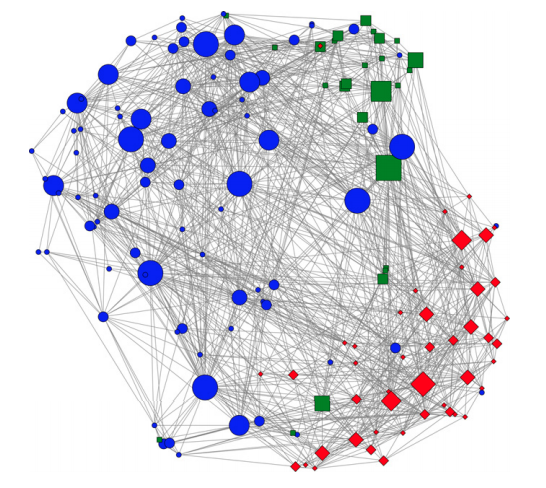
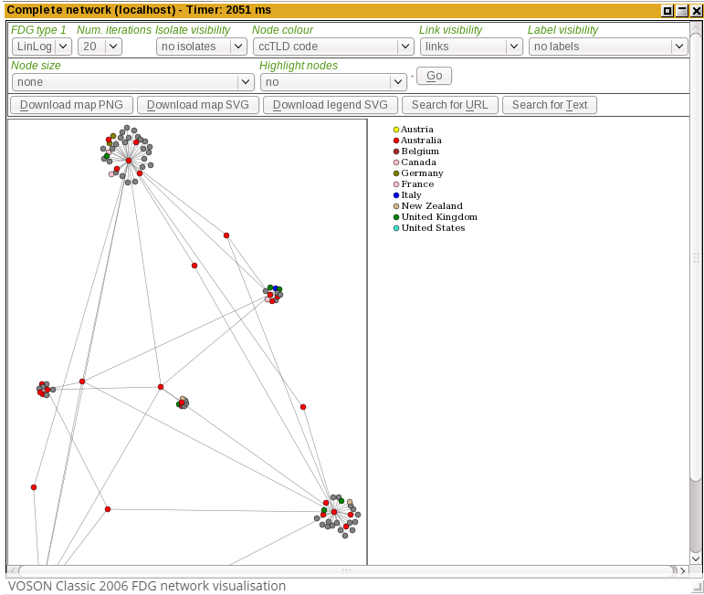
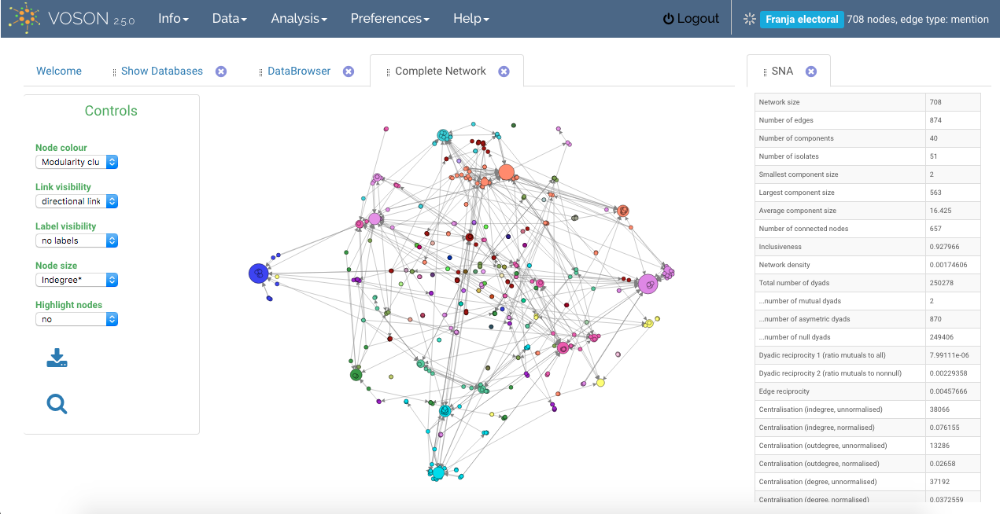

{ style='float:right;width:180px !important;height:208px !important;' }With over 3,000 registered users worldwide, a considerable number of academic publications using `VOSON`, and its high usage rate as an empirical tool for hyperlink and text data collection, we have decided to integrate `VOSON` hyperlink collection and network generation abilities into our open-source R package: `vosonSML`.

Hyperlink collection is now available in `voson.sml` development version 0.30.900, on [GitHub](https://github.com/vosonlab/vosonSML).

### About the VOSON Software

The [VOSON](http://vosonlab.net/VOSON) Software is an early research output of the VOSON Lab. Fifteen years have passed since its inception, even before the surge in popularity of social media. Some examples of research which have actively used  `VOSON` include studying online social movements (Ackland and O’Neil, 2011; Lusher and Ackland, 2011; McIlwain, 2017), and networks around issue spheres (Ackland and Evans, 2015).
 

*Fig. 1: The Online Environmental Movement hyperlink network. Node colour reflect sub-movements: ´Bios´- red diamonds; 'Globals'- blue circles; and 'Toxics' - green square (Ackland and O'Neil, 2011, p.183).* 

### A brief history of the VOSON Software
Full history can be accessed [HERE](https://uberlink.com/voson-turns-10)

The first version of `VOSON` with a graphical user interface was released internally in 2004, as a desktop application built using the `Qt` cross-platform application framework. A decision was made to port `VOSON` to a web application version built using the `PHP` web programming language and associated `AJAX` libraries. The first version of the web app was internally released in 2005. 

Launched in 2006, the `VOSON Classic` version was initially hosted at the ANU. In 2010, under a licensing arrangement with the ANU, [Uberlink Corporation](https://www.uberlink.com/) started commercially hosting and developing `VOSON`. The latest version of `VOSON` (2.5.0) was released in 2017.

### Hyperlink collection in vosonSML

`vosonSML` hyperlink follows similar methodological steps to `VOSON`; the R package crawls websites (internally and/or externally) and, in line with the other data sources (Twitter, Reddit and YouTube), generates two type of networks: *actor networks* - where pagegroups (websites) are nodes, and  *activity networks* - where single web pages are nodes.

The next sections will provide an introduction to collecting hyperlinks and producing networks with `vosonSML`.

## Collect Hyperlinks

## Create a Network

## References

[FB- If we agree to keep the citations, we will have to generate a Bibtex file]

Ackland, R. and Evans, A. (2017), "Using the Web to Examine the Evolution of the Abortion Debate in Australia 2005-2015," in N. Brügger and R. Schroeder (eds), Web as History. London: UCL Press.

Ackland, R., & O'Neil, M. (2011). Online collective identity: The case of the environmental movement. Social Networks, 33(3), 1-18. https://doi.org/10.1016/j.socnet.2011.03.001 

Lusher, D. and Ackland, R. (2011), A Relational Hyperlink Analysis of an Online Social Movement," Journal of Social Structure, 12(5). Available at: http://www.cmu.edu/joss/content/articles/volume12/Lusher/

McIlwain, C. (2017). Racial formation, inequality and the political economy of web traffic. Information, Communication & Society, 20(7), 1073-1089. doi: 10.1080/1369118X.2016.1206137 (VOSON in use)

## Other tools for studying hyperlink networks
From a social science perspective, there is a wide range of tools available for studying hyperlink networks. Some examples are:

* [Hyphe](https://hyphe.medialab.sciences-po.fr/), a curated-oriented approach to web crawling developed at Sciences Po Paris Médialab. 

* [Issuecrawler](http://www.govcom.org/Issuecrawler_instructions.htm), developed at the University of Amsterdam to study issue networks.

* [SocSciBot](http://socscibot.wlv.ac.uk/), developed by the Statistical Cybermetrics Research Group, University of Wolverhampton, to study citation networks.

