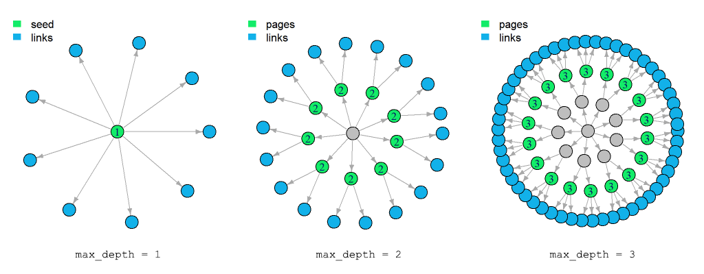
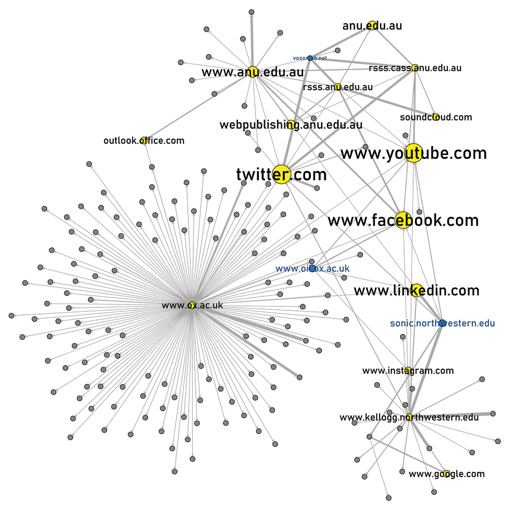

```{r setup, include = FALSE}
knitr::opts_chunk$set(echo = FALSE)
data_path <- "E:/My Drive/VOSON-BLOG-DATA/2021-03-15-hyperlink-networks-with-vosonsml/"
```

The [VOSON](http://vosonlab.net/VOSON) software for hyperlink collection and analysis was an early research output of the VOSON Lab [@ackland2010]. It addressed a need for tools that could help study online social networks, even before the rise of social media, and assisted researchers gain insights into important phenomena such as networks around issue spheres and online social movements [see [@acklandoneil2011] and [@ackland2013]]. After [many years and many iterations](http://vosonlab.net/content/voson-turns-10) since its inception in 2004, the VOSON Lab is happy to reintroduce the canonical VOSON hyperlink collection software as part of our R open-source toolkit for social media collection: `vosonSML`.^[References compiled by Francisca Borquez]

This simple guide will demonstrate how to use the new features of the `vosonSML` package to perform a hyperlink collection and generate networks for analysis.
 
## Introduction

The `vosonSML` hyperlink collection and network creation works similarly to the 3-step process we use with other social media sources: the `Authenticate`, `Collect` and `Create` verb functions. The `Authenticate` function is first called with the parameter "web" to identify and set up the context for subsequent operations, but it does not require any further credentials in this implementation. `vosonSML` uses standard web crawling and text-based page scraping techniques to discover hyperlinks and, as such, there is no need to access any restricted data API's as we commonly do with social media.

### Installation

The new hyperlink collection and network features are currently available in the development version of [vosonSML on GitHub](https://github.com/vosonlab/vosonsml), and are to soon be released on CRAN. The development version can be installed as follows:

```{r install, echo = TRUE, eval = FALSE}
# use the remotes package to install the latest dev version of vosonSML from github
library(remotes)
install_github("vosonlab/vosonsml")

# Downloading GitHub repo vosonlab/vosonsml@HEAD
# √  checking for file
# -  preparing 'vosonSML':
# √  checking DESCRIPTION meta-information ... 
# -  checking for LF line-endings in source and make files and shell scripts
# -  checking for empty or unneeded directories
# -  building 'vosonSML_0.30.00.9000.tar.gz'
#    
# * installing *source* package 'vosonSML' ...
# ...
# * DONE (vosonSML)
# Making 'packages.html' ... done
```

## Hyperlink Collection

### Setting Up

The web sites or pages to collect hyperlinks from are specified and input to the `Collect` function in a dataframe. As there are page specific options that can be used, this format helps us to organise and set the request parameters. The URL's set in the dataframe for the `page` column are called 'seed pages' and are the starting points for web crawling. Although not explicitly indicated in the URL's, the seed pages are actually the landing pages or "index" pages of the web sites and a page name can be specified if known or desired.  

```{r pages, echo = TRUE, eval = FALSE}
# set sites as seed pages and set each for external crawl with a max depth
pages <- data.frame(page = c("http://vosonlab.net",
                             "https://www.oii.ox.ac.uk",
                             "https://sonic.northwestern.edu"),
                    type = c("ext", "ext", "ext"),
                    max_depth = c(2, 2, 2))
```

The example above shows seed pages with some additional per-seed parameters that are used to control the web crawling. The `type` parameter can be set to a value of either `int`, `ext` or `all`, which correspond to following only internal, external or following all hyperlinks found on a seeded web page and subsequent pages discovered from that particular seed. How a hyperlink is classified is determined by the seed domain name, for example, if the seed page is `https://vosonlab.net` a type of `ext` will follow hyperlinks from that page that do not have a domain name of "vosonlab.net". A type of `int` will follow only hyperlinks that match a domain of "vosonlab.net", and a type of `all` will follow all hyperlinks found irrespective of their domain. The final parameter `max_depth` refers to how many levels of pages to follow from the seed page. In the diagram below, the green dots are pages scraped by the web crawler and the blue dots links are the hyperlinks collected from them for a max depth of 1,2 and 3. 



As can be seen, a max depth of 1 directs the crawler to scrape and collect hyperlinks from only seed pages, a max depth of 2 to follow hyperlinks found on the seed pages and collect hyperlinks from those pages as well, and so on radiating outwards. The number of pages and hyperlinks can rise very rapidly so it is best to keep this number as low as possible. If a greater reach in collection sites is desired, this could perhaps more efficiently be achieved by revising and adding more seed pages in the first instance. In the example code the `type` has been set to "ext" (external) for all three seed sites, so as to limit "mapping" of the internal seed web sites and focus on their outward facing connections. Depth of crawl was set to 2.

It should be noted that all hyperlinks found are collected from scraped pages and used to generate networks. The `type` and `max_depth` parameters only apply to the web crawling and scraping activity.

### Performing the Collection

The hyperlink data can now be collected using the `Collect` function with the `pages` parameter. This produces a dataframe that contains the hyperlink URL's found, pages they were found on and other metadata that can be used to help construct networks.

```{r collect, echo = TRUE, eval = FALSE}
library(magrittr)
library(dplyr)
library(vosonSML)

# set up as a web collection and collect the hyperlink data using the
# previously defined seed pages
hyperlinks <- Authenticate("web") %>% Collect(pages)

# Collecting web page hyperlinks...
# *** initial call to get urls - http://vosonlab.net
# * new domain: http://vosonlab.net 
# + http://vosonlab.net (10 secs)
# *** end initial call
# *** set depth: 2
# *** loop call to get urls - nrow: 6 depth: 2 max_depth: 2
# * new domain: http://rsss.anu.edu.au 
# + http://rsss.anu.edu.au (0.96 secs)
# ...

# dataframe structure
glimpse(hyperlinks)
# Rows: 1,163
# Columns: 9
# $ url       <chr> "http://rsss.anu.edu.au", "http://rsss.cass.anu.edu.au", "ht~
# $ n         <int> 1, 1, 4, 1, 1, 2, 2, 2, 2, 2, 2, 1, 1, 1, 4, 1, 1, 1, 1, 1, ~
# $ page_err  <lgl> NA, NA, NA, NA, NA, NA, NA, NA, NA, NA, NA, NA, NA, NA, NA, ~
# $ page      <chr> "http://vosonlab.net", "http://vosonlab.net", "http://vosonl~
# $ depth     <dbl> 1, 1, 1, 1, 1, 1, 1, 1, 1, 1, 1, 1, 1, 1, 1, 1, 1, 1, 1, 1, ~
# $ max_depth <dbl> 2, 2, 2, 2, 2, 2, 2, 2, 2, 2, 2, 2, 2, 2, 2, 2, 2, 2, 2, 2, ~
# $ parse     <df[,6]> <data.frame[26 x 6]>
# $ seed      <chr> "http://vosonlab.net", "http://vosonlab.net", "http://vos~
# $ type      <chr> "ext", "ext", "ext", "ext", "ext", "ext", "ext", "ext", "ext~

# number of pages scraped for hyperlinks
nrow(hyperlinks %>% distinct(page))
# [1] 38

# number of hyperlinks collected
nrow(hyperlinks)
# [1] 1163
```

A total of 1,163 hyperlinks were collected from 38 pages followed from our 3 seed pages. Using this data, it is now possible to generate hyperlink networks.

## Network Creation

### Networks

As with other `vosonSML` social media, there are two standard types of networks we can create. An `activity` network that produces a more structural representation of the network where nodes are web pages and edges are the hyperlink references between them, and an `actor` network that instead groups pages into entities based on their domain names.

```{r create, echo = TRUE, eval = FALSE}
# generate a hyperlink activity network
activity_net <- Create(hyperlinks, "activity")

# generate a hyperlink actor network
actor_net <- Create(hyperlinks, "actor")
# Generating web actor network...
# Done.
```

The output of the network creation is a named list of two dataframes, one for the `nodes` and the other for the `edges` or edge list data. The example below shows the `actor_net`. Note that the edges of the `actor` network are also aggregated into a weight value and that actors can link to themselves forming self-loops.

```{r network, echo = TRUE, eval = FALSE}
print(as_tibble(actor_net$nodes))
# # A tibble: 185 x 2
#   id                              link_id
#   <chr>                             <int>
# 1 accounts.google.com                   1
# 2 alumni.kellogg.northwestern.edu       2
# 3 anu.edu.au                            3
# # ... with 182 more rows

print(as_tibble(actor_net$edges))
# # A tibble: 226 x 3
#   from            to              weight
#   <chr>           <chr>            <int>
# 1 rsss.anu.edu.au anu.edu.au           2
# 2 rsss.anu.edu.au rsss.anu.edu.au     36
# 3 rsss.anu.edu.au soundcloud.com       1
# # ... with 223 more rows
```

### Plot a Graph

Now that the network has been generated, we can create a graph and plot it. The `Graph` function creates an `igraph` format object that can be directly plotted or adjusted for presentation using `igraph` plotting parameters.

```{r graph, echo = TRUE, eval = FALSE}
library(igraph)
library(stringr)

actor_net <- Create(hyperlinks, "actor")

# identify the seed pages and set a node attribute
seed_pages <- pages %>%
  mutate(page = str_remove(page, "^http[s]?://"), seed = TRUE)
actor_net$nodes <- actor_net$nodes %>%
  left_join(seed_pages, by = c("id" = "page"))

# create an igraph from the network
g <- actor_net %>% Graph()

# set node colours
V(g)$color <- ifelse(degree(g, mode = "in") > 1, "yellow", "grey")
V(g)$color[which(V(g)$seed == TRUE)] <- "dodgerblue3"

# set label colours
V(g)$label.color <- "black"
V(g)$label.color[which(V(g)$seed == TRUE)] <- "dodgerblue4"

# set labels for seed sites and nodes with an in-degree > 1
V(g)$label <- ifelse((degree(g, mode = "in") > 1 | V(g)$seed), V(g)$name, NA)

# simplify and plot the graph
set.seed(200)
tkplot(simplify(g),
       canvas.width = 1024, canvas.height = 1024,
       layout = layout_with_dh(g),
       vertex.size = 3 + (degree(g, mode = "in")*2),
       vertex.label.cex = 1 + log(degree(g, mode = "in")),
       edge.arrow.size = 0.4,
       edge.width = 1 + log(E(g)$weight))
```



We now have a simple graph of the actor hyperlink network. Our seed actors are indicated by blue nodes and sites with an in-degree greater than one indicated in yellow. Node size and label size reflect most linked to nodes or highest in-degree. Perhaps unsurprisingly, social media sites and the institutions at which the seed pages are located feature most prominently in the network, and the graph plot provides us a view of the actors online presence and connections.

There is much more network visualisation and analysis that could be performed on the `vosonSML` hyperlink networks and we will be working to add more features such as text analysis and network refinements in our near future releases. In the meantime, we hope you have found this practical introduction to our new tool useful and look forward to your feedback!