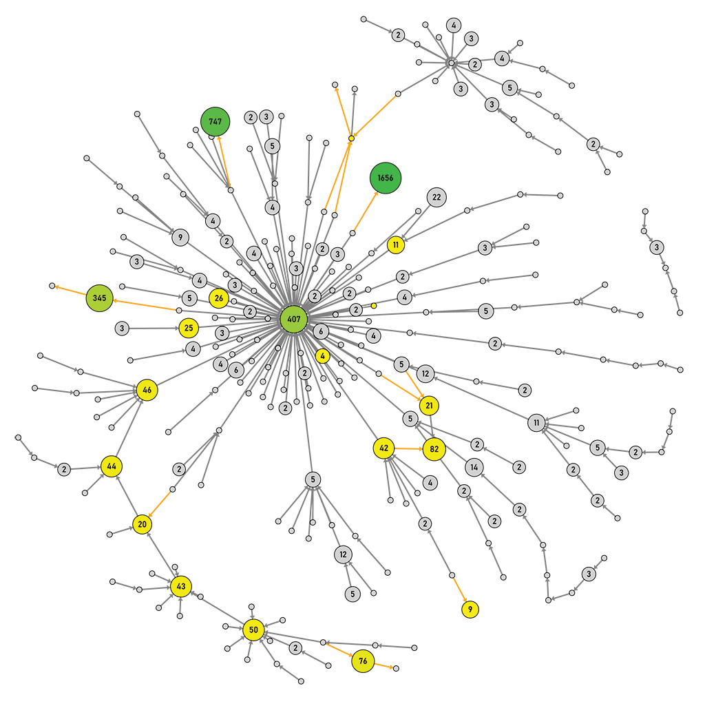
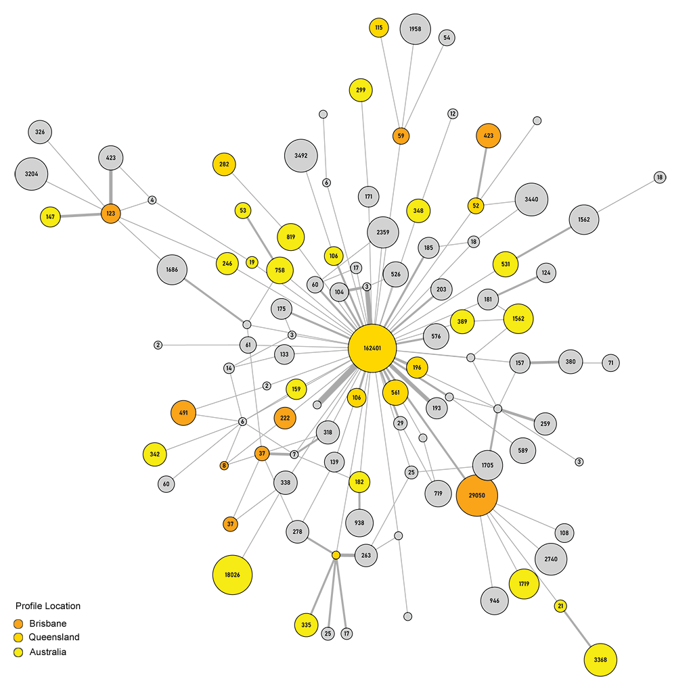

```{r setup, include=FALSE}
knitr::opts_chunk$set(echo = FALSE)
```
{ style='float:right;width:180px !important;height:208px !important;' }
The VOSON Lab has recently published to GitHub a new open source R package called [`{voson.tcn}`](https://vosonlab.github.io/voson.tcn). The package uses the Early-Access Twitter API v2, to collect tweets belonging to specified threaded conversations and generate networks. The Twitter API v2 provides a new tweet identifier: the [conversation ID](https://developer.twitter.com/en/docs/twitter-api/conversation-id), that is common to all tweets that are part of a conversation, and can be searched for using the API search endpoints. Identifiers and associated metadata for referenced tweets can also be collected in the same search for conversation tweets, allowing us to construct twitter networks with tweet and user metadata whilst minimising API requests.

### Twitter Developer Access

The `{voson.tcn}` package requires developer app authentication keys or tokens to access the Twitter API v2. These can be either the `Access token & secret` of an app or its `Bearer token`.

To obtain these credentials and use the early-access API you will need to have or apply for a [Twitter Developer Account](https://developer.twitter.com/en/docs/twitter-api/getting-started/getting-access-to-the-twitter-api), as well as have activated the new [Developer Portal](https://developer.twitter.com/content/developer-twitter/en/portal/opt-in). Once approved you will then need to create a development [project](https://developer.twitter.com/en/docs/projects/overview), which is the new management container for apps, and either create a new [app](https://developer.twitter.com/en/docs/apps/overview) or associate one of your existing apps with it. 

There are currently two project types available that correspond to Twitter's developer [product tracks](https://developer.twitter.com/en/products/twitter-api/early-access/guide), a *standard* and *academic* type. *Academic* projects are only available to researchers who have completed and have had their [application for the academic research track](https://developer.twitter.com/en/solutions/academic-research/application-info) approved for non-commercial research purposes. *Standard* projects are for more general use, including hobby and educational purposes. The project type features differ in their API access and caps; *standard* projects can only access the 7-day recent search endpoint whereas an *academic* project can access the [full-archive search](https://developer.twitter.com/en/docs/twitter-api/tweets/search/introduction) endpoint for historical tweets. There are also rate-limits and monthly tweet caps for API v2 search endpoints. At the time of writing, the caps are 500k and 10 million tweets that can be retrieved per month for the *standard* and *academic* track projects respectively.

Please note that there are also [terms of use and restricted use cases](https://developer.twitter.com/en/developer-terms/more-on-restricted-use-cases) that should be considered before applying for access or using the Twitter API.

### Installation

The `{voson.tcn}` R package is in development and currently only available on [GitHub](https://vosonlab.github.io/voson.tcn). It can be installed as follows:

```{r install, echo=TRUE, eval=FALSE}
# use the remotes package to install the latest dev version of voson.tcn from github
library(remotes)
install_github("vosonlab/voson.tcn")

# Downloading GitHub repo vosonlab/voson.tcn@HEAD
# √  checking for file
# -  preparing 'voson.tcn':
# √  checking DESCRIPTION meta-information ... 
# -  checking for LF line-endings in source and make files and shell scripts
# -  checking for empty or unneeded directories
# -  building 'voson.tcn_0.1.6.9000.tar.gz'
#    
# * installing *source* package 'voson.tcn' ...
# ...
# * DONE (voson.tcn)
# Making 'packages.html' ... done
```

## Authentication

The `{voson.tcn}` package only supports app based authentication using `OAuth2.0` tokens which are also known as [bearer tokens](https://developer.twitter.com/en/docs/authentication/oauth-2-0). We will likely support user based tokens in the future, however at this stage they do not offer any advantages as they have lower rate-limits and we are not using any private metadata of which they permit access (such as user-visible only metrics).

The token can be created using either your apps `access token & secret` (also known as consumer keys) or its `bearer token`. It is recommended that this token is saved for future use; there is no need to perform this step more than once as the token will not change unless it is invalidated or you regenerate keys on the developer portal.

```{r authentication, echo=TRUE, eval=FALSE}
library(voson.tcn)

# retrieves a bearer token from the API using the apps consumer keys
token <- tcn_token(consumer_key = "xxxxxxxx",
                   consumer_secret = "xxxxxxxx")

# alternatively if you have a bearer token already you can assign it directly
token <- list(bearer = "xxxxxxxxxxxx")

# if you save the token to file this step only needs to be done once
saveRDS(token, "~/.tcn_token")
```

## Collection

Collecting conversation tweets requires the tweet ID or URL of a tweet that belongs to each threaded conversation that you are interested in. These are passed to the `{voson.tcn}` collect function `tcn_threads` as a vector or list. Conversation IDs will be tracked by this function to avoid duplication and, if tweet IDs are found to belong to a conversation that has already been collected on, then that conversation will be skipped.

In the following example, we are collecting the tweets for a threaded conversation belonging to a public lockdown announcement following a COVID-19 outbreak in Brisbane, Queensland, Australia, that took place on March, 29, 2021. The tweet URL or ID (number following the status in the URL) can be passed directly to the collection function.


```{r collection, echo=TRUE, eval=FALSE}
# read token from file
token <- readRDS("~/.tcn_token")

# collect the conversation thread tweets for supplied ids           
tweets <- tcn_threads("https://twitter.com/AnnastaciaMP/status/1376311897624956929", token)
```

When completed, a list of named dataframes will be returned, with `tweets` containing all of the tweets and their metadata, and `users` containing all of the referenced users in the tweets and their metadata. In our example, 286 tweets were collected with 180 associated users public metadata. 

Note that the collection of a threaded tweet conversation is a snapshot of the state of the conversation at a point in time. Metrics and networks produced from our data will not completely match subsequent collections of the same conversation, as it will have likely cumulatively expanded over time.

```{r collection-data, echo=TRUE, eval=FALSE}
# collected tweets
print(tweets$tweets, n = 3)
# # A tibble: 286 x 14
#   in_reply_to_user~ conversation_id  source  author_id  tweet_id  ref_tweet_type
#   <chr>             <chr>            <chr>   <chr>      <chr>     <chr>         
# 1 15999~            137631189762495~ Twitte~ 134852208~ 13763373~ replied_to    
# 2 1142316897985163~ 137631189762495~ Twitte~ 126908387~ 13763373~ replied_to    
# 3 25683~            137631189762495~ Twitte~ 137503906~ 13763371~ replied_to    
# # ... with 283 more rows, and 8 more variables: ref_tweet_id <chr>, text <chr>,
# #   created_at <chr>, includes <chr>, public_metrics.retweet_count <int>,
# #   public_metrics.reply_count <int>, public_metrics.like_count <int>,
# #   public_metrics.quote_count <int>

# users metadata
print(tweets$users, n = 3)
# # A tibble: 180 x 12
#   profile.username profile.created_~ profile.profile_~ user_id profile.descript~
#   <chr>            <chr>             <chr>             <chr>   <chr>            
# 1 MSMW~            2013-03-30T06:48~ https://pbs.twim~ 131592~ "Fact checking i~
# 2 bpro~            2012-12-04T02:07~ https://pbs.twim~ 987844~ "Only way to get~
# 3 scre~            2009-10-22T22:56~ https://pbs.twim~ 844463~ "I'm a  creative~
# # ... with 177 more rows, and 7 more variables: profile.name <chr>,
# #   profile.verified <lgl>, profile.location <chr>,
# #   profile.public_metrics.followers_count <int>,
# #   profile.public_metrics.following_count <int>,
# #   profile.public_metrics.tweet_count <int>,
# #   profile.public_metrics.listed_count <int>
```

If interested in text analysis, the tweet text can be found in the `text` column of the `tweets` dataframe and user profile descriptions in `profile.description` of the `users` dataframe.

Public metrics for `tweets` and `users` are found in dataframe columns prefixed, with `public_metrics` and `profile.public_metrics` respectively.

```{r collection-data-metrics, echo=TRUE, eval=FALSE}
library(dplyr)

names(select(tweets$tweets, starts_with("public_metrics")))
# [1] "public_metrics.retweet_count" "public_metrics.reply_count"
# [3] "public_metrics.like_count" "public_metrics.quote_count"

names(select(tweets$users, starts_with("profile.public_metrics")))
# [1] "profile.public_metrics.followers_count"
# [2] "profile.public_metrics.following_count"
# [3] "profile.public_metrics.tweet_count"
# [4] "profile.public_metrics.listed_count"
```

## Network Creation

There are two types of networks that can be generated using `{voson.tcn}`: `activity` and `actor` network. These differ by the type of node and resulting structure of the networks.

### Activity Network

An `activity` network is a representation of the conversation as seen on Twitter: nodes are tweets and the edges are how they are related. Tweets (or nodes) are identified by their unique identifier `Tweet ID` (formerly `Status ID`). In a Twitter threaded conversation, there are only two types of connections or edges between tweets and these are `replied_to` and `quoted`.

Replies are made when a user chooses the *reply* option and publishes a tweet response to the tweet they are replying to. Quotes are a little different in that the user has included a link to or *quoted* another tweet in the body of their tweet. In Twitter conversation networks, it is common to *quote* a tweet as part of a *reply* tweet, generating in the activity network a `replied_to` and `quoted` edge from the same node.
 
```{r network-actor, echo=TRUE, eval=FALSE}
# generate an activity network
activity_net <- tcn_network(tweets, "activity")

# number of nodes
nrow(activity_net$nodes)
# [1] 279

# number of edges
print(activity_net$edges, n = 3)
# # A tibble: 281 x 3
#   from                to                  type      
#   <chr>               <chr>               <chr>     
# 1 1376337359126495232 1376328523518898176 replied_to
# 2 1376337350163267584 1376325216658317315 replied_to
# 3 1376337128016113665 1376311897624956929 replied_to
# # ... with 278 more rows

unique(activity_net$edges$type)
# [1] "replied_to" "quoted"
```

### Actor Network

An `actor` network represents the interactions between Twitter users in the conversation: nodes are the users and edges are their connections. As in the `activity` network, edges are either a `reply` or a `quote` but edges represent the classification of a tweet connecting users rather than the activity. Users (or nodes) are identified by their unique Twitter `User ID`. In the `actor` network, interactions between users are more apparent and can be measured by the frequency (and direction) of edges between them.

```{r network-activity, echo=TRUE, eval=FALSE}
# generate an actor network
actor_net <- tcn_network(tweets, "actor")

# number of nodes or actors
nrow(actor_net$nodes)
# [1] 180

print(actor_net$edges, n = 3)
# # A tibble: 286 x 6
#   from      to        type  tweet_id     created_at    text                     
#   <chr>     <chr>     <chr> <chr>        <chr>         <chr>                    
# 1 13485220~ 15999128~ reply 13763373591~ 2021-03-29T0~ "@Ther~ @Scott~
# 2 12690838~ 11423168~ reply 13763373501~ 2021-03-29T0~ "@Luke~ @Annas~
# 3 13750390~ 25683344~ reply 13763371280~ 2021-03-29T0~ "@AnnastaciaMP You do un~
# # ... with 283 more rows

unique(actor_net$edges$type)
# [1] "reply" "quote" "tweet"
```

Note that in the `actor` network there is an additional edge type: `tweet`, which is assigned to a self-loop edge created for the thread's initial tweet. This is a technique used to retain the initial tweet's metadata as edge attributes comparable to other edges in the network. 

The initial conversation tweet would not usually be included in the edge list, as the initial conversation tweet is not directed at another user, and hence no edge to attach metadata.For example, this allows the text of the initial tweet to be included in any actor network tweet text analysis. It would not usually be included in the edge list as the initial conversation tweet is not directed at another user, and hence no edge to attach metadata is naturally found in this type of network.


## Plot Graphs

### Activity Network

Visualisation of the `activity` network produced with `{igraph}`.

```{r graph-activity-1, echo=TRUE, eval=FALSE}
library(igraph)
library(RColorBrewer)

g <- graph_from_data_frame(activity_net$edges, vertices = activity_net$nodes)
```

```{r graph-activity-2, echo=TRUE, eval=FALSE, code_folding=TRUE}
# change likes to log scale
like_count <- V(g)$public_metrics.like_count
like_count[is.na(like_count)] <- 0
ln_like_count <- log(like_count)
ln_like_count[!is.finite(ln_like_count)] <- 0

# set node size based on likes, min size 4
size <- ln_like_count * 2
V(g)$size <- ifelse(size > 0, size + 8, 4)

# set node label if number of likes >= 2
V(g)$label <- ifelse(like_count >= 2, like_count, NA)
V(g)$label.color <- "black"

# set node colors based on number of retweets low to high is yellow to green
# set tweets with no retweets to grey
rt_count <- V(g)$public_metrics.retweet_count
rt_count[is.na(rt_count)] <- 0
cols <- colorRampPalette(c("yellow1", "green3"))
cols <- cols(max(rt_count) + 1)
V(g)$color <- cols[rt_count + 1]
V(g)$color[which(rt_count < 1)] <- "lightgrey"

# set edge color to orange if tweet quoted another tweet
E(g)$color <- ifelse(E(g)$type == "quoted", "orange", "grey")
```

```{r graph-activity-3, echo=TRUE, eval=FALSE}
# plot the graph using fruchterman reingold layout
set.seed(200)
tkplot(g,
       canvas.width = 1024, canvas.height = 1024,
       layout = layout_with_fr(g),
       edge.arrow.size = 0.5,
       edge.width = 2)
```



`{voson.tcn}` collects tweets that are all linked to each other via the `conversation ID`. This means that in a network generated from this data, such as the activity network, all of the nodes (tweets) should be connected in a single component per `conversation ID`. If multiple `conversation ID`s were collected on then, it is also possible to have one component because of *quote* edges. These edges joining conversations occur when a tweet in one conversation has quoted a tweet in another that you have collected.

In the example activity network above, there are two components even though only one `conversation ID` was collected on. Multiple components are usually due to a missing conversation tweet not able to be retrieved from the API and producing a broken reply chain. This can often occur if, for example, a tweet has been deleted, or the tweet or user flagged or suspended in some way restricting public availability.

### Actor Network

Visualisation of the `actor` network produced with `{igraph}`.

```{r graph-actor-1, echo=TRUE, eval=FALSE}
library(dplyr)
library(magrittr)
library(stringr)

regex_ic <- function(x) regex(x, ignore_case = TRUE)

# best effort set the node colour attribute based on presence of city, state,
# or country in the actors profile location field
nodes <- actor_net$nodes %>%
  mutate(color = case_when(
    str_detect(profile.location, regex_ic("brisbane|bris")) ~ "orange",
    str_detect(profile.location, regex_ic("queensland|qld")) ~ "gold",
    str_detect(profile.location, regex_ic("australia|aus")) ~ "yellow",
    TRUE ~ "lightgrey"))

g2 <- graph_from_data_frame(actor_net$edges, vertices = nodes)
```

```{r graph-actor-2, echo=TRUE, eval=FALSE, code_folding=TRUE}
# the following code de-clutters the actor network by removing some nodes
# that are not part of conversation chains and are stand-alone replies to
# the initial thread tweet

# get the author of the initial thread tweet using the conversation id
conversation_ids <- c("1376311897624956929")
thread_authors <- activity_net$nodes %>%
  filter(tweet_id %in% conversation_ids) %>% select(user_id)

# remove actors replying to the initial tweet that have a degree of 1
thread_spokes <- unlist(
  incident_edges(g2, V(g2)[which(V(g2)$name %in% thread_authors$user_id)],
                 "in"))
spokes_tail_nodes <- V(g2)[tail_of(g2, thread_spokes)]$name
g2 <- delete_vertices(g2, degree(g2) == 1 & V(g2)$name %in% spokes_tail_nodes)

# convert the graph to undirected
# simplify the graph and collapse edges into an edge weight value
E(g2)$weight <- 1
g2 <- as.undirected(simplify(g2, edge.attr.comb = list(weight = "sum")))
g2 <- delete_vertices(g2, degree(g2) == 0)

# use edge weight for graph edge width
E(g2)$width <- ifelse(E(g2)$weight > 1, E(g2)$weight + 1, 1)

# use the actors followers count for node size 
followers_count <- log(V(g2)$profile.public_metrics.followers_count)
followers_count[!is.finite(followers_count)] <- 0
size <- followers_count * 3
V(g2)$size <- ifelse(size < 6, 6, size)
V(g2)$label <- ifelse(followers_count > 0,
                      V(g2)$profile.public_metrics.followers_count, NA)
```

```{r graph-actor-3, echo=TRUE, eval=FALSE}
# plot the graph using automatically chosen layout
set.seed(201)
tkplot(g2,
       canvas.width = 1024, canvas.height = 1024,
       layout = layout_nicely(g2),
       vertex.label.cex = 0.8,
       vertex.label.color = "black")
```


