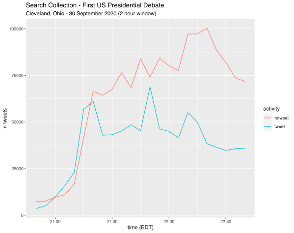
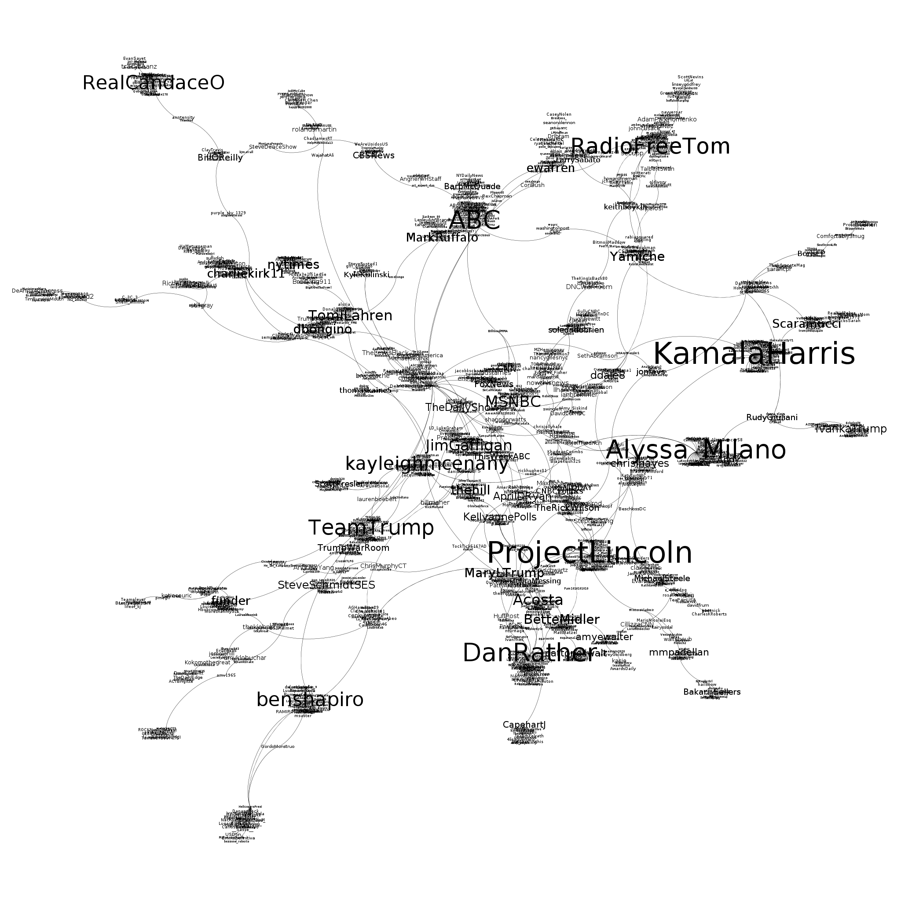

```{r setup, include=FALSE}
knitr::opts_chunk$set(echo = FALSE)
```

The VOSON Lab undertook a number of Twitter collections on selected hashtags during the 2020 US Presidential debates and townhalls. The Twitter streaming API endpoint was used for a sampled real-time collection of tweets during the debates, and the recent search API was used post-debate to collect all tweets containing hashtags that occurred over the debate telecast periods. The two approaches differ in that the streaming API endpoint allows access to a ["roughly 1% random sample of publicly available Tweets in real-time"](https://developer.twitter.com/en/docs/twitter-api/tweets/sampled-stream/introduction) using provided hashtags or terms as a filter to monitor events. The search API endpoint uses terms in a search query to match all tweets containing hashtags for a recent historical period in time. The streaming collections, a filtered sample, produced much smaller datasets and was useful for a timeley review of the Twitter activity during the debates as well as for identifying tweets to act as bounds for search collections. The retrospective search collections were much larger and produced more comprehensive datasets.

The R packages `rtweet` and `vosonSML`, the latter of which wraps the functionality of `rtweet` for its Twitter capability, were used in a semi-automated way to collect data with both streaming and search API's. These packages use the standard [Twitter API v1.1](https://developer.twitter.com/en/docs/twitter-api/v1) endpoints.

Two US Presidential debates took place between Donald Trump and Joe Biden on September 29th and October 22nd, with one debate scheduled for October 15th cancelled due to COVID-19 concerns. One VP debate between Kamala Harris and Mike Pence took place on October 7th. This article will focus on the datasets collected for the first debate, widely reported as ["pure chaos"](https://theconversation.com/the-first-us-presidential-debate-was-pure-chaos-heres-what-our-experts-thought-147178) and ["90 minutes of insult and interjection"](https://www.abc.net.au/news/2020-10-01/us-election-debate-became-little-more-than-shouting-trump-biden/12718458) by commentators, to demonstrate our collection methodology and some simple network analysis.

{width="512"}

## Collection Strategy

The US Presidential debates were all scheduled to run for 1.5 hours between 9pm and 10.30pm Eastern Daylight Time (EDT). To capture Twitter discussion surrounding the debate a four hour streaming window was chosen, with the collection starting at 8.30pm and concluding at 12.30am EDT (0.5 hours before and 2 hours after the debate). Streaming collection was performed by multiple team members, each with slightly staggered start times. This is because streaming collections were divided into 15 minute segments, and offsetting allowed tweets to be collected during connections, disconnections and segment changeover intervals. The tweets could then be merged and any duplicates removed in post-processing.

Because of the very likely large volume of tweets collected using the search API endpoint the collection window was reduced to 2 hours, starting 15 minutes before and concluding 15 minutes after the debates. Twitter searches are historical and page backwards in time, results are returned from most recent tweet as the first observation to the earliest tweet matching search criteria as last observation collected. There are also limits to how many tweets can be collected as defined by the API rate-limit. Using a [bearer authentication token](https://developer.twitter.com/en/docs/authentication/oauth-2-0/bearer-tokens) to perform searches allows for 45,000 tweets to be retrieved every 15 minutes.

As tweet status ID's are sequential numbers, with new tweets incrementing the identifier, they can be used to set bounds for searches. Simply, the first tweet in the collected data from a search (earliest tweet in data) can be used as a starting point for subsequent searches as we move backwards in time. This means that given two tweets, one at the beginning and the other at the end of an event - the debate, we can systematically and programatically collect all tweets in-between working backwards from the end of event tweet. To identify which tweets to use as bounds we performed timestamp search of collected streaming tweets. We identified the highest status ID tweet matching our end time for the collection window 10.45pm EDT (search start) and the lowest ID matching our debate start time 8.45pm EDT (search end).

In practice, 45,000 tweets were collected with a pause for the 15 minute rate-limit to reset, then a further 45,000 were collected with a pause, and so on until the tweet that we identified as marking the beginning of the debate window was collected. Because this process could take many hours, it was important to perform the search collections within 7 days of the debates.

### Hashtags

A set of hashtags were selected in order to capture tweets related to the presidential debates. The following 12 were used for streaming and search collections for all debates, with 4 addditonal hashtags for the vice presidential debate and 3 for the townhalls.

+-------------------------------------+---------------------------------------------------------------------------------------------------------------------------------------------------------------------------------------+
|                                     | Hashtags                                                                                                                                                                              |
+=====================================+=======================================================================================================================================================================================+
| Hashtags for all events             | \#PresidentialDebate, \#PresidentialDebates, \#Election2020, \#Debates2020, \#Debates, \#DebateNight, \#Biden, \#Biden2020, \#BidenHarris2020, \#Trump, \#Trump2020, \#TrumpPence2020 |
+-------------------------------------+---------------------------------------------------------------------------------------------------------------------------------------------------------------------------------------+
| Additional vice presidential debate | \#VPDebate, \#VPDebate2020, \#VPDebates, \#VPDebates2020                                                                                                                              |
+-------------------------------------+---------------------------------------------------------------------------------------------------------------------------------------------------------------------------------------+
| Additional televised townhalls      | \#BidenTownHall, \#TrumpTownHall, \#TownHall                                                                                                                                          |
+-------------------------------------+---------------------------------------------------------------------------------------------------------------------------------------------------------------------------------------+

: Table 1: Debate hashtags

### Timezones

The first US Presidential debate took place in Cleveland, Ohio at 9pm Eastern Daylight Time (EDT) on the 29th September, 2020. Tweet timestamps are all in Universal Coordinated Time (UTC), meaning times in the data need to be offset by -4 to find the debate time in EDT. As collection took place in Canberra, Australia or Australian Eastern Standard Time (AEST), the local system timestamps produced by scripts for logging are in AEST. The first debate time and timezone conversions can be seen in the table below.

+----------+------------------+------------------+
| Timezone | Start time       | End time         |
+==========+==================+==================+
| EDT      | 2020-09-29 21:00 | 2020-09-29 22:30 |
+----------+------------------+------------------+
| UTC      | 2020-09-30 01:00 | 2020-09-30 02:30 |
+----------+------------------+------------------+
| AEST     | 2020-09-30 11:00 | 2020-09-30 12:30 |
+----------+------------------+------------------+

: Table 2: First debate timezone reference

## Streaming Collection

For the streaming collection a directory was created to for easier post-processing. Streaming data was collected and written to file in JSON format using timestamp formatted file names. The streaming collection period was set to 4 hours and divided into segments or files.

```{r stream-setup, echo=TRUE, eval=FALSE, code_folding=TRUE}
wd <- getwd()

# check paths and create directories if they do not exist
data_path <- paste0(wd, "/data")
if (!dir.exists(data_path)) { dir.create(data_path, showWarnings = FALSE) }

streams_path <- paste0(data_path, "/pres-debate-streams")
if (!dir.exists(streams_path)) { dir.create(streams_path, showWarnings = FALSE) }

# helper functions to write to log file and to create date time based file names
log <- function(msg, fn) { cat(msg, file = fn, append = TRUE, sep = "\n") }
fname <- function(path, ts) { paste0(path, "/stream-", gsub("[^[:digit:]_]", "", ts)) }

# set stream filter hashtags - comma seperated
stream_filter <- paste0("#PresidentialDebate,#PresidentialDebates,#Election2020,",
                       "#Debates2020,#Debates,#DebateNight,",
                       "#Biden,#Biden2020,#BidenHarris2020,",
                       "#Trump,#Trump2020,#TrumpPence2020")

# set the time period to collect tweets in seconds
stream_period <- 4 * 60 * 60 # 4 hours or 14400 seconds

# break up streaming collection into segments
num_segs <- 16 # each segment is 15 minutes
seg_period <- ceiling(stream_period / num_segs)
```

The streaming collection is performed by the `rtweet` function `stream_tweets` which in our operation uses the query or filter parameter `q`, a `timeout` period which is the length of time to collect streaming tweets, and an output JSON `file_name`. The collection is wrapped in a loop which is for the number of 15 minute segments in the collection period. Each iteration sets up a new timestamped data file and log file.

```{r stream-collection, echo=TRUE, eval=FALSE, code_folding=TRUE}
library(rtweet)

# load rtweet auth token
token <- readRDS("~/.rtweet_oauth1a")

# collect streaming tweets with a new file every 15 minutes
for (i in 1:num_segs) {

  # create log file and JSON data file
  timestamp <- Sys.time()
  log_file <- paste0(fname(streams_path, timestamp), ".txt")
  json_file <- paste0(fname(streams_path, timestamp), ".json")
  
  log(paste0("timestamp: ", timestamp, "\ntimeout: ",
             seg_period, " secs\nfilter: ", stream_filter),
    log_file)
  
  # collect streaming tweets and write to JSON file
  tryCatch({
    rtweet::stream_tweets(
      token = token,
      q = stream_filter,
      timeout = seg_period,
      file_name = json_file,
      parse = FALSE
    )
  }, error = function(e) {
    cat(paste0(e, "\n"))
    log(paste0("error: ", e), log_file)
  })
  
  log(paste0("completed: ", Sys.time()), log_file)
}
```

Log entries for each 15 minute iteration confirm the collection period and each file matches a JSON data file (note timestamps are in local time which was AEST).

    # data/pres-debate-streams/stream-20200930102859.txt 

    timestamp: 2020-09-30 10:28:59
    timeout: 900 secs
    query: #PresidentialDebate,#PresidentialDebates,#Election2020,
    #Debates2020,#Debates,#DebateNight,#Biden,#Biden2020,#BidenHarris2020,
    #Trump,#Trump2020,#TrumpPence2020
    completed: 2020-09-30 10:43:59

For the first streaming collection iteration an **180MB** JSON file was written with **111,244 lines**. Each line contains the JSON for a single tweet, meaning the same number of tweets were collected.

```{r streaming-data-json, echo=TRUE, eval=FALSE}
> first_json_file <- "./data/pres-debate-streams/stream-20200930102859.json"
> file.size(first_json_file)
[1] 188575977 # 180MB

> length(readLines(first_json_file))
[1] 111244
```

**16 JSON data files** were written, corresponding to the number of 15 minute segments specified. These were then individually processed and converted to dataframes, which were then merged into a single complete streaming collection dataframe for the first debate.

## Search Collection

As with the streaming collection directories were created to store collected data and search parameters set. The search query containing hashtags uses the Twitter `OR` search operator unlike the streaming filter which was comma seperated. A maximum number of tweets for each collection iteration as well as a maximum number of iterations are set. The number of tweets is required for the search request and is set to the maximum rate-limit value for a bearer token. A maximum number of iterations is set as a precaution to prevent infinite collection should a problem arise. The two tweets found from the streaming collection and used as search bounds are also set. The search will start at the `latest id` and continue until the `earliest id` is found, or the maximum iterations has been reached.

```{r search-setup, echo=TRUE, eval=FALSE, code_folding=TRUE}
wd <- getwd()

# check paths and create directories if they do not exist
data_path <- paste0(wd, "/data")
if (!dir.exists(data_path)) { dir.create(data_path, showWarnings = FALSE) }

searches_path <- paste0(data_path, "/pres-debate-searches")
if (!dir.exists(searches_path)) { dir.create(searches_path, showWarnings = FALSE) }

# set search query hashtags - separated with OR search operator
q <- paste0("#PresidentialDebate OR #PresidentialDebates ",
            "OR #Election2020 OR ",
            "#Debates2020 OR #Debates OR #DebateNight OR ",
            "#Biden OR #Biden2020 OR #BidenHarris2020 OR ",
            "#Trump OR #Trump2020 OR #TrumpPence2020")

type <- "recent"
num_tweets <- 45000
max_iter <- 40

# pres debate 1 search
latest_id <- "1311121700394807296"    # start tweet
earliest_id <- "1311104723978579968"  # end tweet
```

The search collection is performed by the `vosonSML` function `Collect`. The process is more involved than the streaming collection in that the reset time for the rate-limit is calculated each collection iteration and the script sleeps for that period of time before continuing. Tracking of search progress is also logged to the console in this approach but was redirected to a log file.

```{r search-collection, echo=TRUE, eval=FALSE, code_folding=TRUE}
library(vosonSML)

auth <- readRDS("~/.vsml_oauth2")

cat("large twitter search\n")
cat(paste0("type: ", type, "\n"))
cat(paste0("tweets per iter: ", num_tweets, "\n"))
cat(paste0("max iter: ", max_iter, " (", (max_iter * num_tweets), " tweets)\n\n"))

i <- 1
while (i <= max_iter) {
  cat(paste0("iteration ", i, " of ", max_iter, "\n"))
  cat(paste0("time: ", Sys.time(), "\n"))
  cat(paste0("set max_id: ", latest_id, "\n"))
  req_time <- as.numeric(Sys.time())
  reset_time <- req_time + (15 * 60) + 10 # add 10 sec buffer
  
  code_wd <- getwd()
  setwd(searches_path)
  
  data <- tryCatch({
    auth %>%
      Collect(searchTerm = q,
              searchType = type,
              numTweets = num_tweets,
              max_id = latest_id,
              verbose = TRUE,
              includeRetweets = TRUE,
              retryOnRateLimit = TRUE,
              writeToFile = TRUE)
  }, error = function(e) {
    cat(paste0(e, "\n"))
    NULL
  })
  
  setwd(code_wd)
  
  if (!is.null(data) && nrow(data)) {
    data_first_obvs_id <- data$status_id[1]
    data_last_obvs_id <- data$status_id[nrow(data)]
    cat(paste0("data nrows = ", nrow(data), "\n",
               "first row status id = ", data_first_obvs_id, "\n",
               "last row status id = ", data_last_obvs_id, "\n"))
    
    # set latest id to lowest status id in data for NEXT iteration
    # this is typically the last observation
    latest_id <- data_last_obvs_id
    
    # if our target id is passed then stop
    if (earliest_id >= latest_id) {
      cat("earliest id reached\n")
      break
    }
    now_time <- as.numeric(Sys.time())
    if (i < max_iter) {
      sleep_time <- reset_time - now_time
      if (sleep_time > 0) {
        cat("sleeping ", sleep_time, " secs\n")
        Sys.sleep(sleep_time)  
      }      
    }
  } else {
    cat("no data\n")
    break
  }
  i <- i + 1
}

cat(paste0("completed: ", Sys.time(), "\n"))
```

The first search collection iteration collected a full **45,000 tweets** and wrote an R `dataframe` object to an `RDS` file. The `vosonSML` output also indicates the minimum and maximum tweet `status ID` in the data and their timestamp (UTC) to assist with tracking the collection progress, it shows that the first 45,000 tweets were all created within an approximate 2.25 min period. It took **5.5 mins** for the first collection to complete, and it slept for over 9.5 mins while the rate-limit reset before iteration 2. Timestamps other than the tweet creation time are in local time AEST.

    large twitter search
    type: recent
    tweets per iter: 45000
    max iter: 40 (1800000 tweets)

    iteration 1 of 40
    time: 2020-10-03 08:50:31
    set max_id: 1311134926167834628
    Collecting tweets for search query...
    Search term: #PresidentialDebate OR #PresidentialDebates OR
    #Election2020 OR #Debates2020 OR #Debates OR #DebateNight OR
    #Biden OR #Biden2020 OR #BidenHarris2020 OR #Trump OR #Trump2020
    OR #TrumpPence2020
    Requested 45000 tweets of 45000 in this search rate limit.
    Rate limit reset: 2020-10-03 09:05:32
    Downloading [=========================================] 100%

    tweet  | status_id           | created             | screen_name   
    -------------------------------------------------------------------
    Min ID | 1311134367985565697 | 2020-09-30 02:42:47 | @pxxxxx_xx   
    Max ID | 1311134926167834628 | 2020-09-30 02:45:00 | @ixxxxxxxxxxx
    Collected 45000 tweets.
    RDS file written: ./data/pres-debate-searches/2020-10-03_085550-TwitterData.rds
    Done.
    Elapsed time: 0 hrs 5 mins 22 secs (321.79)
    data nrows = 45000
    first row status id = 1311134926167834628
    last row status id = 1311134367985565697
    sleeping  588.2078  secs

**54 RDS data files** containing Twitter collection dataframes were written and the search took approximately **17.5 hours**. These files were then merged into a single complete search collection dataframe for the first debate.

## First Presidential Debate Preliminary Results

### Data Summary

Data was collected by multiple team members, presented are the un-merged results from a single members streaming and search collections for the first presidential debate.

+----------------------+------------------+------------------+----------------+------------------------------+
| Twitter API endpoint | Start time (EDT) | End time (EDT)   | Period (hours) | Observations (unique tweets) |
+======================+==================+==================+================+==============================+
| Streaming            | 2020-09-29 20:30 | 2020-09-30 00:30 | 4.00           | 449,102                      |
+----------------------+------------------+------------------+----------------+------------------------------+
| Search               | 2020-09-29 20:45 | 2020-09-29 22:45 | 2.00           | 2,387,587                    |
+----------------------+------------------+------------------+----------------+------------------------------+

: Table 2: Collection summary

### Data Tweet Activity

Time series plots for the streaming and search collections were created to indicate tweet activity over time. Observations are grouped by tweet type and into 5 minute bins. Perhaps unsurprisingly, retweet activity appears to became more prevalent as the first debate progressed. At around **10.20pm** in the search collection just over **100,000 retweets** were collected.

{width="640"}

{width="640"}

## Network Analysis

Using `vosonSML` the Twitter data for both streaming and search collections is able to be converted into networks in the same way. The following code will demonstrate the merging of search collection data, and creation of an `activity` and `actor` network for the first debate.

### Merge Collected Data

```{r combine-data, echo=TRUE, eval=FALSE, code_folding=FALSE}
library(dplyr)

# combine the search data files and remove duplicate tweets

# get all of the files to combine
files <- list.files(path = "./data/pres-debate-searches/",
                    pattern = ".+TwitterData\\.rds$", full.names = TRUE)

# merge dataframes
comb_data <- bind_rows(lapply(files, function(x) { readRDS(x) }))
data <- comb_data %>% arrange(desc(status_id))

# find and remove any duplicates
dupes <- data %>% filter(status_id %in% data$status_id[duplicated(data$status_id)])
if (nrow(dupes)) { data <- data %>% distinct(status_id, .keep_all = TRUE) }

saveRDS(data, "./data/pres_debate1_search.rds") # save combined data
```

### Create Networks

Because the combined search data for the first debate is quite large, it can be useful to reduce it to a much smaller window of time for demonstration and network visualization purposes. The following code will extract 15 minutes of tweet data from between 21:30 - 21:45 EDT.

```{r data-filtering, echo=TRUE, eval=FALSE, code_folding=FALSE}
data <- readRDS("./data/pres_debate1_search.rds") # load the previously saved data

# filter out tweets with creation timestamps outside of the 15 min window
data <- data %>% filter(created_at >= as.POSIXct("2020-09-30 01:30:00", tz = "UTC") &
                        created_at <= as.POSIXct("2020-09-30 01:45:00", tz = "UTC"))

> nrow(data)
[1] 349937
> min(data$created_at)
[1] "2020-09-30 01:30:00 UTC"
> max(data$created_at)
[1] "2020-09-30 01:45:00 UTC"
```

The data is now comprised of **349,937 unique tweets** that all were created during our specified window. We can now create our networks using `vosonSML`.

```{r network-creation, echo=TRUE, eval=FALSE, code_folding=FALSE}
library(vosonSML)

# use the vosonsml create function to create networks

# activity network
> net_activity <- data %>% Create("activity2")
Generating twitter activity network...
-------------------------
collected tweets | 349937
tweet            | 125626
retweet          | 212842
reply            | 7316
quote            | 4210
nodes            | 366029
edges            | 349994
-------------------------
Done.

# actor network
> net_actor <- data %>% Create("actor2")
Generating twitter actor network...
-------------------------
collected tweets | 349937
tweet mention    | 15021
tweet            | 125626
retweet          | 212842
reply mention    | 2202 
reply            | 7316 
quote mention    | 734  
quote            | 4210 
nodes            | 202333
edges            | 367951
-------------------------
Done.
```

The `activity` network has **366,029** nodes or **unique tweets**, and the `actor` network has **202,333** nodes or **unique actors** for our 15 minute window.

### Reply-network Giant Component

If we're interested in exploring some of the Twitter interactions taking place between users during the 21:30 - 21:45 window of the first debate, the network can be further distilled by looking at the actor network and including only reply edges. This will reveal a number of reply-conversations, but we can select for the giant component to find the largest one. The `igraph` library can be used to perform a number of common network operations such as removing self-loops, isolates and finding the giant component.

```{r reply-network-creation, echo=TRUE, eval=FALSE, code_folding=FALSE}
library(igraph)

# convert vosonsml actor network to igraph object
> g_actor <- net_actor %>% Graph()
Creating igraph network graph...Done.

# remove edges that are not replies
# remove self-loops and isolates
g_actor_reply <- g_actor %>% delete_edges(E(g_actor)[E(g_actor)$edge_type != "reply"])
g_actor_reply <- g_actor_reply %>% simplify(remove.multiple = FALSE)
g_actor_reply <- g_actor_reply %>%
  delete_vertices(V(g_actor_reply)[which(degree(g_actor_reply) == 0)])

# find the giant component
comps <- clusters(g_actor_reply, mode = "weak")
largest_cluster_id <- which.max(comps$csize)
node_ids <- V(g_actor_reply)[comps$membership == largest_cluster_id]
g_actor_reply_gc <- induced_subgraph(g_actor_reply, node_ids)
```

The giant component in the reply-network has **1743 nodes** and **1982 edges**. We can use `igraphs` `degree` function to further explore who the most prominent actors are in the network by in-degree.

```{r prominent-actors, echo=TRUE, eval=FALSE, code_folding=FALSE}
> V(g_actor_reply_gc)$screen_name[order(degree(g_actor_reply_gc, mode = "in"), decreasing = TRUE)]
[1] "realDonaldTrump"    "JoeBiden"           "GOPLeader"         
[4] "KamalaHarris"       "ProjectLincoln"     "Alyssa_Milano"
```

To visualise the conversation occurring during this 15 minutes of the debate, we first removed the Twitter accounts for the two candidates (`"realDonaldTrump"`, `"JoeBiden"`, `"GOPLeader"`), and then constructed a new giant component from the reply network, which now has **1345 nodes** and **1484 edges**.

The visualization of this network (using `Gephi`) with node size proportional to in-degree is below.

{width="1048"}

This graph provides some insight into the largest reply network at our chosen point in time, revealing the Twitter actors receiving the most reply attention and their associations.
