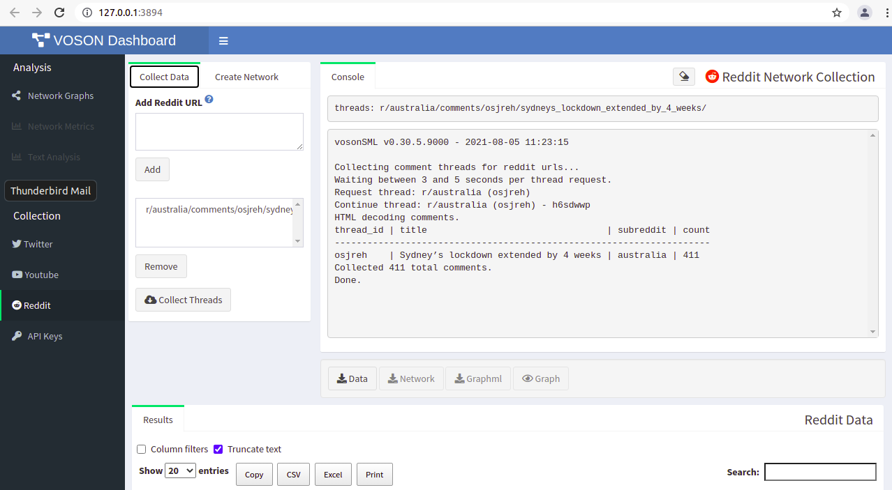
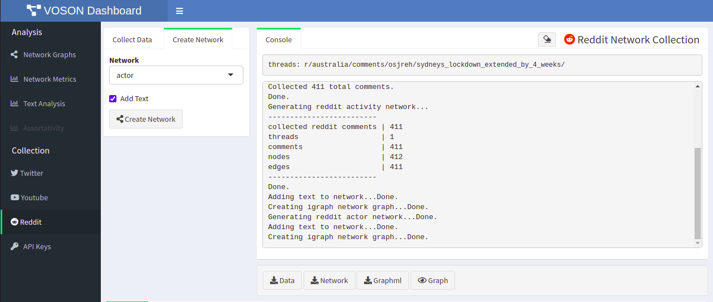
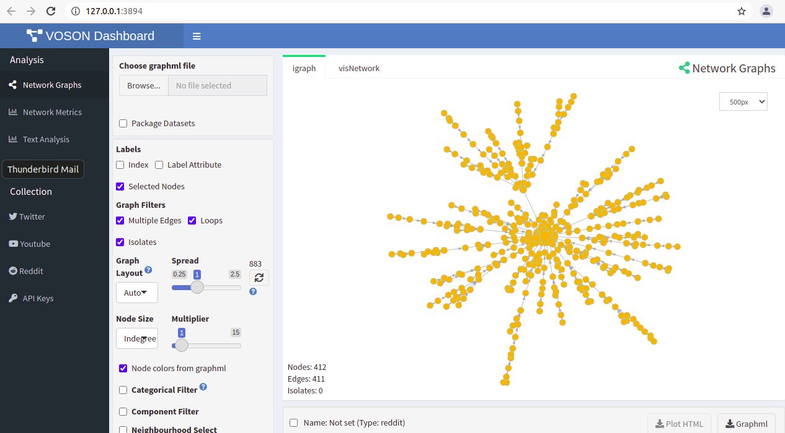
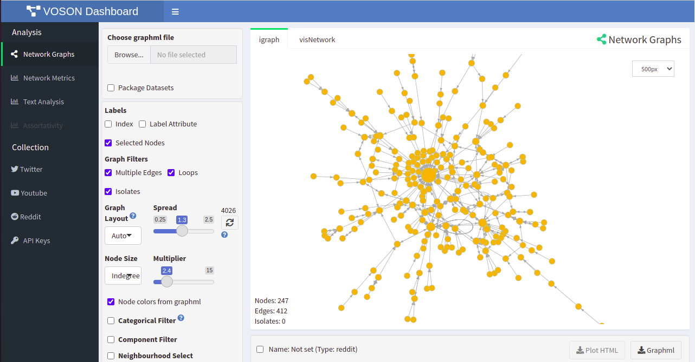

```{r setup, include=FALSE}
knitr::opts_chunk$set(echo = FALSE)
```
The following guide provides a practical demonstration to studying online networks of Reddit data, using VOSON Lab's interactive R/Shiny app `VOSONDash`. [Reddit](https://www.reddit.com/) is a social news aggregation, web content rating, and discussion website. Registered users post content in "subreddits"-- online boards which cover a variety of topics including, politics, religion, science, movies, and video games, among many others. Reddit provides the opportunity for researchers to access themed-based online discussion data, and to understand the dynamics of these conversations. 

### SNA approach to studying online networks

`VOSONDash` and `vosonSML` method for network construction is based on [Ackland and Zhu]'s approach, whereby edges in Reddit networks are *implicitly directed ties*, representing exchange of opinion between users, but not necessarily an explicit social relationship, such as friendship. Conversations threads can be analysed as networks and `VOSONDash` provides two approaches to constructing Reddit networks:

- *Actor networks* -- where nodes represent users who have posted original posts and comments, and edges are the comment interactions between users.

- *Activity networks* -- where nodes are comments or initial thread posts and edges represent either replies to the original post, or replies to comments.

### Methodology

In this post, we will collect data from a Reddit post relating to the COVID-19 lockdown in Sydney, Australia, and proceed to use `VOSONDash` features to demonstrate the data outputs and analysis tools.

The post titled [*Sydney Lockdown extended until the end of September*](https://www.reddit.com/r/sydney/comments/p7s5s6/sydney_lockdown_extended_until_the_end_of/) was created on 20 August 2021, and by the time of data collection (September, 16, 2021) it had attracted 566 comments.


## Starting VOSONDash

The GitHub page provides instructions to install and run `VOSONDash`. 


## Collecting Reddit data
Simply go to the Reddit view, enter the URL, and click on `Collect Threads`. The output of the collection is presented in the right pane (Figure 1). In this example, 411 comments were collected. At this stage, the data can be saved as `.rds` dataframe.
[difference 420, no new comments added?]



## Creating Reddit activity networks with VOSONDash 

This type of network represents the three-like structure of conversations, with nodes being comments or the initial post, and edges being replies to comments or replies to initial post. In this example, we selected the `Add text` option, so the `.graphml` file contains text data.

The console displays the output of the activity network (Figure 2). The *Activity network* has 412 nodes (including the initial post), and 411 edges (comments). The network can be saved ad `.graphml`, if you prefer to use a different tool for analysis. 



## Creating Reddit activity networks with VOSONDash 

Activity networks represent the actual conversation interaction between Reddit users, where nodes represent users and edges are comments. Similarly, we selected `Activity network` and , `Add text` options. Figure 3 presents a visualisation of the network we just generated, with node size by indegree and directional tie.


## Creating Reddit actor networks with VOSONDash

In a similar workflow, we can use the data we just collected to create *Actor networks*, to observe Reddit users interactions. As mentioned earlier, in *Actor networks*, nodes are comments or initial thread posts, and edges represent either replies to the original post, or replies to comments. Again, the `Add text` option was selected, for the `.graphml` file to contain text data.

The console displays the output of the activity network once the network is created. Figure 4 presents the network visualisation pane (eye icon), The *Activity network* has 247 nodes, and 405 edges. Node size by indegree.




