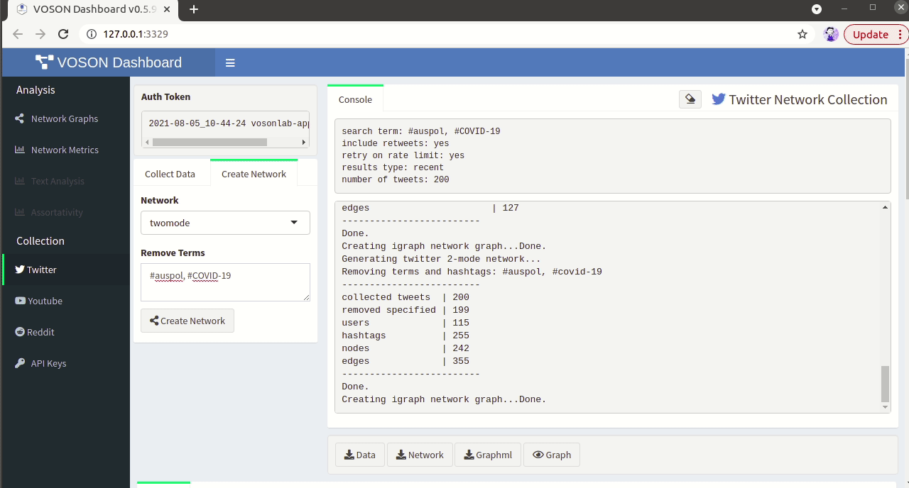

```{r setup, include=FALSE}
knitr::opts_chunk$set(echo = FALSE)
```


This guide provides a practical demonstration for collecting [Twitter](https://twitter.com/home) data and constructing networks, using VOSON Lab's interactive [R/Shiny](https://shiny.rstudio.com/) app [VOSONDash](http://vosonlab.net/voson-dashboard). 

The [GitHub page](https://github.com/vosonlab/VOSONDash) provides instructions to install and run VOSONDash. More information on features can be accessed in the [VOSONDash Userguide](https://vosonlab.github.io/VOSONDashDocs/)[@VOSONDash2020-M].

## Collecting Twitter data

Twitter collection require authentication with `OAuth1.0` API keys, provided via Twitter Developer account. Simply, enter the fields in the `API Keys` window in VOSONDash. The token can be saved to disk for future use. 

In this example, data were collected on 6 December 2021 and include 200 recent tweets with the hashtags #auspol and #COVID-19 (Fig. 1). 


## Twitter networks

VOSONDash -- via `vosonSML`-- provides four types of Twitter networks for analysis:

- *Activity networks* -- where nodes represent tweets and edge types are: replies, retweets and quoted retweets. In this example, there are 225 nodes (excluding isolates) and 200 edges (including multiple edges and loops).

- *Actor networks* -- where nodes represent users who have tweeted, or else are mentioned or replied to in tweets. Edges represent interactions between Twitter users, and an edge attribute indicates whether the interaction is a mention, reply, retweet, quoted retweet or self-loop. In this example, there are 212 nodes and 213 edges (including multiple edges and loops).


- *Two-mode networks* -- where nodes are actors (Twitter users) and hashtags, and there is an edge from user i to hashtag j if user i authored a tweet containing hashtag j. In this example, we have removed the hashtags we used in our collection #auspol and #COVID-19. The resulting network has 242 nodes and 213 edges. When clicking on `Label attribute`, we can observe hashtags and handles used in those tweets.


- *Semantic networks* -- where nodes represent entities extracted from the tweet text: common words, hashtags and usernames. Edges reflect co-occurrence of terms. In this example, we have removed the terms #auspol and #COVID-19, and set the parameters to include 5% most frequent words and 50% most frequent hashtags. The resulting network has 55 nodes (excluding isolates), and 127 edges. `Label attribute` option displays terms in network visualisation.



To learn more about VOSONDash network and text analysis features, see our previous post [Analysing online networks with VOSONDash](https://vosonlab.github.io/posts/2021-08-06-analysing-online-networks-with-vosondash/).


