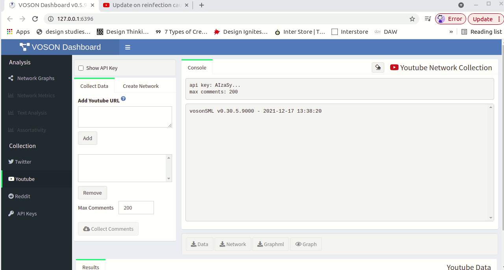

```{r setup, include=FALSE}
knitr::opts_chunk$set(echo = FALSE)
```

This guide provides a practical demonstration for collecting comments from YouTube videos, and constructing networks, using the VOSON Lab's interactive [R/Shiny](https://shiny.rstudio.com/) app [VOSONDash](http://vosonlab.net/voson-dashboard). 

The [GitHub page](https://github.com/vosonlab/VOSONDash) provides instructions to install and run VOSONDash. More information on features can be accessed in the [VOSONDash Userguide](https://vosonlab.github.io/VOSONDashDocs/)[@VOSONDash2020-M].

## Collecting YouTube data

As for Twitter, YouTube collection requires API keys, which are provided via the Google API console. Similarly, we enter the key in the `API Keys` window, `YouTube` tab in VOSONDash and the token can be saved to disk for future use. 

In this example, we are collecting comments from a YouTube video titled [*Update on reinfection caused by Omicron variant*](https://www.youtube.com/watch?v=qwUF-n3lJOc), which was uploaded by the World Health Organization (WHO) on 5th December 2021 and had attracted 182 comments at the time of data collection (17 December 2021).

## YouTube networks

VOSONDash (via `vosonSML`) provides two types of YouTube networks:

- *Activity networks* -- nodes are either comments or videos (videos represent a starting comment), and edges are interactions between comments. In this example, there are 81 nodes and 119 edges. The most central node is the initial post, which receives 100 comments.

- *Actor networks* -- nodes are users who have commented on videos and the videos themselves are included in the network as special nodes. Edges are the interactions between users in the comments. We can distinguish a top-level comment, which is a reply to the initial post (video), and  “reply to a reply”, when users mention the username of the person that they are replying to. The most central node is the initial post, which receives 110 comments.



The Blog post [*Analysing online networks with VOSONDash*](https://vosonlab.github.io/posts/2021-08-06-analysing-online-networks-with-vosondash/) provides more detail into features for network analysis, network visualisation and text analysis.
