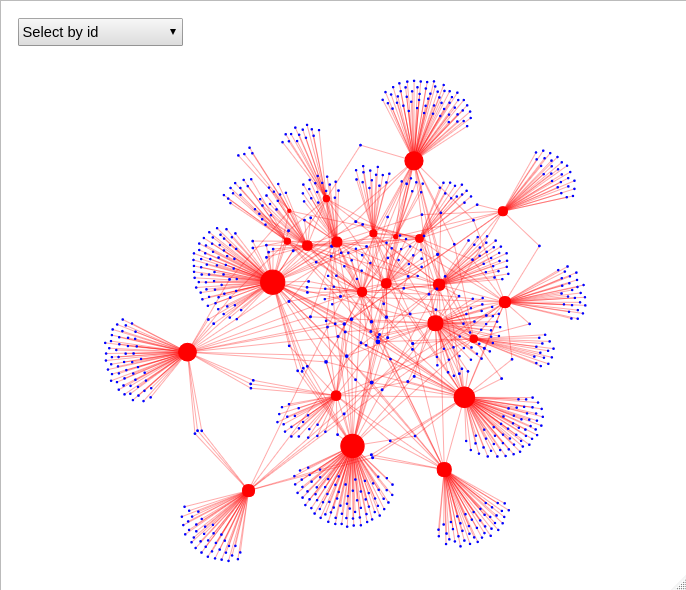

```{r setup, include=FALSE}
knitr::opts_chunk$set(echo = FALSE)
```

## Introduction
Our previous [post](https://vosonlab.github.io/posts/2022-06-05-egocentric-networks-from-twitter-timelines/) covered the methodological steps to construct Twitter ego-networks of timeline data, using `rtweet` and `vosonSML` packages. In this post, we would like to extend the application of such method, this time collecting ego-network data with `vosonSML` and use the data as a way to identify relevant 'alters'. This approach follows a similar logic to the hyperlink collection, i.e. providing an initial set of seed Twitter accounts (egos), collect their timelines, identify important alters, and merge them into a single network of twitter activity.

## Identifying Indigenous advocacy groups on twitter
This collection is part of an interdisciplinary approach to study Indigenous governance networks, which includes methods derived from ethnography and social network analysis. A previous step of this research involved studying an Indigenous alliance negotiating and exercising land rights: the [10 Deserts Project](https://10deserts.org/) ^[For this preliminary research, we did not consult directly with the 10 Deserts Alliance. Rather, it was an initial exploration of publicly available information (websites and Twitter data)]. In that piece, we collected website data from partner organisations, conducted text analysis, and constructed socio-semantic networks.

In a similar manner, this example will focus on identifying networks of Indigenous Australia advocacy groups on Twitter. Such groups tend to have strong social media presence and to be actively engaged in this space. Ego-network timeline collection is used as a way to grow the sample, through identifying important actors among the alters.

## Twitter accounts representing Indigenous advocacy groups

Starting from `@CountryNeedsPpl`, a conservation/advocacy partner of the 10 Desert Alliance, a total of eight Twitter accounts were initially identified as 'similar', some of them representing advocacy groups, some representing RNTBCs (Registered Native Title Body Corporate). Individuals, government and conservation organisations were excluded.
 
If you have your own API access, the `vosonSML` `Collect` function can be used with the
`endpoint = "timeline"` parameter. The first step involves API authentication. If you do not have API access, you can collect Twitter timeline data using `rtweet`, following the steps provided in  [this blogpost](https://vosonlab.github.io/posts/2022-06-05-egocentric-networks-from-twitter-timelines/).

```{r, echo = TRUE, eval = FALSE}
library(dplyr)
library(DT)
library(rtweet)
library(vosonSML)
library(igraph)

# twitter authentication creates an access token as part of the auth object
auth_tw_bearer <- Authenticate("twitter", bearerToken = "XXXX")

# save the object to file after authenticate
saveRDS(auth_tw_bearer, file = "~/.auth_tw_bearer")

# or read a previously saved vosonSML twitter auth object
auth_twitter <- readRDS("~/.auth_tw_bearer")
```

Then, we create an R object including all seed accounts, and proceed to collect their timeline data: 100 most recent tweets. For reference, this collection was run on the 2nd of September, 2022.

```{r, echo = TRUE, eval = FALSE}
# Create R object with seed accounts
accs <- c("CountryNeedsPpl","KLC1978","IndigLandSea","KJMartu","EnviroKimberley","OurMobOnCountry","VoiceMakarrata","SeedMob")

#collect timeline tweets (100) from accounts object 
ego_tweets <- auth_twitter |>
  Collect(
    endpoint = "timeline",
    users = accs,
    numTweets = 100,
    verbose = TRUE
  )

#Collecting timeline tweets for users...
#Requested 800 tweets of 150000 in this search rate limit.
#Rate limit reset: 2022-09-02 00:28:49

#tweet        | status_id           | created            
#--------------------------------------------------------
#Latest Obs   | 1565118028949250048 | 2022-08-31 23:23:11
#Earliest Obs | 1152043117794582528 | 2019-07-19 02:30:57
#Collected 797 tweets.
#Done.

#Save the raw data 
saveRDS(ego_tweets, "ego_tweets.rds")
```

The raw data `ego_tweets` is a list containing two data frames (tibbles). We saved this file as we will be merging with the following collection (important alters).

Now, we can create the `vosonSML` network object. In this case, we are creating an *Actor network* where nodes are Twitter users representing Indigenous advocacy organisations and groups, and edges are twitter interactions (tweet mention, tweet, retweet, reply mention, reply, quote mention, and quote). 

```{r, echo = TRUE, eval = FALSE}

#create the vosonSML network object for ego net
ego_net <- ego_tweets |> Create("actor", verbose = TRUE)


#Generating twitter actor network...
#-------------------------
#collected tweets | 797
#tweet mention    | 160
#tweet            | 417
#retweet          | 260
#reply mention    | 97 
#reply            | 73 
#quote mention    | 29 
#quote            | 47 
#nodes            | 332
#edges            | 1083
#-------------------------
#Done.
```

The actor network has 332 nodes and 1,083 edges. Now, we can create an igraph object, where we can identify egos (in red) and alters (in blue).

```{r, echo = TRUE, eval = FALSE}
#create igraph network, where egos are red and alters are blue
g <- ego_net |> Graph()
ind <- which(degree(g, mode="out")>0)
V(g)$color <- "blue"
V(g)$color[ind] <- "red"
plot(g, vertex.label="")

# optional - test the network data by outdegree
sort(degree(g, mode="out"), decreasing = TRUE)[1:20]

#optional - test the network data by indegree
ind <- order(degree(g, mode="out"), decreasing = TRUE)[1:20]
V(g)$screen_name[ind]
```

To identify important alters from the network, we will first filter the accounts to those alters (blue) with indegree greater than 2. The indegree threshold can be set to any meaningful value. Then, we save a `.csv` file where we manually identify and code important alters following our sampling criteria, i.e. those Twitter accounts representing Indigenous advocacy groups.

```{r, echo = TRUE, eval = FALSE}
#identify "important" alters, i.e. indegree > 2, and blue=alters
ind <- which(degree(g, mode="in")>2 & V(g)$color=="blue")

#write "important" alters to file
write.csv(V(g)$screen_name[ind], "important_alters.csv")

#read in the coded important alter file
df <- read.csv("important_alters_coded.csv", header=FALSE)

# get list of important alter user ids from network
#we have coded important alters with 1
df <- df[which(df$V3==1),]
imp_alter_user_ids <- V(g)$name[match(df$V2, V(g)$screen_name)]
```

Now, we collect the 100 most recent tweets from the important alters' timelines, and save the data to disk.

```{r, echo = TRUE, eval = FALSE}
#collect timeline tweets from alters accounts 
alter_tweets <- auth_twitter |>
  Collect(
    endpoint = "timeline",
    users = imp_alter_user_ids,
    numTweets = 100,
    verbose = TRUE
  )
#Save the raw data 
saveRDS(alter_tweets, "alter_tweets.rds")
```

Now, we merge the two raw datasets: `ego_tweets` and `alter_tweets`, with the vosonSML `merge` function, and then create an ego actor network.

```{r, echo = TRUE, eval = FALSE}
# combine all of the tweets from ego and alters timelines using vosonSML merge
tweets <- Merge(ego_tweets, alter_tweets)

# create actor network from combined timeline tweets
actor_net <- tweets |> Create("actor", verbose = TRUE) %>% AddText(tweets)

#Generating twitter actor network...
#-------------------------
#collected tweets | 2233
#tweet mention    | 741
#tweet            | 1199
#retweet          | 778
#reply mention    | 180
#reply            | 139
#quote mention    | 160
#quote            | 117
#nodes            | 775
#edges            | 3314
#-------------------------
#Done.

#create igraph network, where egos are red and alters are blue
g2 <- actor_net %>% Graph() 
V(g2)$color <-"blue"
V(g2)$color[which(degree(g2, mode="out")>0)]<-"red"
V(g2)$label <- paste0("@", V(g2)$screen_name)
visIgraph(g2)

#Optional network visualisation using visNetwork

library(visNetwork)

# combine and weight the edges between nodes
E(g2)$weight <- 1
g2 <- igraph::simplify(g2, edge.attr.comb = list(weight = "sum"))
g2 <- as.undirected(g2)


# map visual properties of graph to attributes
E(g2)$width <- ifelse(E(g2)$weight > 1, log(E(g2)$weight) + 1, 1.1)

V(g2)$size <- degree(g2) + 5
V(g2)$label <- paste0("@", V(g2)$u.screen_name)

visIgraph(g2, idToLabel = FALSE) |>
  visIgraphLayout(layout = "layout_with_fr") |>
  visOptions(
    nodesIdSelection = TRUE,
    highlightNearest = TRUE
  )
```

The resulting network contains 775 nodes and 3,314 edges. Red nodes represent initial seeds (8) and important alters (15 accounts, which have been used as seeds); and blue nodes represent their alters. 




