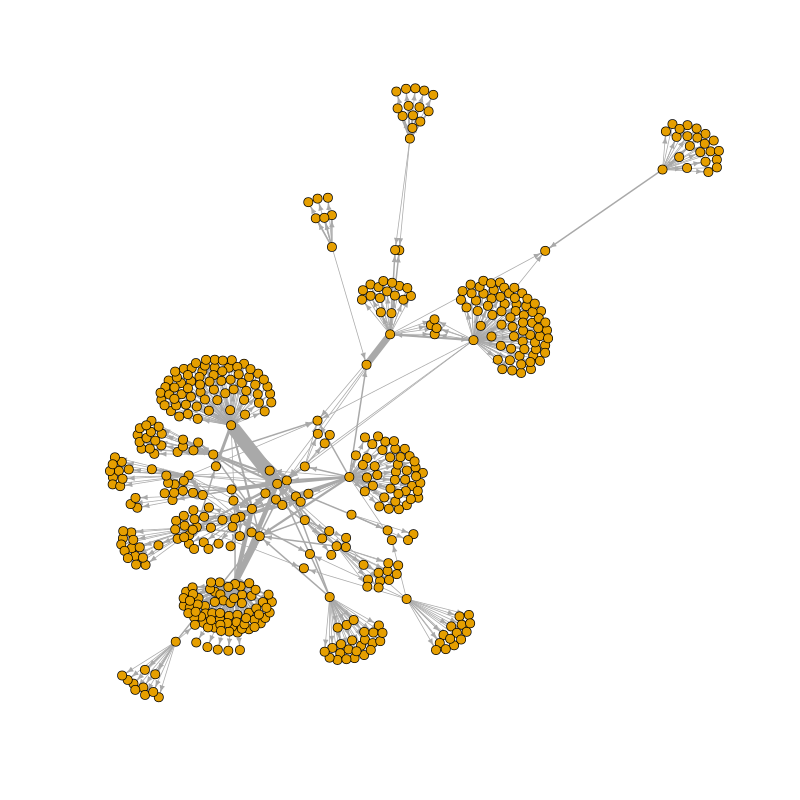
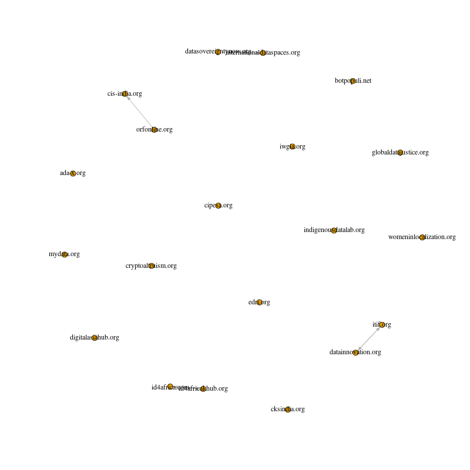
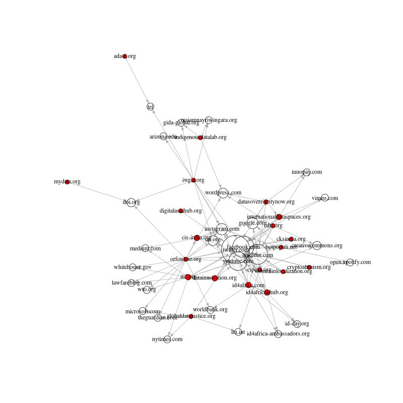
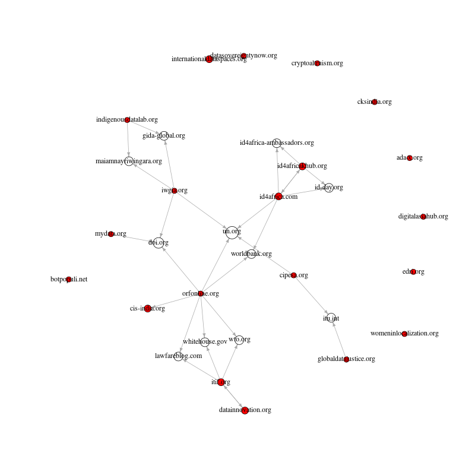

```{r setup, include=FALSE}
knitr::opts_chunk$set(echo = TRUE)
```

## 1. Introduction

The VOSON software web app -- first made publicly available in 2006 -- was a tool designed to enable researchers to study Web 1.0 websites as online social networks [@Ackland2010; @AcklandONeil2011; @Lusher2011; @Ackland2013]. The canonical VOSON hyperlink collection was [reintroduced in 2021 in vosonSML)](https://vosonlab.github.io/posts/2021-03-15-hyperlink-networks-with-vosonsml/) and it was made available in [VOSONDash version 0.6.1](https://github.com/vosonlab/VOSONDash) in February 2023. This post provides the methodological steps and code for collecting hyperlink data using `vosonSML` and pre-processing hyperlink network data via R, including the specific approaches that were previously available via VOSON software web app (pruning, preserving and pagegrouping). 

## 2. Collecting hyperlink data via web crawling

### 2.1 The seed set
The organisations represented in this collection are a sample of non-state or non-government entities (for-profit and non-for-profit), which actively engage in 'data sovereignty' debates as part of their concern in contemporary data politics. These organisations include NGOs, research think tanks, companies, industry associations, and movements or initiatives from communities. These different group of organisations deal with various issues and values when promoting their agenda ranging from security, privacy, innovation, entrepreneurship, to human rights and social justice.

Being involved in the emerging issues of global data politics, these organisations are based or headquartered in different countries across the globe including the US, UK, Canada, Germany, The Netherlands, Belgium, and Denmark -- which represent the Global North -- and South Africa, India and Hong Kong, representing the Global South. The websites are being used by these organisations to participate in the emerging debates on data politics. Their participation in the debates are becoming more intense in the midst of the ongoing process of massive 'digitisation' and 'datafication' in societies. We have selected 1 or 2 pages from each website and are using these as "seed pages" i.e. starting points for the crawler. In this way, we are directing the crawler to the pages we think will be most "productive" in terms of containing hyperlinks and text that are of interest to the study.

### 2.2 Data collection

The first step involves the collection of hyperlink data using [vosonSML](https://github.com/vosonlab/vosonSML). To do so, we read a `.csv` file which includes the URLs of 20 organisations actively involved in data sovereignty debates and we create a dataframe containing those pages as seeds. 

```{r}
library(magrittr)             #only need to load this if we use %>% as pipe, otherwise can use |>
library(vosonSML)
library(igraph)
library(dplyr)
library(knitr)
library(stringr)

#For more information on collecting hyperlink networks using vosonSML, see: #https://vosonlab.github.io/posts/2021-03-15-hyperlink-networks-with-vosonsml/.

# The dataframe needs to have the folllowing fields, for hyperlink collection via vosonSML:
# page: the seed pages
# type: the type of crawl, with allowed values:
#   int: collect all hyperlinks but only follow links that have same domain as seed page (internal)
#   ext: collect all hyperlinks but only follow links that have different domain as seed page (external)
#   all: collect and follow all hyperlinks
# max_depth: how many levels of hyperlinks to follow from seed page
#For example:
#pages <- data.frame(page = c("http://vosonlab.net",
#                             "https://rsss.cass.anu.edu.au",
#                             "https://www.ansna.org.au"),
#                    type = c("int", "ext", "all"),
#                    max_depth = c(1, 1, 1))

pages <- read.csv("seed_sites_20.csv")
kable(head(pages))

#remove pages that caused error with crawler
pages <- pages %>% filter(!grepl("ispa.org.za", pages$page))
```

Note that for the crawler all we need is a data frame with three columns: page (URLs), type (`int`), max_depth (1). See code commented above for an explanation of these terms and also see the [VOSON Lab blog post on crawling using vosonSML](https://vosonlab.github.io/posts/2021-03-15-hyperlink-networks-with-vosonsml/)) for detail steps. It might be useful to include other meta data in this file that is used in analysis later, for example the field `Country` as presented in the table above. 

Now, we run the crawl and save an `.rds` file with the data:

```{r, eval=FALSE}
#Remember to set `verbose=TRUE` to see the crawler working
crawlDF <- Authenticate("web") %>% Collect(pages, verbose=TRUE)
#crawlDF

#We will save this dataframe, for use later
#saveRDS(crawlDF, "crawlDF.rds")
saveRDS(crawlDF, "crawlDF_20_sites_depth1.rds")
```

## 3. Creating hyperlink networks

Let's now create networks from the crawl data. First, we read in and inspect the dataframe structure. This data contains 2,826 rows and 9 columns.

```{r}
crawlDF <- readRDS("crawlDF_20_sites_depth1.rds")

# explore dataframe structure
glimpse(crawlDF)
```

### 3.1 Activity network
First, we create the activity network using `vosonSML`. In hyperlink activity networks, the nodes are web pages and edges are hyperlinks. For the purpose of visualisation, we will simplify the network by removing loops and multiple edges (weighted edges), using `igraph`.

```{r}
# create activity network: nodes are pages hyperlinks were collected from
net_activity <- crawlDF %>% Create("activity")
g_activity <- net_activity %>% Graph()
#simplify the network - remove loops and multiple edges
g_activity <- simplify(g_activity)

```

```{r, eval=FALSE}
png("activity_network.png", width=800, height=800)
plot(g_activity, layout=layout_with_fr(g_activity), vertex.label="", vertex.size=3, edge.width=1, edge.arrow.size=0.5)
dev.off()
```


We can see from the visualisation that the hyperlink activity network consists of a number of connected components (sets of nodes that are connected either directly or indirectly).  We can look further at these clusters or components.

```{r}
cc <- components(g_activity)
str(cc)
summary(cc$csize)
```

The above indicates we have `r length(cc$csize)` weakly-connected components, and these range in size from `r min(cc$csize)` nodes to `r max(cc$csize)` nodes.  It is not unexpected that the hyperlink activity network is quite disconnected since two seed pages $i$ and $j$ will only be directly connected if they link to each other and they will be indirectly connected if they link to the same third page. 

### 3.2 Actor network
Now, we will create the actor network using `vosonSML`. With hyperlink actor networks, the nodes are web domains (in this document we use "site" and "domain" interchangeably) and edges are hyperlinks between them. Again, for the purpose of visualisation, we will simplify the network by removing loops and multiple edges (weighted edges).  Multiple edges can arise because multiple pages within a domain can link to the same or multiple pages within another domain.  We will also create an edge weight field ("weight") to store this information on multiple links between domains.

```{r}
# create actor network: nodes are site domains of pages hyperlinks were collected from
net_actor <- crawlDF %>% Create("actor")
g_actor <- net_actor %>% Graph()
vcount(g_actor)
ecount(g_actor)
#simplify the network - remove loops and multiple edges
#we will also create an edge attribute "weight"
E(g_actor)$weight <- 1
g_actor <- simplify(g_actor)
ecount(g_actor)

```

```{r, eval=FALSE}
png("actor_network.png", width=800, height=800)
plot(g_actor, layout=layout_with_fr(g_actor), vertex.label="", vertex.size=3, edge.width=E(g_actor)$weight, edge.arrow.size=0.5)
dev.off()
```


```{r}
cc <- components(g_actor)
str(cc)
```

The actor network has `r vcount(g_actor)` nodes and `r ecount(g_actor)` edges.  The above indicates we have a single (weakly-connected) component: with hyperlink actor networks seeds are more likely to be connected to one another (either directly or indirectly) as they only need to link to a common domain.

## 4. Processing nodes in the hyperlink actor network

For the rest of this exercise, we will use the actor network.  We will now look at three approaches for processing hyperlink network data: pagegrouping, pruning, and preserving.

### 4.1 Pagegrouping

Pagegrouping refers to merging nodes within a hyperlink network. A common example of a situation where you may want to apply pagegrouping is when you would like to ensure that a subdomain node is not shown separately in the network i.e. it is merged with its domain node.  For example, we might want to merge `www.anu.edu.au` with `anu.edu.au` (or rename `www.anu.edu.au` to `anu.edu.au` if the latter does not already exist).  It should be noted that whether this pagegrouping is enacted is dependent on the research setting: it might be the case that you want to keep particular subdomains separate to their parent domain.  For example we might want `rsss.anu.edu.au` or `cass.anu.edu.au` to be separate nodes, and not merged with `anu.edu.au`.

There are two approaches we can used to undertake pagerouping: (1) operating on the `vosonSML` network object (that is then used to create the `igraph` graph object); (2) operating on the `igraph` graph object.  In this document we will demonstrate method (2).

#### 4.1.1 Merging the "www" subdomain into a canonical domain

First, we are going to consolidate nodes into a single canonical domain.  This will involve stripping "www" from www.x.y if only www.x.y exists and if both www.x.y and x.y exist then the former will be merged into the latter.  Note that the following code also works if the canonical domain contains three or more parts e.g. x.y.z.  Also note that the following step will only modify the www subdomain (e.g. www.x.y): other subbdomains (e.g. othersub.x.y) are handled below.

Let's focus on an example present in this dataset:

```{r}
g <- g_actor             #easier to write code

V(g)$name[grep("mydata.org", V(g)$name)]

```

This first step will involve merging www.mydata.org into mydata.org.

```{r, eval=TRUE}
g <- g_actor             #easier to write code

#create vector of the sites that start with "www"
t2 <- 1
www_sites <- V(g)$name[grep("^www\\.", V(g)$name)]
for (c in www_sites){

  #cat("working on:", c, "\n")
  if (t2%%100==0)
    cat("Finished working on", c, "(", t2, "of", length(www_sites), ")\n")

  ind_i <- grep(paste0("^",c,"$"), V(g)$name)
  i <- str_remove(c,"^www.")
  
  #if (c=="www.mydata.org")
  #  break
  #next
  #print(i)
  #print(V(g)$name[grep(i, V(g)$name)])
  #num_parts <- str_count(c, "\\.")
  #print(num_parts)
  #ind <- grep(paste0(i,"$"), as.character(V(g)$name))
  #ind <- grep(paste0("\\.",i,"$"), as.character(V(g)$name))
  #this is a hack...want to match on ".abc.com" or "abc.com"
  #ind <- union(grep(paste0("\\.",i,"$"), as.character(V(g)$name)), grep(paste0("^",i,"$"), as.character(V(g)$name)))
  
  ind <- grep(paste0("^",i,"$"), as.character(V(g)$name))

  if (!length(ind)){     #there is only the "www" version, just rename node to domain
    V(g)$name[ind_i] <- i
    t2 <- t2 + 1
    next
  }
    
  #Otherwise, we have two versions: www.x.y and x.y: merge these
  #Note we will deal with situation where we have e.g. othersubdomain.x.y below
  
  ind <- sort(c(ind_i, ind))
  #ind <- sort(ind)
  #print(ind)

  #if (length(ind)>1)
  #  break
    
  #merging nodes involves creating a map of vertices e.g. if we have 5 vertices 
  #and want to merge nodes 1 and 2 and also merge nodes 3 and 4 the map needs to be:
  #1 1 2 2 3
  #i.e. nodes 1 and 2 become node 1, nodes 3 and 4 become node 2, and node 5 becomes node 3
  map_i <- 1:ind[1]
  t <- ind[1]+1
  for (j in (ind[1]+1):vcount(g)){
    #print(j)
    if (j %in% ind){     #node to merge 
      map_i <- c(map_i, ind[1])
    }else{               #not node to merge
      map_i <- c(map_i, t)
      t <- t + 1
    }
  }
  
  #need to use vertex.attr.comb="first" or else get weird lists in attribute
  #and it messes things up.  Replaced anyway...
  g <-contract(g, map_i, vertex.attr.comb="first")
  V(g)$name[ind[1]] <- i                #rename the node to the non-www version
  
  t2 <- t2 + 1
  
}

#We have reduced the number of nodes from:
vcount(g_actor)
#to
vcount(g)

```

#### 4.1.2 Merging other subdomains into the canonical domain

Now have only a single canonical version of the mydata.org domain, but there are still two subdomains (other than www).

```{r}
V(g)$name[grep("mydata.org", V(g)$name)]
```

In this next step, we will merge all remaining subdomains into the canonical domain. However, there might be examples of subdomains that we want "preserved" (not merged into the canonical domain); they should be specified in advance. A good example is websites created using Wordpress.

```{r}
V(g)$name[grep("wordpress.com", V(g)$name)]
```

If we don't "preserve" these Wordpress websites (which are run by different organisations or groups) then, they will all be merged into a single node Wordpress.com.

We will implement two types of preserving: (1) preserve specific subdomains, (2) preserve all subdomains via a wildcard match.

In the example below we will preserve specific Wordpress subdomains (and the rest will be merged into the canonical domain wordpress.com) and we will preserve all subdomains for mydata.org.

A final point to note is that the "wildcard" approach to preserving subddomains (what we are doing for mydata.org) will only work if mydata.org exists in the network. From the following, we can see that mydata.org exists, but fraunhofer.de does not exist.

```{r}
V(g)$name[grep("mydata.org", V(g)$name)]
V(g)$name[grep("fraunhofer.de", V(g)$name)]
```

If the canonical domain doesn't exist, as in the case of fraunhofer.de, then we need a separate process to undertake pagegrouping.  We do this for fraunhofer.de in the section on "custom merging" below.


```{r, eval=TRUE}
#vector containing the information for preserving subdomains
#we would most likely store this as a csv file with notes on choices made
preserve <- c("*mydata.org", "coporwa1en.wordpress.com", "institutdayakologi.wordpress.com",
              "indigenousdatalab.wordpress.com")

for (i in V(g)$name){

  #cat("working on:", i, "\n")
  ind_i <- which(V(g)$name==i)
  
  #want to match only on ".x.y" not "x.y"
  ind <- grep(paste0("\\.",i,"$"), as.character(V(g)$name))
  
  #skip any subdomains that are to be preserved
  ind_g <- grep(i, preserve)
  for (j in ind_g){
    if ( grepl("^\\*",preserve[j]) ){        #wildcard, skip all subdomains
      ind <- NULL
      break
    }else{
      ind_rem <- which(V(g)$name==preserve[j])
      ind <- ind[-which(ind==ind_rem)]
    }
  }
      
  if (!length(ind))              #there is no subdomain(s)
    next

  cat("working on:", i, "\n")
  
  #We have one or more subdomains

  print(V(g)$name[ind])

  ind <- sort(c(ind_i, ind))
  print(ind)

  map_i <- 1:ind[1]
  t <- ind[1]+1
  for (j in (ind[1]+1):vcount(g)){
    #print(j)
    if (j %in% ind){     #node to merge
      map_i <- c(map_i, ind[1])
    }else{               #not node to merge
      map_i <- c(map_i, t)
      t <- t + 1
    }
  }
  
  g <-contract.vertices(g, map_i, vertex.attr.comb="first")
  V(g)$name[ind[1]] <- i

}

#We have reduced the number of nodes from:
vcount(g_actor)
#to
vcount(g)

```

The following shows that the correct subdomains have been preserved.  The two subdomains of mydata.org have been preserved.

```{r}
V(g)$name[grep("mydata.org", V(g)$name)]
```

We have preserved three subdomains of wordpress.com, and the rest have been merged into the canonical domain.

```{r}
V(g)$name[grep("wordpress.com", V(g)$name)]
```

#### 4.1.3 Custom merging of domains

The above code showed how to merge subdomains "in bulk", and we also showed how to control this merging by "preserving" subdomains.  But we might need to undertake an additional step for merging domains and subdomains.  When an organisation uses two or more websites, it might be desirable to merge the relevant domains into a single node in the actor network.  The following approach also takes account of the situation we found above for fraunhofer.de: the bulk merging did not work because the canonical domain fraunhofer.de doesn't yet exist in our hyperlink actor network.

The following code does this with reference to the following examples:

```{r}
V(g)$name[grep("womeninlocalization", V(g)$name)]
V(g)$name[grep("fraunhofer", V(g)$name)]
V(g)$name[grep("undocs|undp|uneca|unpo|unhcr|unstats|unwomen|unesco|un\\.org", V(g)$name)]
```

As with the above, this step involves pre-specification of how the sites are to be merged.  We will use a wildcard to merge the two womeninlocalization sites. We will also bulk merge subdomains of fraunhofer.de, preserving two subdomains.  Finally, we will merge selected domains from the UN into a canonical domain un.org. Note that in the case of fraunhofer and the UN, the decision of exactly which subdomains and domains to merge is arbitrary: this is just for purposes of showing example code.

```{r, eval=TRUE}

#vector containing the information for preserving subdomains
#we would most likely store this as a csv file with notes on choices made
preserve <- c("dataspaces.fraunhofer.de","medical-data-space.fraunhofer.de")

#the above process of merging subdomains will only work if there was www.x.y in the original dataset
#if this is not the case, and want to merge subdomains using a wildcard, then specify the canonical domain here
#note that here we use a dataframe with the first column being the canonical domain (what other domains/subdomains will be merged into), and subsequent columns are the other domains/subdomains.  If only the first column is specified, then a bulk merge will be undertaken
#There are two types of merge below:
# (1) bulk merge: this is when there is only one column in the data frame, the canonical domain.  This domain needs to be contained in the subdomains that are to be merged
# (2) bespoke merge: this is when the first column contains the domain which all the other subdomains/domains will be merged into.  Note that this domain does not even need to exist in the hyperlink actor network
#the following will only work if the canonical domain is contained in at least one 
#Note that this would normally be stored in csv file
ex1 <- data.frame(V1="womeninlocalization.org", V2="womeninlocalization.com")    #bespoke merge
ex2 <- data.frame(V1="fraunhofer.de")                                            #bulk merge
ex3 <- data.frame(V1="un.org", V2="en.unesco.org", V3="lac.unwomen.org", V4="undocs.org", V5="unstats.un.org", V6="undp.org", V7="uneca.org")         #bespoke merge
mergeDF <- bind_rows(ex1, ex2, ex3)
#note that we preserve particular subdomains of fraunhofer.de by including in preserve above

#seems most efficient to iterate over nodes first, rather than iterating over merges first
for (i in V(g)$name){
  
  #cat("working on:", i, "\n")
  ind_i <- which(V(g)$name==i)

  for (m in 1:nrow(mergeDF)){
    col1 <- mergeDF[m,1]
    othcol <- NULL
    for (m2 in 2:ncol(mergeDF)){
      if ( !is.na(mergeDF[m,m2]) )
        othcol <- c(othcol, mergeDF[m,m2])
      else
        break
    }
    #print(col1)
    #print(othcol)

    if (is.null(othcol))                 #bulk match - grep match on first col
      ind_g <- grep(col1,i)              #should search on ".[pattern]"
    else
      ind_g <- match(i,othcol)           #exact match on othcol

    if (!length(ind_g))
      ind_g <- NA
      
    if (!is.na(ind_g))                   #we have a match
      break
  }

  if (is.na(ind_g))        #no merging for this node
    next
    
  #we are going to merge only node i (this is different to the above code)
    
  #break
  
  #but first check that this node is not to be preserved
  #can be exact match for this
  if (!is.na(match(i, preserve))){
    cat(i, "is to be preserved\n")
    next
  }
  
  #Also check that the node we are merging is not the same as the node we are merging to i.e. not merging
  #fraunhofer.de -> fraunhofer.de
  if (i==col1){
    cat(i, ", trying to merge node with itself...\n")
    next
  }
    
  #break
  
  cat(i, "merged to", col1, "\n") 

  #next we check if the node that i is being merged with even exists
  #if it doesn't then we just rename i, and we are done
  dom_match <- match(col1, V(g)$name)
  if (is.na(dom_match)){
    V(g)$name[ind_i] <- col1
    cat("renaming", i, "to", col1, "\n")
    next
  }
   
  #break
  
  #the following will only have two nodes in it, but use it so can re-use code from above
  ind <- sort(c(ind_i, dom_match))
  
  #break
  
  map_i <- 1:ind[1]
  t <- ind[1]+1
  for (j in (ind[1]+1):vcount(g)){
    #print(j)
    if (j %in% ind){     #node to merge
      map_i <- c(map_i, ind[1])
    }else{               #not node to merge
      map_i <- c(map_i, t)
      t <- t + 1
    }
  }
  
  g <-contract.vertices(g, map_i, vertex.attr.comb="first")
  V(g)$name[ind[1]] <- col1
  
}

#We have reduced the number of nodes from:
vcount(g_actor)
#to
vcount(g)

```

The following confirms that the merges have taken place correctly.

```{r}
V(g)$name[grep("womeninlocalization", V(g)$name)]
V(g)$name[grep("fraunhofer", V(g)$name)]
V(g)$name[grep("undocs|undp|uneca|unpo|unhcr|unstats|unwomen|unesco|un\\.org", V(g)$name)]
```


### 4.2 Pruning

Pruning refers to removing nodes that are considered not relevant to the analysis.  It is highly likely that the web crawler will pick up pages that are not relevant to the study, and so we use pruning to identify and remove these irrelevant pages.

#### 4.2.1 Creatng the network containing just the seed sites

We will first create an actor network containing just the seed sites: in effect we are "pruning" non-seed sites. To start with, we need to identify what are the seed sites: we do this using the `pages` dataframe we created above for the web crawl.  Recall that the `pages` dataframe contains *web pages* that we have crawled, but the hyperlink actor network contains *websites (or domains)*.  So we need to process the `pages` dataframe so as to identify what are the seed sites (not seed pages).

```{r}

# identify the seed pages and set a node attribute
# we are also removing http tag and trailing forward slash
seed_sites <- pages %>%
  mutate(site = str_remove(page, "^http[s]?://"), seed = TRUE)
# also remove trailing "/"
seed_sites <- seed_sites %>%
  mutate(site = str_remove(site, "/$"))

#The following will return just the domain name
a <- str_match(seed_sites$site, "(.+?)/")
seed_sites$site <- ifelse(grepl("/", seed_sites$site), a[,2], seed_sites$site)

#remove redundant column "page" and also user-created column "domain" (to avoid confusion, since not using)
#and put "site" colum first
seed_sites <- seed_sites %>% select(-c(page,domain)) %>% relocate(site)

seed_sites <- seed_sites %>% distinct(site, .keep_all=TRUE)

kable(head(seed_sites))

nrow(seed_sites)

```

We have created a dataframe `seed_sites` which contains the domains extracted from the seed pages used for crawling - this is stored in the column `site`. We have created a column `seed` and set this to TRUE (this will be used below when we use this dataframe to identify seed sites in the hyperlink actor network).   Note that there was also a column `domain` but this was manually created at the time the seed pages were identified (in the same way that the column was `country` was manually created);  we do not make use of that column in what follows, and so we removed it from the `seed_sites` dataframe.

Before proceeding, we need to first make some modifications to the `seed_sites` dataframe.  The pagegrouping step above means that we no longer have the "www" subdomain present in the hyperlink actor network, and so we need to modify `seed_sites` by stripping "www" from the seed sites stored in the column `site`.  Also, the pagegrouping means that we no longer have womeninlocalization.com in the network, so we need to change the seed site to womeninlocalization.org.

```{r}
seed_sites <- seed_sites %>% mutate(site=gsub("^www\\.","",site))

seed_sites$site[which(seed_sites$site=="womeninlocalization.com")] <- "womeninlocalization.org"

seed_sites <- seed_sites %>% distinct(site, .keep_all=TRUE)

kable(head(seed_sites))

nrow(seed_sites)
```

So we have `r nrow(seed_sites)` seed sites and we are now ready to create the "seeds only" hyperlink network.  To do this, we will create a node attribute "seed" which indicates whether a site is a seed or not.

```{r}
V(g)$seed <- seed_sites$seed[match(V(g)$name, seed_sites$site)]

table(V(g)$seed)
```

The above indicates that there are now 20 nodes in the network with the attribute `seed` equal to 1 (the rest have values of NA), so we have correctly identified our seed sites in the network.  We can now visualise the seeds only hyperlink network.

```{r}
#for the remainder of this exercise we will work with the simiplified network
#simplify the network - remove loops and multiple edges
E(g)$weight <- 1
g <- simplify(g)

g_seeds <- induced.subgraph(g, which(V(g)$seed==1))
```

```{r, eval=FALSE}
png("seeds.png", width=800, height=800)
plot(g_seeds, vertex.label.color="black", vertex.size=3, edge.width=E(g_seeds)$weight, edge.arrow.size=0.5)
dev.off()
```



The above figure shows that the seed sites are very disconnected, with only four pairs of sites connected; this is to be expected given we have only crawled to depth 1 (i.e. only the seed page is crawled).  If we increased the crawl depth to 2, then it is to be expected that the seeds hyperlink network would become more connected.

#### 4.2.2 Creatng the network containing the seeds plus "important" non-seed sites

Next we will create the "seeds plus important" network: this contains the seed sites plus those other sites that are hyperlinked to by two or more seeds.

```{r}
g_seedsImp <- induced.subgraph(g, which(V(g)$seed==1 | (degree(g)>=2)))

#red nodes are seeds, blue nodes are importnant non-seeds
V(g_seedsImp)$color <- ifelse(V(g_seedsImp)$seed==1, "red", "blue")
```

```{r, eval=FALSE}
png("seeds_important.png", width=800, height=800)
plot(g_seedsImp, vertex.label.color="black", vertex.size=3+degree(g_seedsImp, mode="in"), edge.width=E(g_seedsImp)$weight, edge.arrow.size=0.5)
dev.off()
```


The above visualisation indicates that we now have a much more connected network, indeed it is fully-connected (no isolates) but a casual inspection indicates that many of the so-called "important" sites are probably not relevant to the analysis.  For example, the most central nodes are social media sites (e.g. twitter.com, youtube.com).  This brings us to the final step in the processing of the hyperlink data: manually pruning irrelevant sites.

#### 4.2.3 Manually pruning irrelevant sites

Whether a site is relevant to the research is something only the researcher will know, so this final step is necessarily a manual one.  We recommend that the "seeds plus important" network nodes are written to csv file, and then this csv file is manually coded so either the relevant sites are kept or the irrelevant sites are removed.  In the example below, we are keeping those sites that are deemed relevant.

```{r, eval=FALSE}
#write the sites to csv file, for manual coding
#also write seed status, since this will be used to determine whether a site is relevant
write.csv(data.frame(site=V(g_seedsImp)$name, seed=V(g_seedsImp)$seed), "seeds_plus_important.csv")
```

The sites are manually coded - a new column "keep" is created, with a 1 indicating that the site is either a seed or it is a relevant non-seed site.  The coded csv file is then used to create the new sub-network.


```{r}
df2 <- read.csv("seeds_plus_important_coded.csv")
V(g_seedsImp)$keep <- df2$keep[match(V(g_seedsImp)$name, df2$site)]
g_seedsImp2 <- induced.subgraph(g_seedsImp, which(V(g_seedsImp)$keep==1))

```

```{r, eval=FALSE}
png("seeds_important2.png", width=800, height=800)
plot(g_seedsImp2, vertex.label.color="black", vertex.size=3+degree(g_seedsImp2, mode="in"), edge.width=E(g_seedsImp2)$weight, edge.arrow.size=0.5)
dev.off()
```


The result is a graph presenting a connection or disconnection among organisations discussing 'data sovereignty' issues on the web. It shows that the debates interestingly place the already powerful institutions such as the UN and the World Bank at the center which makes them appear to be influential actors in the network of data sovereignty debates. Given their prominent positions in the network connecting otherwise separated organisations across countries or regions interested in data politics, it is interesting to gain insight into how organisations such as the UN and the World Bank impose their interest on data sovereignty agenda.

### 4.3 Preserving

We have already mentioned preserving of subdomains above (to prevent all subdomains being merged into a single node when pagregrouping is undertaken).  Another example of preserving is when we want to preserve sub-directories.  By default, `vosonSML` does not preserve sub-directories and so `www.example.com/subdir1` and `www.example.com/subdir2` would, by default, be merged to the node `www.example.com`.  Preserving these sub-directories would involve working with the activity network object returned by `vosonSML`:

```{r}
head(net_activity$edges)
```

It would be necessary to process the URLs in the `from` and `to` using similar techniques to those presented above e.g. converting URLs to the domain names, but preserving certain sub-directories.  Then the `vosonSML` `Create()` function can be used to create the igraph graph object.  We will not cover this in full here, but leave this for a future blog post.


