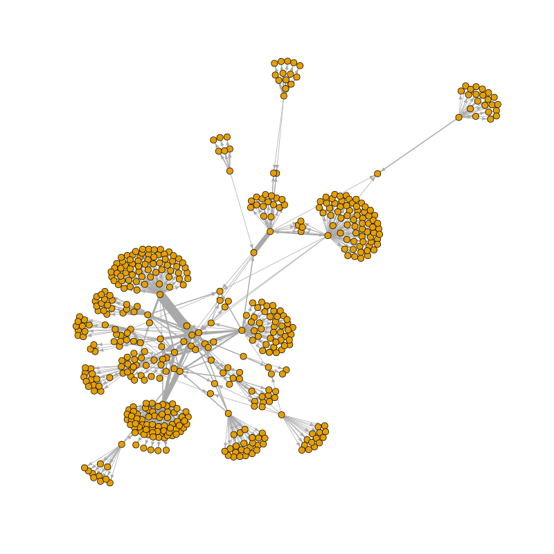

```{r setup, include=FALSE}
knitr::opts_chunk$set(echo = TRUE)
```

# 1. Collecting hyperlink data via web crawling

Let's first test out hyperlink collection.

We are going to use VOSON to collect hyperlinks.

First load the libraries.

```{r}
library(magrittr)
library(vosonSML)
library(igraph)
library(dplyr)
library(knitr)
library(stringr)

```

We create a dataframe containing the pages to be crawled.  We are reading a csv file with pages for 20 organisations. These organisations are samples of non-state or non-government entities (for-profit and non-for-profit) which actively engage in 'data sovereignty' debates as part of their concern in contemporary data politics. These organisations include NGO, research think thank, media, companies, industry associations, and movements or initiatives from communities. These different group of organisations deal with various issues and values when promoting their agenda ranging from security, privacy, innovation, entrepreneurship, to human rights and social justice.

Being involved in the emerging issues of global data politics, these organisations are based or headquartered in different countries across the globe include the US, UK, Canada, Germany, The Netherlands, Belgium, and Denmark which represent the Global North, and South Africa, India and Hong Kong representing the Global South. The websites are being used by these organisations to participate in the emerging debates on data politics. Their participation in the debates are becoming more intense in the midst of the ongoing process of massive 'digitisation' and 'datafication' in societies. We have chosen 1 or 2 pages from each website and are using these as "seed pages" where the crawler will start: in this way we are directing the crawler to the pages we think will be most "productive" in terms of containing hyperlinks and text that are of interest to the study.

```{r}

#For more information on collecting hyperlink networks using vosonSML, see:
#https://vosonlab.github.io/posts/2021-03-15-hyperlink-networks-with-vosonsml/

# The dataframe needs to have the folllowing fields, for hyperlink collection via vosonSML:
# page: the seed pages
# type: the type of crawl, with allowed values:
#   int: collect all hyperlinks but only follow links that have same domain as seed page (internal)
#   ext: collect all hyperlinks but only follow links that have different domain as seed page (external)
#   all: collect and follow all hyperlinks
# max_depth: how many levels of hyperlinks to follow from seed page
#For example:
#pages <- data.frame(page = c("http://vosonlab.net",
#                             "https://rsss.cass.anu.edu.au",
#                             "https://www.ansna.org.au"),
#                    type = c("int", "ext", "all"),
#                    max_depth = c(1, 1, 1))

pages <- read.csv("seed_sites_20.csv")
kable(head(pages))

#remove pages that caused error with crawler
#Rob to check this again..error might no longer be present with new version of vosonSML
pages <- pages %>% filter(!grepl("ispa.org.za", pages$page))

```

Note that for the crawler all we need is a dataframe with three columns: page, type, max_depth (explain these), but of course it might be useful to include other meta data in this file that is used in analysis later.

Now run the crawl. 

```{r, eval=FALSE}
#Remember to set `verbose=TRUE` to see the crawler working
crawlDF <- Authenticate("web") %>% Collect(pages, verbose=TRUE)
#crawlDF

#We will save this dataframe, for use later
#saveRDS(crawlDF, "crawlDF.rds")
saveRDS(crawlDF, "crawlDF_20_sites_depth1.rds")
```

## 2. Creating hyperlink networks

Let's now create networks from the crawl data.

```{r}
crawlDF <- readRDS("crawlDF_20_sites_depth1.rds")

# explore dataframe structure
glimpse(crawlDF)
```

First we create the activity network: with hyperlink activity networks, the nodes are web pages. For the purpose of visualisation we will simplify the network by removing loops (with activity networks there should not be any multiple edges).

```{r}
# create activity network: nodes are pages hyperlinks were collected from
net_activity <- crawlDF %>% Create("activity")
g_activity <- net_activity %>% Graph()
#simplify the network - remove loops and multiple edges
g_activity <- simplify(g_activity)

```

```{r, eval=FALSE}
png("activity_network.png", width=800, height=800)
plot(g_activity, layout=layout_with_fr(g_activity), vertex.label="", vertex.size=3, edge.width=1, edge.arrow.size=0.5)
dev.off()
```


We can see from the visualisation that the hyperlink activity network consists of a number of connected components (sets of nodes that are connected either directly or indirectly).  We can look further at these clusters or components.

```{r}
cc <- components(g_activity)
str(cc)
summary(cc$csize)
```

The above indicates we have `r length(cc$csize)` weakly-connected components, and these range in size from `r min(cc$csize)` nodes to `r max(cc$csize)` nodes.  It is not unexpected that the hyperlink activity network is quite disconnected since two seed pages $i$ and $j$ will only be directly connected if they link to each other and they will be indirectly connected if they link to the same third page. 

We now create the actor network: with hyperlink actor networks, the nodes in the actor network are web domains (in this document we use "site" and "domain" interchangeably). For the purpose of visualisation we will simplify the network by removing loops and multiple edges.  Multiple edges can arise because multiple pages within a domain can link to the same or multiple pages within another domain.  We will also create an edge weight ("weight") to store this information on multiple links between domains.

```{r}
# create actor network: nodes are site domains of pages hyperlinks were collected from
net_actor <- crawlDF %>% Create("actor")
g_actor <- net_actor %>% Graph()
vcount(g_actor)
ecount(g_actor)
#simplify the network - remove loops and multiple edges
#we will also create an edge attribute "weight"
E(g_actor)$weight <- 1
g_actor <- simplify(g_actor)
ecount(g_actor)

```

```{r, eval=FALSE}
png("actor_network.png", width=800, height=800)
plot(g_actor, layout=layout_with_fr(g_actor), vertex.label="", vertex.size=3, edge.width=E(g_actor)$weight, edge.arrow.size=0.5)
dev.off()
```


```{r}
cc <- components(g_actor)
str(cc)
```

The actor network has `r vcount(g_actor)` nodes and `r ecount(g_actor)` edges.  The above indicates we have a single (weakly-connected) component: with hyperlink actor networks seeds are more likely to be connected to one another (either directly or indirectly) as they only need to link to a common domain.

# 3. Processing nodes in the hyperlink actor network

For the rest of this exercise we will use the actor network.  We will now look at three approaches for processing hyperlink network data: pagegrouping, pruning, and preserving **[REF to Rob's earlier work, VOSON software]**.

## 3.1 Pagegrouping

Pagegrouping refers to merging nodes within a hyperlink network. A common example of a situation where you may want to apply pagegrouping is when you would like to ensure that a subdomain node is not shown separately in the network i.e. it is merged with its domain node.  For example, we might want to merge `www.anu.edu.au` with `anu.edu.au` (or rename `www.anu.edu.au` to `anu.edu.au` if the latter does not already exist).  It should be noted that whether this pagegrouping is enacted is dependent on the research setting: it might be the case that you want to keep particular subdomains separate to their parent domain.  For example we might want `rsss.anu.edu.au` or `cass.anu.edu.au` to be separate nodes, and not merged with `anu.edu.au`.

There two approaches we can used to undertake pagrouping: (1) operating on the `vosonSML` network object (that is then used to create the `igraph` graph object); (2) operating on the `igraph` graph object.  In this document we will demonstrate method (2).

### 3.1.1 Merging nodes into single canonical domain

First we are going to consolidate nodes into a single canonical domain.  This will involve stripping "www" from www.x.y if only www.x.y exists and if both www.x.y and x.y exist then the former will be merged into the latter.  Note that the following code also works if the canonical domain contains three or more parts e.g. x.y.z.  Also note that the following step will only modify the wwww subdomain (e.g. wwww.x.y): other subbdomains (e.g. othersub.x.y) are handled below.

Let's focus on an example present in this dataset.

```{r}
g <- g_actor             #easier to write code

V(g)$name[grep("mydata.org", V(g)$name)]

```

So this first step will involve merging www.mydata.org into mydata.org.

```{r, eval=TRUE}
g <- g_actor             #easier to write code

#create vector of the sites that start with "www"
t2 <- 1
www_sites <- V(g)$name[grep("^www\\.", V(g)$name)]
for (c in www_sites){

  #cat("working on:", c, "\n")
  if (t2%%100==0)
    cat("Finished working on", c, "(", t2, "of", length(www_sites), ")\n")

  ind_i <- grep(paste0("^",c,"$"), V(g)$name)
  i <- str_remove(c,"^www.")
  
  #if (c=="www.mydata.org")
  #  break
  #next
  #print(i)
  #print(V(g)$name[grep(i, V(g)$name)])
  #num_parts <- str_count(c, "\\.")
  #print(num_parts)
  #ind <- grep(paste0(i,"$"), as.character(V(g)$name))
  #ind <- grep(paste0("\\.",i,"$"), as.character(V(g)$name))
  #this is a hack...want to match on ".abc.com" or "abc.com"
  #ind <- union(grep(paste0("\\.",i,"$"), as.character(V(g)$name)), grep(paste0("^",i,"$"), as.character(V(g)$name)))
  
  ind <- grep(paste0("^",i,"$"), as.character(V(g)$name))

  if (!length(ind)){     #there is only the "www" version, just rename node to domain
    V(g)$name[ind_i] <- i
    t2 <- t2 + 1
    next
  }
    
  #Otherwise, we have two versions: www.x.y and x.y: merge these
  #Note we will deal with situation where we have e.g. othersubdomain.x.y below
  
  ind <- sort(c(ind_i, ind))
  #ind <- sort(ind)
  #print(ind)

  #if (length(ind)>1)
  #  break
    
  #merging nodes involves creating a map of vertices e.g. if we have 5 vertices 
  #and want to merge nodes 1 and 2 and also merge nodes 3 and 4 the map needs to be:
  #1 1 2 2 3
  #i.e. nodes 1 and 2 become node 1, nodes 3 and 4 become node 2, and node 5 becomes node 3
  map_i <- 1:ind[1]
  t <- ind[1]+1
  for (j in (ind[1]+1):vcount(g)){
    #print(j)
    if (j %in% ind){     #node to merge 
      map_i <- c(map_i, ind[1])
    }else{               #not node to merge
      map_i <- c(map_i, t)
      t <- t + 1
    }
  }
  
  #need to use vertex.attr.comb="first" or else get weird lists in attribute
  #and it messes things up.  Replaced anyway...
  g <-contract(g, map_i, vertex.attr.comb="first")
  V(g)$name[ind[1]] <- i                #rename the node to the non-www version
  
  t2 <- t2 + 1
  
}

#We have reduced the number of nodes from:
vcount(g_actor)
vcount(g)

```

### 3.1.2 Merging other subdomains into the canonical domain

Now have only a single canonical version of the mydata.org domain, but there are still two subdomains (other than www).

```{r}
V(g)$name[grep("mydata.org", V(g)$name)]
```

In this next step we will merge all remaining subdomains into the canonical domain.

However, there might be examples of subdomains that we want "preserved" (not merged into the canonical domain), they should be specified in advance.

A good example is websites created using Wordpress.

```{r}
V(g)$name[grep("wordpress.com", V(g)$name)]
```

If we don't "preserve" these wordpress websites (which are run by different organisations or groups) then they will all be merged into a single node wordpress.com.

We will implement two types of preserving: (1) preserve specific subdomains, (2) preserve all subdomains via a wildcard match.

In the example below we will preserve specific wordpress subdomains (and the rest will be merged into the canonincal domain wordpress.com) and we will preserve all subdomains for mydata.org.

A final point to note is that the "wildcard" approach to preserving subddomains (what we are doing for mydata.org) will only work if there exists mydata.org. From the following, we can see that mydata.org exists, but fraunhofer.de does not exist.

```{r}
V(g)$name[grep("mydata.org", V(g)$name)]
V(g)$name[grep("fraunhofer.de", V(g)$name)]
```

If the canonical domain doesn't exist, then we need to specify the relevant domain separately.  We do this below for fraunhofer.de.


```{r, eval=TRUE}
#NOTE: Remove merge code below...no longer doing here...

#vector containing the information for preserving subdomains
#we would most likely store this as a csv file with notes on choices made
preserve <- c("*mydata.org", "coporwa1en.wordpress.com", "institutdayakologi.wordpress.com",
              "indigenousdatalab.wordpress.com")

#the above process of merging subdomains will only work if there was www.x.y in the original dataset
#if this is not the case, and want to merge subdomains using a wildcard, then specify the canonical domain here
merge <- c("y", "x")
#merge <- c("fraunhofer.de", "x")
#note that we can preserve particular subdomains of fraunhofer.de by including in preserve above

for (i in V(g)$name){

  #cat("working on:", i, "\n")
  ind_i <- which(V(g)$name==i)
  
  for (m in merge){
    ind_g <- grep(m,i)
    if (length(ind_g)){
      i <- merge[ind_g]
      break
    }
  }
  
  #we are going to merge all subdomains of e.g. fraunhofer.de
  
  #want to match only on ".x.y" not "x.y"
  ind <- grep(paste0("\\.",i,"$"), as.character(V(g)$name))
  
  #if (i=="wordpress.com")
  #  break
  #if (grepl("fraunhofer.de",i))
  #  break
  
  
  #skip any subdomains that are to be preserved
  ind_g <- grep(i, preserve)
  for (j in ind_g){
    if ( grepl("^\\*",preserve[j]) ){        #wildcard, skip all subdomains
      ind <- NULL
      break
    }else{
      ind_rem <- which(V(g)$name==preserve[j])
      ind <- ind[-which(ind==ind_rem)]
    }
  }
      
  if (!length(ind))              #there is no subdomain(s)
    next

  cat("working on:", i, "\n")
  
  #We have one or more subdomains

  print(V(g)$name[ind])

  ind <- sort(c(ind_i, ind))
  print(ind)

  map_i <- 1:ind[1]
  t <- ind[1]+1
  for (j in (ind[1]+1):vcount(g)){
    #print(j)
    if (j %in% ind){     #node to merge
      map_i <- c(map_i, ind[1])
    }else{               #not node to merge
      map_i <- c(map_i, t)
      t <- t + 1
    }
  }
  
  g <-contract.vertices(g, map_i, vertex.attr.comb="first")
  V(g)$name[ind[1]] <- i

}

#We have reduced the number of nodes from:
vcount(g_actor)
vcount(g)

```

The following shows that the correct subdomains have been preserved.  The two subdomains of mydata.org have been preserved.

```{r}
V(g)$name[grep("mydata.org", V(g)$name)]
```

We have preserved three subdomains of wordpress.com, and the rest have been merged into the canonical domain.

```{r}
V(g)$name[grep("wordpress.com", V(g)$name)]
```

We have created a new canonical domain fraunhofer.de, and all but two specified subdomains have been merged into this domain.

```{r}
V(g)$name[grep("fraunhofer.de", V(g)$name)]
```

### 3.1.3 Custom merging of domains

The above code showed how to merge subdomains "in bulk", and we also showed how to control this merging by "preserving" subdomains.  But we might need to undertake an additional step for merging domains and subdomains.  When an organisation uses two or more websites, it might be desirable to merge the relevant domains into a single node in the actor network.  The following approach also takes account of the situation we found above for fraunhofer.de: the bulk merging did not work because the canonical domain fraunhofer.de doesn't exist in our hyperlink actor network.

The following code does this with reference to the following examples:

```{r}
V(g)$name[grep("womeninlocalization", V(g)$name)]
V(g)$name[grep("fraunhofer", V(g)$name)]
V(g)$name[grep("undocs|undp|uneca|unpo|unhcr|unstats|unwomen|unesco|un\\.org", V(g)$name)]
```

As with the above, this step involves pre-specification of how the sites are to be merged.  We will use a wildcard to merge the two womeninlocalization sites. We will also bulk merge subdomains of fraunhofer.de, preserving two subdomains.  Finally, we will merge selected domains from the UN into a canonical domain un.org. Note that in the case of fraunhofer and the UN, the decision of which subdomains and domains to merge is somewhat arbitrary: this is just for purposes of showing example code.


```{r, eval=TRUE}

#vector containing the information for preserving subdomains
#we would most likely store this as a csv file with notes on choices made
preserve <- c("dataspaces.fraunhofer.de","medical-data-space.fraunhofer.de")

#the above process of merging subdomains will only work if there was www.x.y in the original dataset
#if this is not the case, and want to merge subdomains using a wildcard, then specify the canonical domain here
#note that here we use a dataframe with the first column being the canonical domain (what other domains/subdomains will be merged into), and subsequent columns are the other domains/subdomains.  If only the first column is specified, then a bulk merge will be undertaken
#There are two types of merge below:
# (1) bulk merge: this is when there is only one column in the data frame, the canonical domain.  This domain needs to be contained in the subdomains that are to be merged
# (2) bespoke merge: this is when the first column contains the domain which all the other subdomains/domains will be merged into.  Note that this domain does not even need to exist in the hyperlink actor network
#the following will only work if the canonical domain is contained in at least one 
#Note that this would normally be stored in csv file
ex1 <- data.frame(V1="womeninlocalization.org", V2="womeninlocalization.com")    #bespoke merge
ex2 <- data.frame(V1="fraunhofer.de")                                            #bulk merge
ex3 <- data.frame(V1="un.org", V2="en.unesco.org", V3="lac.unwomen.org", V4="undocs.org", V5="unstats.un.org", V6="undp.org", V7="uneca.org")         #bespoke merge
merge <- bind_rows(ex1, ex2, ex3)
#note that we preserve particular subdomains of fraunhofer.de by including in preserve above

#seems most efficient to iterate over nodes first, rather than iterating over merges first
for (i in V(g)$name){
  
  #cat("working on:", i, "\n")
  ind_i <- which(V(g)$name==i)

  for (m in 1:nrow(merge)){
    col1 <- merge[m,1]
    othcol <- NULL
    for (m2 in 2:ncol(merge)){
      if ( !is.na(merge[m,m2]) )
        othcol <- c(othcol, merge[m,m2])
      else
        break
    }
    #print(col1)
    #print(othcol)

    if (is.null(othcol))                 #bulk match - grep match on first col
      ind_g <- grep(col1,i)              #should search on ".[pattern]"
    else
      ind_g <- match(i,othcol)           #exact match on othcol

    if (!length(ind_g))
      ind_g <- NA
      
    if (!is.na(ind_g))                   #we have a match
      break
  }

  if (is.na(ind_g))        #no merging for this node
    next
    
  #we are going to merge only node i (this is different to the above code)
    
  #break
  
  #but first check that this node is not to be preserved
  #can be exact match for this
  if (!is.na(match(i, preserve))){
    cat(i, "is to be preserved\n")
    next
  }
  
  #Also check that the node we are merging is not the same as the node we are merging to i.e. not merging
  #fraunhofer.de -> fraunhofer.de
  if (i==col1){
    cat(i, ", trying to merge node with itself...\n")
    next
  }
    
  #break
  
  cat(i, "merged to", col1, "\n") 

  #next we check if the node that i is being merged with even exists
  #if it doesn't then we just rename i, and we are done
  dom_match <- match(col1, V(g)$name)
  if (is.na(dom_match)){
    V(g)$name[ind_i] <- col1
    cat("renaming", i, "to", col1, "\n")
    next
  }
   
  #break
  
  #the following will only have two nodes in it, but use it so can re-use code from above
  ind <- sort(c(ind_i, dom_match))
  
  #break
  
  map_i <- 1:ind[1]
  t <- ind[1]+1
  for (j in (ind[1]+1):vcount(g)){
    #print(j)
    if (j %in% ind){     #node to merge
      map_i <- c(map_i, ind[1])
    }else{               #not node to merge
      map_i <- c(map_i, t)
      t <- t + 1
    }
  }
  
  g <-contract.vertices(g, map_i, vertex.attr.comb="first")
  V(g)$name[ind[1]] <- col1
  
}

#We have reduced the number of nodes from:
vcount(g_actor)
vcount(g)

```

The following confirms that the merges have taken place correctly.

```{r}
V(g)$name[grep("womeninlocalization", V(g)$name)]
V(g)$name[grep("fraunhofer", V(g)$name)]
V(g)$name[grep("undocs|undp|uneca|unpo|unhcr|unstats|unwomen|unesco|un\\.org", V(g)$name)]
```


*** ROB IS UP TO HERE ***

## 3.2 Pruning

Pruning refers to removing nodes that are considered not relevant to the analysis.  It is highly likely that the web crawler will pick up pages that are not relevant to the study, and so we use pruning to identify and remove these irrelevant pages.

### Seed sites only

```{r, eval=FALSE}

# identify the seed pages and set a node attribute
# we are also removing http tag and trailing forward slash
seed_pages <- pages %>%
  mutate(page = str_remove(page, "^http[s]?://"), seed = TRUE)
# also remove trailing "/"
seed_pages <- seed_pages %>%
  mutate(page = str_remove(page, "/$"))

#Because default vosonsml behaviour when creating actor network is to 
#not "preserve" subdirectories, this means that seed site:
#womeninlocalization.com/partners 
#is in the network as:
#womeninlocalization.com
#As a HACK for time being, we will ignore the preservation issue
#So adjust the URL in seed_pages accordingly, so we can get identify all seeds in the network

#The following will return just the domain name
a <- str_match(seed_pages$page, "(.+?)/")
seed_pages$page <- ifelse(grepl("/", seed_pages$page), a[,2], seed_pages$page)

seed_pages <- seed_pages %>% distinct(page, .keep_all=TRUE)

nrow(seed_pages)

net_actor$nodes <- net_actor$nodes %>%
  left_join(seed_pages, by = c("id" = "page"))

# create an igraph object from the network
g <- net_actor %>% Graph()

#simplify the network - remove loops and multiple edges
E(g)$weight <- 1
g <- simplify(g)

#OK now have all 11 seeds in the network
table(V(g)$seed)
#TRUE 
#11 

#create igraph graph of just the seed sites
g_seed <- induced.subgraph(g, which(V(g)$seed==TRUE))
#png("activity.png", width=800, height=800)
plot(g_seed, layout=layout_with_fr(g_seed), vertex.label="", vertex.size=3, edge.width=1, edge.arrow.size=0.5)
#dev.off()

V(g)$color <- ifelse(V(g)$seed==TRUE, "red", "blue")
plot(g, layout=layout_with_fr(g), vertex.label="", vertex.size=3, edge.width=E(g)$weight, edge.arrow.size=0.5)

```


### Seed sites plus "important" other sites

```{r, eval=FALSE}

g_seedImp <- induced.subgraph(g, which(V(g)$seed==TRUE | (degree(g)>=2)))
plot(g_seedImp, layout=layout_with_fr(g_seedImp), vertex.size=3, edge.width=1, edge.arrow.size=0.5)


```

# Pruning

The above "seeds plus important" network has sites that are not relevant to the study.  let's prune them.


