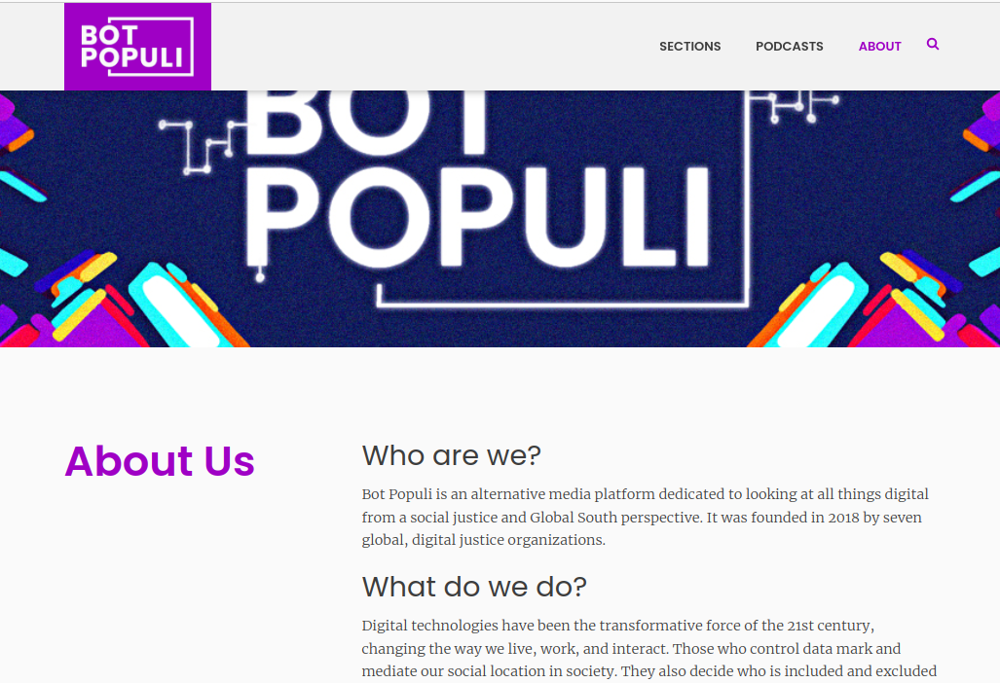
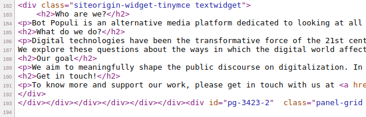
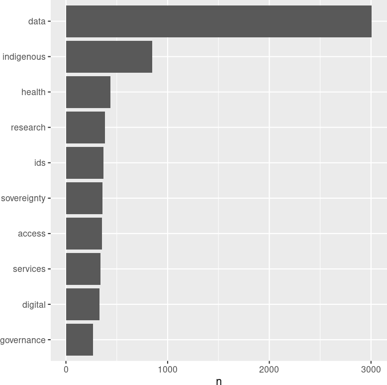
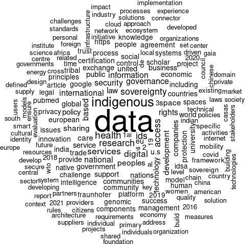
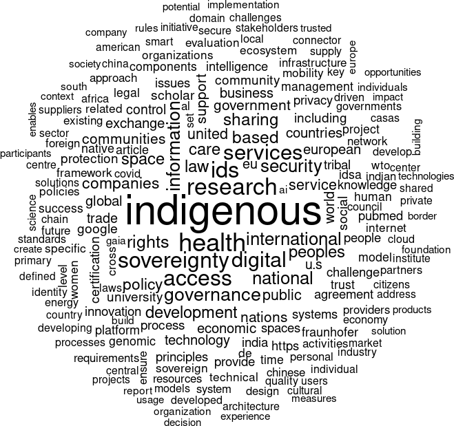
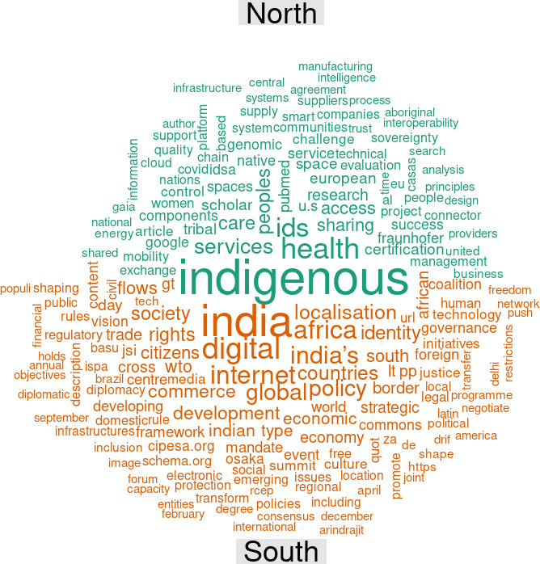

```{r setup, include=FALSE}
knitr::opts_chunk$set(echo = TRUE)
```

## 1. Introduction

This is the second of two posts about collecting and analysing WWW hyperlink networks and text data. The [first post](https://vosonlab.github.io/posts/2023-01-20-hyperlink-networks-pre-processing/) focused on how to collect hyperlink data using the web crawler in vosonSML, and how to process the hyperlink data so as to produce hyperlink networks that can be used for research.  The present post is focused on how to collect and process website text content, and we also provide some basic frequency analysis of words/terms extracted from the web pages.

## 2. Identifying the web pages from which to collect text content

The `vosonSML` web crawler uses the `rvest` R package to crawl web pages but only the hyperlinks are extracted from these web pages: website text content is not retained.

So our plan is to use `rvest` directly (not via `vosonSML`) to crawl the relevant web pages and this time, we will extract and work with the text content (not the hyperlinks). 

To find what pages we need to crawl, our starting point is the "seeds plus important websites" network that we created in the [previous post](https://vosonlab.github.io/posts/2023-01-20-hyperlink-networks-pre-processing/). We saved this to a `graphml` file.

```{r}
library(igraph)
library(dplyr)
library(knitr)
library(rvest)

g <- read.graph("g_seedsImp2.graphml", format="graphml")
g

```
We want to collect text content for the `r vcount(g)` sites in this network.  But it is important to remember that we are only interested in website text content that relates to our research topic (data sovereignty) and so we want to target the web pages on these sites that are are most likely to be related to our research topic.

So what we will do is use the raw web crawl data returned by `vosonSML` (see the [previous post](https://vosonlab.github.io/posts/2023-01-20-hyperlink-networks-pre-processing/)) to identify exactly what pages we need to collect website text content from.

```{r}
#read in the raw crawl data returned by vosonSML
crawlDF <- readRDS("crawlDF_20_sites_depth1.rds")

#find the pages that correspond to the sites in the "seeds plus important" network
textPages <- NULL
for (i in 1:vcount(g)){
  #cat("site:", V(g)$name[i], ", seed:",V(g)$seed[i],"\n")
  ind <- grep(paste0(V(g)$name[i],"$"), crawlDF$parse$domain)
  #cat("\tnumber of pages:", length(ind), "\n")
  textPages <- rbind(textPages, data.frame(domain=V(g)$name[i], 
                                           page=crawlDF$url[ind], seed=V(g)$seed[i]))
}
 
#it is possible that pages are not-unique (e.g. two seed pages can link to the same third page)
#remove duplicate pages
textPages <- textPages %>% distinct(page, .keep_all = TRUE)

head(textPages)
nrow(textPages) 

```

The above shows that if were were to collect text from all pages for the `r vcount(g)` websites in the "seeds plus important" network that have been identified (via the vosonSML web crawl), then we would need to collect `r nrow(textPages)` web pages.  

The following shows the number of pages identified for each of the seed sites.

```{r}
#number of pages identified for seed sites
kable(textPages %>% filter(seed==TRUE) %>% group_by(domain) %>% summarise(n = n()))
```

The following shows the number of pages identified for each of the non-seed important sites.

```{r}
#number of pages identified for non-seed important sites
kable(textPages %>% filter(seed==FALSE) %>% group_by(domain) %>% summarise(n = n()))
```

It is apparent that there are many more web pages identified for seed sites, compared with non-seed sites.  This makes sense, because only the seed sites have been crawled by vosonSML: so the crawler has identified these web pages by crawling the seed pages.  In contrast, only a handful of pages have been identified for each non-seed important websites: these are pages that were linked to by the seed sites.  

It should be noted out that only one unique page has been identified for the seed site `womeninlocalization.org`.  However this is due to the fact that in the [previous post](https://vosonlab.github.io/posts/2023-01-20-hyperlink-networks-pre-processing/) we used pagegrouping to merge `womeninlocalization.org` and `womeninlocalization.com` together into a site labelled `womeninlocalization.org`.  The following shows that the crawler in fact found over 60 pages for `womeninlocalization.com`.

```{r}
ind <- grep(paste0("womeninlocalization.org","$"), crawlDF$parse$domain)
length(ind)
crawlDF$url[ind]
ind <- grep(paste0("womeninlocalization.com","$"), crawlDF$parse$domain)
length(ind)
head(crawlDF$url[ind])
```

For the purposes of this exercise we do not want to be collecting text content from `r nrow(textPages)` web pages: this would be a significant undertaking to collect and process these data.  Another issue is that many of the web pages identified for the seed sites will not contain content relevant to our research topic of data sovereignty.  This is because the web crawler is quite a blunt object: it is simply finding hyperlinks to pages within the seed site, and not taking account of whether these pages are relevant or not to our research topic.

So our strategy (in order to keep the exercise simple and also maximise the likelihood of collecting relevant text data) is as follows:

1. For the seed sites, we will collect text content only from the web pages we originally identified for the crawling
2. For the non-seed important sites, we will collect text content from the web pages identified by the crawler.  By construction, these are pages that are linked to by two or or more seed sites (this is how we constructed the "seeds plus important" network in the [previous post](https://vosonlab.github.io/posts/2023-01-20-hyperlink-networks-pre-processing/)), and so we can expect that the text content on these pages is relevant to our study.

```{r}
pages <- read.csv("seed_sites_20.csv")
kable(head(pages))

#just keep the columns we will work with
#note that why "domain" is specified in this csv file, we will extract this
#programmatically from the URL
pagesForText <- pages %>% select(page)

#function from https://stackoverflow.com/questions/19020749/function-to-extract-domain-name-from-url-in-r
domain <- function(x) strsplit(gsub("http://|https://|www\\.", "", x), "/")[[c(1, 1)]]
#following could be done more elegantly, but it works...
dd <- sapply(pagesForText$page, domain)
pagesForText$domain <- as.character(dd)

#modify domain to account for fact we use (in seeds+important network) 
#womeninlocalization.org not womeninlocalization.com

pagesForText$domain[which(pagesForText$domain=="womeninlocalization.com")] <- "womeninlocalization.org"

#not sure if we need this
pagesForText$seed <- TRUE

#check that we've got all the seed pages
#just a sanity check...
seedDom <- V(g)$name[V(g)$seed==TRUE]
#all OK
length(which(is.na(match(seedDom, unique(pagesForText$domain)))))

```

So we have the web pages (for text collection) for the seed sites.  Now we will add in the web pages for non-seed important sites.

```{r}
#dataframe with pages for non-seed sites
dd <- textPages %>% filter(seed==FALSE) %>% relocate(page, domain, seed)

#append to dataframe for seed sites
pagesForText <- rbind(pagesForText, dd)

nrow(pagesForText)

```

So we have `r nrow(pagesForText)` pages which we will use `rvest` to collect text content from.  The following shows that there are some duplicated web pages for non-seed sites - the "http" and "https" version of the same page.  We may adjust for this later on.

```{r}
kable(pagesForText %>% filter(grepl("gida-global.org|worldbank.org", pagesForText$page)))
```

## 3. Collecting the website text content

Here we make use of the [`rvest` R package ("Easily Harvest (Scrape) Web Pages")](https://cran.r-project.org/package=rvest), which provides "wrappers around the 'xml2' and 'httr' packages to make it easy to download, then manipulate, HTML and XML."

### 3.1 Example web page

Using `rvest` can be quite a complicated, requiring an understanding of how web pages are structured. Here we use `rvest` in a very simple way: we only use it to extract website text that is contained in HTML paragraph tags.

Before using `rvest` to collect text content for all our web pages, it is useful to first look at its use for an example web page: [Bot Populi](https://botpopuli.net/about-us/) which is an "alternative media platform dedicated to looking at all things digital from a social justice and Global South perspective."



If we look at the source code for this web page, we see the use of the HTML paragraph tags.

{width=100%}

Now we will use `rvest` to download the web page and extract text content from the HTML paragraph tags.  

```{r, eval=FALSE}
testurl <- pagesForText$page[7]
testurl

#fetch the webpage
testpage <- read_html(testurl)

#As explained in following post:
#https://stackoverflow.com/questions/57764585/how-to-save-and-read-output-of-read-html-as-an-rds-file
#we need to use as.character() on the object returned by read_html()
#if we want to save it to RDS file
#we save the object returned by read_html() to file because below we are 
#just extracting text from paragraph html tags, but in future might want to
#extract other tags
saveRDS(as.character(testpage), "testpage.rds")
```

```{r}
testpage <- readRDS("testpage.rds")
#note that use of read_html() in following is because we above used
#as.character() to save the object to RDS file
testpage <- read_html(testpage)

#extract the paragraphs
p_text <- html_nodes(testpage, 'p') %>% html_text()
head(p_text, n=3)

```

In this exercise we will just work with the paragraph text, but it should be noted that useful text content might be stored in other HTML tags such as titles (header tags "h1", "h2" etc.) and anchor tags.

### 3.2 Collecting paragraph text from all the web pages

In the code below we use the `rvest` `read_html()` function to collect the web pages for all our seed and non-seed sites, and we store the objects returned by `read_html()` in a list, and save this list object to an `rds` file for later use. 

Before we collect the html data, we are going to remove some web pages that caused problems (`rvest` failed while collecting the html). For this exercise, we don't try to figure out why these URLs are causing problems for `rvest` and we do not try to improve the code to make it more robust (e.g. via error handling). 

We also note that some of the URLs are for pdf files - these would normally be removed.

```{r, eval=FALSE}
#first remove problematic URLs

url_problem <- c(
  "https://docs.wto.org/dol2fe/Pages/SS/directdoc.aspx?filename=q:/WT/GC/W798.pdf&Open=True xxiv",
"https://doi.org/10.1002/ajs4.141",  #Error in open.connection(x, "rb") : HTTP error 503.
"https://www.id4africa-ambassadors.org",  #Error in open.connection(x, "rb") : HTTP error 404.
"https://www.id4africa-ambassadors.org/iic"  #Error in open.connection(x, "rb") : HTTP error 404.
)
 
pagesForText <- pagesForText %>% filter(!page %in% url_problem)

#now collect the html and store in list
L_html <- list()

for (i in 1:nrow(pagesForText)){
  url_i <- pagesForText$page[i]
  cat("working on:", url_i, "\n")  
  L_html[[url_i]] <- read_html(url_i)
  #if (i > 5)
  #  break
}

#See note above about needing to use as.character() on 
#the object returned by read_html()
for (i in names(L_html)){
  L_html[[i]] <- as.character(L_html[[i]])   
}
saveRDS(L_html, "L_html.rds")

```

Now we iterate over the webpages in the list, extracting and joining the paragraphs and putting them in the `textContent` dataframe that we will later use for text analysis.

```{r}
L_html <- readRDS("L_html.rds")

#this is not an efficient way of creating a dataframe, but will do here...
textContent <- NULL
for (i in names(L_html)){
  
  #cat("working on:", i, "\n") 
  
  #note that use of read_html() in following is because we above used
  #as.character() to save the object returned by read_html() to RDS file
  p_text <- html_nodes(read_html(L_html[[i]]), 'p') %>% html_text()
  #print(head(p_text))
  textContent <- rbind(textContent, 
                       data.frame(page=i, text=paste0(p_text, collapse=" ")))
}
#saveRDS(textContent, "textContent.rds")

```

## 4. Word frequency analysis

The final part of this blog post involves a basic analysis of the website text content: computing word frequencies. We will use the `tidytext` package.  In the following, we will only work with unigrams (we'll look at bigrams in a later post).

### Word frequency barplot 

First, we will present the word frequencies in a barplot.

```{r}
library(tidytext)

#creating copy of the dataframe containing text, so can reuse code
df <- textContent

#dplyr syntax
df <- df %>% unnest_tokens(word, text)

nrow(df)

#df %>% count(word)

#remove stopwords (not really necessary for this dataset)
#df %>%
#  anti_join(get_stopwords())

#Word frequency bar chart
library(ggplot2)
library(crop)

png("word_frequency_barplot.png", width=800, height=800)
df %>%
    anti_join(stop_words) %>%
    count(word, sort=TRUE) %>%
    top_n(10) %>%
    mutate(word = reorder(word, n)) %>%
    ggplot(aes(word, n)) +
    geom_col() +
    xlab(NULL) +
    coord_flip() +
    theme_grey(base_size = 22)
dev.off.crop("word_frequency_barplot.png")

```



### Wordcloud

Next, we will present the word frequencies in a wordcloud.


```{r}
library(wordcloud)

png("wordcloud.png", width=800, height=800)
df %>% 
  anti_join(stop_words) %>%
  count(word) %>%
  with(wordcloud(word, n, max.words = 200, random.order = FALSE, scale=c(5, 1)))
dev.off.crop("wordcloud.png")
```
{width=80%}

The wordcloud is simply another way of visualising the word frequency counts: in the above wordcloud, the words that are used more often are larger and towards the centre of the figure. The wordcloud shows what we saw in the frequency barplot above: the term 'data' was the most frequently use term. This shouldn't come as a surprise since by construction, issues that are being focused on by the websites in our data set are related to data, more specifically 'data sovereignty'. 

While the wordcloud looks OK, there are a couple of simple things we can do to improve it.  First, there are some numbers in the wordlcoud, so we will remove numbers from the terms extracted from the web pages.  Second, the dominant word is 'data' but this is not really that informative since all the websites are by construction going to have something to do with data, so we will add the word 'data' to a custom stopword list.

```{r}
#remove tokens that are numbers
df <- df %>% filter(!grepl("[[:digit:]]", word))

#create a custom stopword dataframe
stop_words2 <- rbind(stop_words, data.frame(word="data", lexicon="custom"))

png("wordcloud2.png", width=800, height=800)
df %>% 
  anti_join(stop_words2) %>%
  count(word) %>%
  with(wordcloud(word, n, max.words = 200, random.order = FALSE, scale=c(5, 1)))
dev.off.crop("wordcloud2.png")
```
{width=90%}

The improved wordcloud (with 'data' removed) now more clearly reveals other key terms such as 'indigenous', 'research', and 'health'. These words can be seen as a representation of texts indicating that a variety of issues such as indigenousity, research and health are being discussed by organisations addressing the 'data sovereignty' topic. Different organisations might be concerned with different issues while using the same term. For example, some organisations mention the term 'data sovereignty' when discussing about indigenous-related issues. Some others direct their discussion to address 'research' or 'health' related issues. This wordcloud provides a visual representation of texts which is very useful as a first step in our text analysis.

### Comparison cloud

Finally, we will present a comparison cloud showing the words used by (or most associated with) the global north versus the those used by the global south.  To do this, we first need to manually create a global north/south classification.  We will do this by extracting the domains from the URLs, and then manually coding these domains as indicating that the organisation is from the global north or south.

```{r}
#we use the function defined above, for extracting the domain from a URL
dd <- sapply(df$page, domain)
df$domain <- as.character(dd)

#now create a csv file containing the unique domains
write.csv(unique(df$domain), "domains.csv")

#we code up the domains according to whether the organisations are from global north or south
#then read the coded csv file back into R
coded <- read.csv("domains_coded.csv")
#> head(coded)
#  X                       x  type
#1 1 womeninlocalization.com north
#2 2               iwgia.org north
#3 3   indigenousdatalab.org north
#4 4           botpopuli.net south
#5 5              cipesa.org south
#6 6              mydata.org north

#now get the north/south classification into the dataframe containing the tokens
df$type <- coded$type[match(df$domain, coded$x)]

#finally, we will create the comparison cloud
library(reshape2)
library(RColorBrewer)

dark2 <- brewer.pal(8, "Dark2")

png("comparison_cloud.png", width=800, height=800)
df %>%
    anti_join(stop_words2) %>%
    group_by(type) %>%
    count(word) %>%
    acast(word ~ type, value.var = "n", fill = 0) %>%
    comparison.cloud(color = dark2, title.size = 1,  scale = c(5,  1), random.order = FALSE, max.words = 200)
dev.off.crop("comparison_cloud.png")
```
{width=90%}
