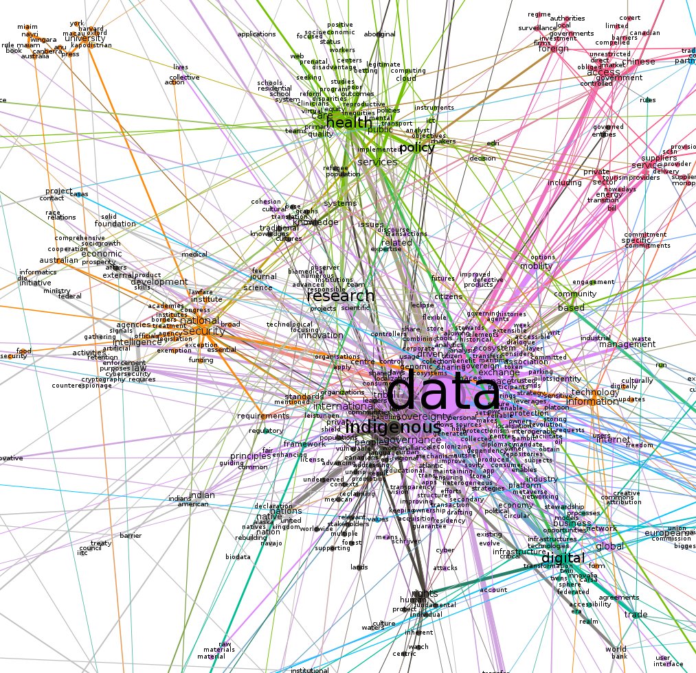
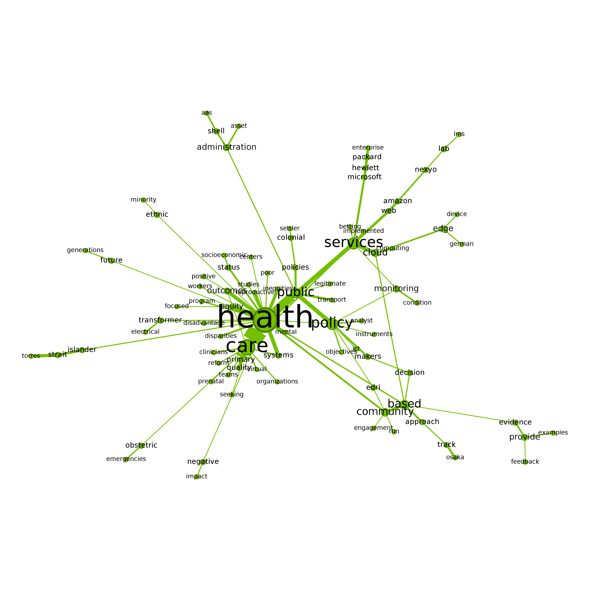
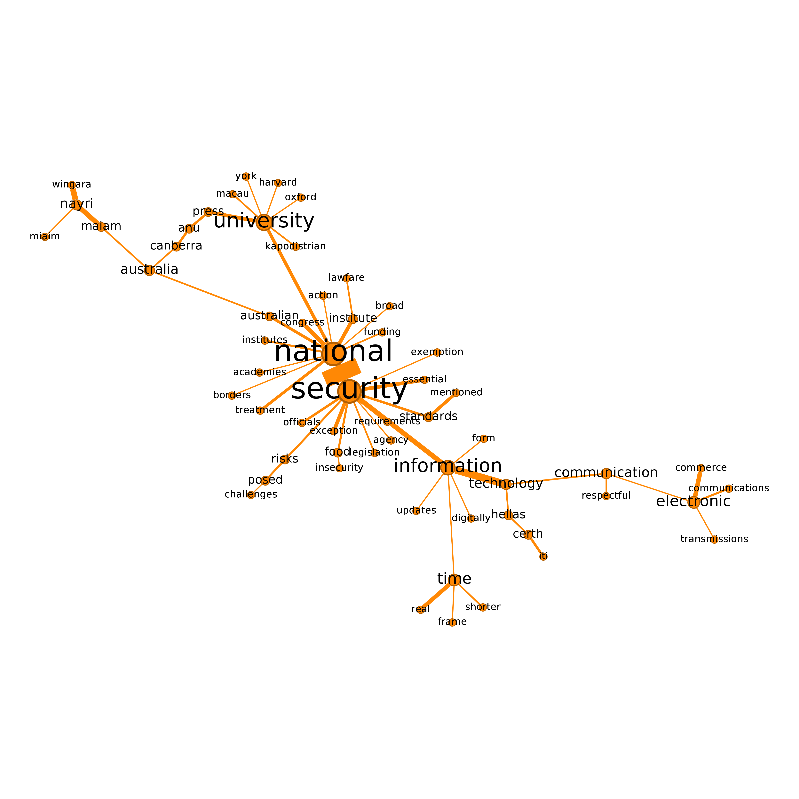

```{r setup, include=FALSE}
knitr::opts_chunk$set(echo = TRUE)
```

## 1. Introduction
In our previous posts ([Hyperlink networks and website text content](https://vosonlab.github.io/posts/2023-02-23-hyperlink-networks-and-website-text-content/) and [Analysis of website text content using quanteda](https://vosonlab.github.io/posts/2023-04-13-website-text-analysis-with-quanteda/), we processed and quantitatively analysed text extracted from websites of organisations involved in data sovereignty. To complement previous analysis, in this post we will conduct a type of semantic network analysis to understand how concepts relate to each other, and to observe framing structures emerging from the corpus.

### 1.1 Semantic network analysis

Semantic network analysis extends the social network analysis (SNA) approach, to measuring relationships between semantic units. In semantic networks, nodes are semantic concepts (words, topics, themes) and ties are associations between concepts (e.g. co-occurrence). @Yang-GonzalezB2018 (see Table 13.1 in p.330) distinguish different types of semantic network analysis according to the level of analysis (individual, interpersonal, collective), and the type of semantic network (concept-to-concept, actor-to-actor). In this blogpost, we conduct a type of semantic network analysis referred to as "salience and framing" [@Yang-GonzalezB2018]. This approach aggregates semantic units across a collective of individuals, therefore focusing on the concepts and their relationships, rather than on opinions/concepts associated with particular individuals, or in our case organisations, (this is referred to as "discourse network analysis"). 

Our approach involves constructing networks where the nodes are terms extracted from website text and a weighted edge between two terms indicates the number of times they co-occur in the website text. There are two ways of identifying co-occurrence of terms: 

1. Bigrams -- the terms co-occur because they are positioned directly next to each other in a sentence on a website
2. Co-occurrence within sentences -- the terms co-occur because they are located in the same sentence, are but not necessarily positioned next to each other.

In this blogpost we will use bigrams to identify co-occurrence of terms and in a later blogpost we will use sentences to identify co-occurence of terms. 

Finally, we will identify clusters of terms in semantic networks and will assess to what extent these clusters can be interpreted as frames. In this blogpost we will do this for all websites in our dataset, while in a later blogpost we will explore whether we can observe significant differences between frames used by Global North and Global South organisations. 

## 2. Semantic network using bigrams

First, we read in the dataframe constructed in this [post](https://vosonlab.github.io/posts/2023-02-23-hyperlink-networks-and-website-text-content/).

```{r}
library(knitr)
textContent <- readRDS("textContent2.rds")
```

As a reminder, here is a summary of what is contained in this dataframe.

```{r}
colnames(textContent)
kable(head(textContent[,c(1,3,4)]))
#kable seems to have trouble with following...
head(substr(textContent$text,1,80))
```

With framing semantic network analysis, we will only be making use of `text` and `type` columns. First we will attempt to identify potential frames that are present in the website text authored by all organisations in our dataset, and then we will see if there is any difference in the framing by Global North and Global South organisations.

For this part of the exercise, we will use `tidytext`, to identify bigrams, i.e. terms that co-occured because they are positioned directly next to each other in a sentence or in a page.


```{r}
library(tidytext)
library(tidyverse)
library(dplyr)

#we will also remove bigrams that contain numbers
df1 <- textContent %>% unnest_tokens(ngram, text, token = "ngrams", n = 2) %>%
  filter(!grepl("[[:digit:]]", ngram))
nrow(df1)

#split the bigrams so we have a dataframe with: node1, node2, frequency
#there are some warning messages to with apostrophe in word in bigram (separate doesn't know how to deal)
df2 <- df1 %>%
  count(ngram, sort = TRUE) %>%
  separate(ngram, c("node1","node2"))

head(df2, 20)

nrow(df2)
```

### 2.1 Removal of stopwords

The resulting data frame contains 23,842 rows. It is apparent that many of the highly-frequent bigrams involve one or more stopwords: these bigrams (edges) will dominate the semantic network, and will not provide much analytical insight and further, they will make the semantic network very highly connected and therefore less likely for clusters (which may be interpreted as frames) to emerge.

We will remove the bigrams that involve one or more stopwords.  We will also retain only those bigrams where both words have more than three characters.

```{r}
df2 <- df2 %>% anti_join(stop_words, join_by(node1 == word)) %>% 
  anti_join(stop_words, join_by(node2 == word))

head(df2, 20)
nrow(df2)

df2 <- df2 %>% filter(nchar(node1)>2 & nchar(node2)>2)
nrow(df2)
```

This action has significantly reduced the number of bigrams (by about two thirds), and perusal of the top-20 bigrams (in terms of frequency) indicates that they are informative.

Before processing the bigrams to create a semantic network, it is somewhat useful to check if the top phrases on the bigrams seem to be all relevant for analysis. For example, the phrase 'google scholar' above might be informative or might not. To do this, we can locate the text into the wider context by using `kwic` (keyword-in-context) syntax from `quanteda` package.

```{r kwic}
library(quanteda)

#create corpus (text stored in 'text' column so don't need to specify text_field argument)
corpus1 <- corpus(textContent)

#remove numbers, punctuations, separators, and urls
#tokens1  <- tokens(corpus1, remove_numbers = TRUE, remove_punct = TRUE, remove_separators = TRUE, remove_url = TRUE )
tokens1  <- tokens(corpus1)

#convert the tokens to lower case
#tokens1_lower  <- tokens_tolower(tokens1)
#remove stopwords
#tokens1_clean  <- tokens_remove(tokens1_lower, c(stopwords('en')))

#tokens1_ngram <- tokens_ngrams(tokens1_clean, n = 1:2)

#explore keywords in context
gs <- kwic(tokens1, pattern = phrase("google scholar"))
#gs <- kwic(corpus1, pattern = phrase("google scholar"))
head(gs, 10)

```

While prominent, the output shows that the bigram 'google scholar' appears simply as of references or indexes of scholarly publications cited on the webpages. So, we decided to remove that phrase from our data frame.

```{r}
#remove the row containing 'google scholar' from the data frame
#base R
df2a <- df2[-which(df2$node1=="google" & df2$node2=="scholar"),]
nrow(df2a)

#dplyr
#note: dplyr::filter also removes rows containing NA (none here)
df2b <- df2 %>% filter(!(node1=="google" & node2=="scholar"))
nrow(df2b)

#the filtered dataframes are identical
df2 <- df2a
```

However, the number of bigrams (`r nrow(df2)`) will make semantic network visualisation challenging, and regardless, it is often analytically more interesting to focus on those bigrams that are more commonly used (this is similar to word frequency analysis, where word clouds and comparison clouds are only constructed for the top 100 or 200 words, for example).

The following shows that the vast majority of bigrams only appeared once or twice on the web pages in the study: we will remove these uncommonly-occurring bigrams and focus on those that occurred three or more times. 

```{r}
table(df2$n)

df2 <- df2 %>% filter(n>=3)

nrow(df2)
```

### 2.2 Constructing the semantic network using `igraph`

We will now use `igraph` to construct a semantic network using the dataframe containing the bigrams and their frequency counts.

```{r}
#igraph won't accepting a tibble, so convert to standard dataframe
library(igraph)
g <- graph_from_data_frame(as.data.frame(df2), directed=FALSE)
g <- delete.vertices(g, which(V(g)$name=="NA"))       #remove NA (parsing problem)

vcount(g)
ecount(g)

#rename edge attribute 'n' to 'weight' - used in community/cluster identification
E(g)$weight <- E(g)$n
g <- delete_edge_attr(g, "n")

```

We do have some instances of loops and multiple edges.  This is not surprising since, for example, "data sharing" and "sharing data" have different meanings but will result in a multiple edges connecting "data" and "sharing".  For this exercise, we could simply ignore the loops and multiple edges since they are unlikely to have a material impact on our analysis, but instead we will use the `igraph` `simplify` function to remove the loops and multiple edges.  Note that by default, the `simplify` function will sum the edge weights of multiple edges. 

```{r}
E(g)[which(is.loop(g, E(g)))]
E(g)[which(is.multiple(g, E(g)))]
ecount(g)

g <- simplify(g)
ecount(g)
```

Now we write the graphml file so we can visualise the semantic network in `Gephi`. 

```{r}
write.graph(g, "semantic_network_frames.graphml", format="graphml")
```

### 2.3 Visualising the semantic network using `Gephi`

First, we visualise semantic network in `Gephi`.  Note that we have created a sub network of the giant component, which contains 937 nodes and 1370 edges.  We have used the modularity clustering algorithm and it identified 28 communities or clusters, and these are denoted by colours in the network visualisation.  The visualisation layout is the ForceAtlas 2 (with options: LinLog mode, Prevent Overlap, Scaling=6).   

```{r, echo=FALSE, fig.cap="Semantic network"}
knitr::include_graphics('gephi_giant_comp.png')
```

```{r, echo=FALSE, fig.cap="Semantic network - zoomed in"}

```


Next we visualise two of the clusters from the semantic network (health and national security), with updated node layouts.

```{r, echo=FALSE, fig.cap="Semantic network - health cluster"}

```

```{r, echo=FALSE, fig.cap="Semantic network - national security cluster"}

```


### 2.4 Visualising the semantic network using `igraph`

Next, we visualise selected clusters in the semantic network using `igraph`. Note that we will not attempt to visualise the entire semantic network using `igraph`: we regard `Gephi` to be more suitable for visualising large-scale networks such as the full semantic network constructed here.

To visualise selected clusters in the semantic network we will attempt to follow a similar workflow to what used above with `Gephi`. First, we identify the giant component and then use the Louvain modularity cluster algorithm (which is the same algorithm as used in `Gephi`) to identify clusters in the giant component. 

```{r}
cc <- components(g)
g2 <- induced_subgraph(g,which(cc$membership == which.max(cc$csize)))

set.seed(222)                     #set random seed (there is randomness in cluster generation)
mod <- cluster_louvain(g2)         #community identification using modularity (same algorithm as in Gephi)

table(mod$membership)
#sizes(mod)           #easier way of doing the same thing...

```

Note that due to the fact that the modularity clustering algorithm produces slightly different clusters each time it is run (due to use of random number generation in the algorithm), the number of clusters identified (30) is different to what was found with `Gephi`.

The following code defines some functions that we will use for plotting the networks; note that some of this code has been adapted from the code used in [VOSON Dashboard](https://github.com/vosonlab/VOSONDash).


```{r}

norm_values <- function(x) {
  # all values the same
  if (var(x) == 0) { return(rep(0.1, length(x))) }

  min_x <- min(x)
  diff_x <- max(x) - min_x
  s <- sapply(x, function(y) { (y - min_x) / diff_x })
}

plot_cluster <- function(cid){
  
    g2t <- induced.subgraph(g2, which(mod$membership == cid))
    #cat("cluster number:", cid, "size:", vcount(g2t), "\n")
    #print(vcount(gt))
    
    plot_parameters <- list(g2t, edge.arrow.size = 0.4)
    plot_parameters['vertex.label.color'] <- "#000000"
    plot_parameters['vertex.label.family'] <- "Arial"
    plot_parameters[['vertex.label.cex']] <- (norm_values(degree(g2t))) + 0.6
    plot_parameters['vertex.label.dist'] <- 0.6
    plot_parameters['vertex.label.degree'] <- -(pi)/2
    plot_parameters[['vertex.size']] <- 4
    plot_parameters[['edge.width']] <- (norm_values(E(g2t)$weight)) + 1
      
    #graph_layout <- layout_nicely(g2t, dim = 2)
    graph_layout <- layout_with_graphopt(g2t)
      
    graph_layout <- igraph::norm_coords(graph_layout, ymin = -1, ymax = 1, xmin = -1, xmax = 1)
    plot_parameters['rescale'] <- FALSE
    plot_parameters[['layout']] <-  graph_layout * 1
    par(mar = rep(0, 4))
    #png("file.png", width=800, height=800)
    do.call(plot.igraph, plot_parameters)
    #dev.off()
}
```

We will only plot the largest clusters from the semantic network: we use an arbitrary threshold for cluster size (for a cluster to be plotted) of 30.

```{r}
which(sizes(mod) > 30)
```

For an overview, we will first plot the clusters in groups of 4.

```{r, fig.width = 7, fig.height = 6, fig.cap = "Clusters 1, 2, 3, 4"}
par(mfrow=c(2,2))
plot_cluster(1)
plot_cluster(2)
plot_cluster(3)
plot_cluster(4)
```

```{r, echo=FALSE, fig.width = 7, fig.height = 6, fig.cap = "Clusters 7, 8, 10, 11"}
par(mfrow=c(2,2))
plot_cluster(7)
plot_cluster(8)
plot_cluster(10)
plot_cluster(11)
```

```{r, echo=FALSE, fig.width = 7, fig.height = 6, fig.cap = "Clusters 12, 15, 22"}
par(mfrow=c(2,2))
plot_cluster(12)
plot_cluster(15)
plot_cluster(22)
#dev.off()
```

Next we look at three clusters more closely and attempt to discern whatt issue (or issues) these clusters pertain to. 

Note that in what follows we are using a similar approach to that recommended by @Miller1997: we identify the issue (or issues) represented by a cluster, or interpret the cluster as a frame, by writing a simple statement that includes terms extracted from the cluster.  **It should be emphasised that for this illustrative example we have not conducted an in-depth examination of exactly how the identified terms are being used on the websites.  If we were to fully implement this approach in an actual research project, we would be conducting (for example) keyword-in-context to manually check that our interpretation of the issues/frames is valid.**

### Cluster 2

```{r, echo = FALSE, fig.width = 7, fig.height = 6, fig.cap = "Cluster 2"}
plot_cluster(2)
```

In this cluster, we identify a number of issues related to problems experienced by indigenous people and communities with regard to data sovereignty. These problems include the protection of status of minority populations, the fundamental right of indigenous people, their living conditions and the conditions of their environments such as the lands, forests and languages. The figure shows the connections between the term 'people' and other words such as 'displaced', 'million', 'living', which may indicate the presence of narratives describing vulnerable indigenous populations who are subject to displacement. The co-occurrence of 'rights' and 'human' suggests that the problem of indigenous rights is discussed within the broader context of human rights or at least both are inseparably connected. As a community of native, tribe, and nation, indigenous people are also described being surrounded with risks and they have to face another challenges such as gender inequality which imply that indigenous women are in a vulnerable position and in need of support. Based on this preliminary analysis, our interpretation is that data sovereignty notions are being discussed in the context of addressing these complex problems faced by indigenous people.

### Cluster 3

```{r, echo = FALSE, fig.width = 7, fig.height = 6, fig.cap = "Cluster 3"}
plot_cluster(3)
```

This cluster pertains to security issues. It appears that security issues were discussed in at least two main areas: the problem of the national security and the practice of intelligence agencies. When it comes to national security, we identify issues relating to technical/legal requirements to support the data sovereignty agenda, national borders, resources or funding, and the roles of universities. Issues around the practice of intelligence agencies include their surveillance activities, the role of officials and law enforcement in dealing with issues such as counterspionage, cybersecurity and cryptography. Semantic connections between the term 'intelligence' with 'artificial', 'signals', 'gathering' might express the emergence of AI as a new security issue. Meanwhile, the practices of intelligence agencies for gathering information or data which create a security threat to other states are indeed part of security concerns for nation states. Based on this figure, our interpretation is that data sovereignty has implications for the two interrelated issues of the practice of intelligence agencies and threats to national security.

### Cluster 10

```{r, echo = FALSE, fig.width = 7, fig.height = 6, fig.cap = "Cluster 10"}
plot_cluster(10)
```

This cluster appears to map issues centered around data policy and accessibility, addressing how local governments and authorities deal with foreign companies or firms (from China and the United States) that invest in and supply services and equipment relating to data infrastructure. The on-going rivalry between Chinese and American suppliers of technology is likely to feature in discussion on these websites, as is the connection of the Chinese private sector to the Chinese Communist Party. In terms of policy, we discern that discussions also touch upon ICT development and the threat of surveillance from foreign entities, and concerns of local governments over the rules and regulations can be read as a response to such conditions.
