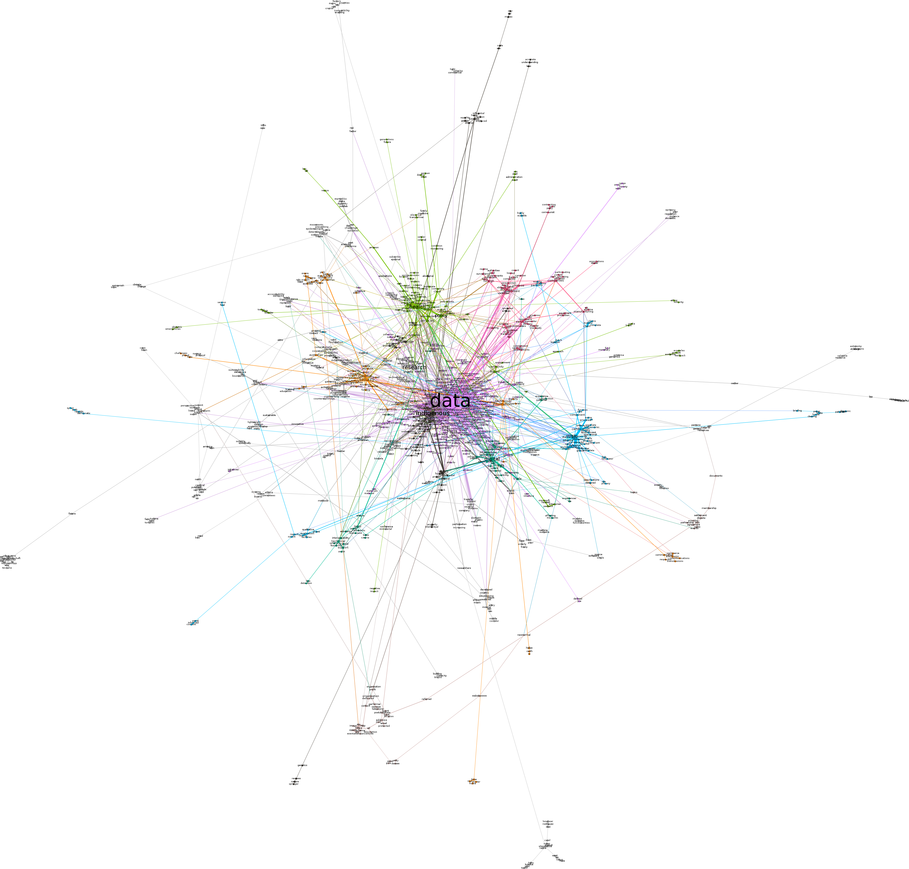

```{r setup, include=FALSE}
knitr::opts_chunk$set(echo = TRUE)
```

## 1. Introduction
In our previous posts: ([Hyperlink networks and website text content](https://vosonlab.github.io/posts/2023-02-23-hyperlink-networks-and-website-text-content/) and [Analysis of website text content using quanteda](ADD LINK ONCE PUBLISHED), we quantitatively processed and analysed text extracted from websites of organisations involved in data sovereignty. To complement previous analysis, in this post we will conduct a type of semantic network analysis to understand how concepts relate to each other, and to observe framing structures emerging from the corpus.

### 1.1 Semantic network analysis

Semantic network analysis extends the social network analysis (SNA) approach, to measuring relationships between semantic units. In semantic networks, nodes are semantic concepts (words, topics, themes) and ties are associations between concepts (e.g. co-occurrence). @Yang-GonzalezB2018 (see Table 13.1 in p.330) distinguish different types of semantic network analysis according to the level of analysis (individual, interpersonal, collective), and the type of semantic network (concept-to-concept, actor-to-actor). In this blogpost, we conduct a type of semantic network analysis referred to as "salience and framing" [@Yang-GonzalezB2018]. This approach aggregates semantic units across a collective of individuals, therefore focusing on the concepts and their relationships, rather than on opinions/concepts associated with individuals (discourse network analysis). 

We will then construct networks where the nodes are terms extracted from the "Data Sovereignty" website text and a weighted edge between two terms indicates the number of times they co-occur in the website text. We will explore two types of co-occurrence: 
- Bigrams -- the terms co-occur because they are positioned directly next to each other in a sentence on a website
- Co-occurrence within sentences -- the terms co-occur because they are located in the same sentence, are but not necessarily positioned next to each other.

Finally, we will identify clusters of terms that can be interpreted as frames for all the webistes , as well as to observe if there are significant differences between frames used by Global North and Global South organisations. 

## 2. Semantic network using bigrams

First, we read in the dataframe constructed in this [post](https://vosonlab.github.io/posts/2023-02-23-hyperlink-networks-and-website-text-content/).

```{r}
library(knitr)
textContent <- readRDS("textContent2.rds")
```

As a reminder, here is a summary of what is contained in this dataframe.

```{r}
colnames(textContent)
kable(head(textContent[,c(1,3,4)]))
#kable seems to have trouble with following...
head(substr(textContent$text,1,80))
```

With framing semantic network analysis, we will only be making use of `text` and `type` columns. First we will attempt to identify potential frames that are present in the website text authored by all organisations in our dataset, and then we will see if there is any difference in the framing by Global North and Global South organisations.

For this part of the exercise, we will use `tidytext`, to identify bigrams, i.e. terms that co-occured because they are positioned directly next to each other in a sentence or in a page.


```{r}
library(tidytext)
library(tidyverse)
library(dplyr)

#we will also remove bigrams that contain numbers
df1 <- textContent %>% unnest_tokens(ngram, text, token = "ngrams", n = 2) %>%
  filter(!grepl("[[:digit:]]", ngram))
nrow(df1)

#split the bigrams so we have a dataframe with: node1, node2, frequency
#there are some warning messages to with apostrophe in word in bigram (separate doesn't know how to deal)
df2 <- df1 %>%
  count(ngram, sort = TRUE) %>%
  separate(ngram, c("node1","node2"))

head(df2, 20)

nrow(df2)
```

### 2.1 Removal of stopwords

The resulting data frame contains 23,842 rows. It is apparent that many of the highly-frequent bigrams involve one or more stopwords: these bigrams (edges) will dominate the semantic network, and will not provide much analytical insight and further, they will make the semantic network very highly connected and therefore less likely for clusters (which may be interpreted as frames) to emerge.

We will remove the bigrams that involve one or more stopwords.  We will also retain only those bigrams where both words have more than three characters.

```{r}
df2 <- df2 %>% anti_join(stop_words, join_by(node1 == word)) %>% 
  anti_join(stop_words, join_by(node2 == word))

head(df2, 20)
nrow(df2)

df2 <- df2 %>% filter(nchar(node1)>2 & nchar(node2)>2)
nrow(df2)
```

This action has significantly reduced the number of bigrams (by about two thirds), and perusal of the top-20 bigrams (in terms of frequency) indicates that they are informative.

Before processing the bigrams to create a semantic network, it is somewhat useful to check if the top phrases on the bigrams seem to be all relevant for analysis. For example, the phrase 'google scholar' above might be informative or might not. To do this, we can locate the text into the wider context by using `kwic` (keyword-in-context) syntax from `quanteda` package.

```{r kwic}
library(quanteda)

#create corpus (text stored in 'text' column so don't need to specify text_field argument)
corpus1 <- corpus(textContent)

#remove numbers, punctuations, separators, and urls
#tokens1  <- tokens(corpus1, remove_numbers = TRUE, remove_punct = TRUE, remove_separators = TRUE, remove_url = TRUE )
tokens1  <- tokens(corpus1)

#convert the tokens to lower case
#tokens1_lower  <- tokens_tolower(tokens1)
#remove stopwords
#tokens1_clean  <- tokens_remove(tokens1_lower, c(stopwords('en')))

#tokens1_ngram <- tokens_ngrams(tokens1_clean, n = 1:2)

#explore keywords in context
gs <- kwic(tokens1, pattern = phrase("google scholar"))
#gs <- kwic(corpus1, pattern = phrase("google scholar"))
head(gs, 10)

```

While prominent, the output shows that the bigram 'google scholar' appears simply as of references or indexes of scholarly publications cited on the webpages. So, we decided to remove that phrase from our data frame.

```{r}
#remove the row containing 'google scholar' from the data frame
#base R
df2a <- df2[-which(df2$node1=="google" & df2$node2=="scholar"),]
nrow(df2a)

#dplyr
#note: dplyr::filter also removes rows containing NA (none here)
df2b <- df2 %>% filter(!(node1=="google" & node2=="scholar"))
nrow(df2b)

#the filtered dataframes are identical
df2 <- df2a
```

However, the number of bigrams (`r nrow(df2)`) will make semantic network visualisation challenging, and regardless, it is often analytically more interesting to focus on those bigrams that are more commonly used (this is similar to word frequency analysis, where word clouds and comparison clouds are only constructed for the top 100 or 200 words, for example).

The following shows that the vast majority of bigrams only appeared once or twice on the web pages in the study: we will remove these uncommonly-occurring bigrams and focus on those that occurred three or more times. 

```{r}
table(df2$n)

df2 <- df2 %>% filter(n>=3)

nrow(df2)
```

### 2.2 Constructing the semantic network using `igraph`

We will now use `igraph` to construct a semantic network using the dataframe containing the bigrams and their frequency counts.

```{r}
#igraph won't accepting a tibble, so convert to standard dataframe
library(igraph)
g <- graph_from_data_frame(as.data.frame(df2), directed=FALSE)
g <- delete.vertices(g, which(V(g)$name=="NA"))       #remove NA (parsing problem)

vcount(g)
ecount(g)

#rename edge attribute 'n' to 'weight' - used in community/cluster identification
E(g)$weight <- E(g)$n
g <- delete_edge_attr(g, "n")

```

We do have some instances of loops and multiple edges.  This is not surprising since, for example, "data sharing" and "sharing data" have different meanings but will result in a multiple edges connecting "data" and "sharing".  For this exercise, we could simply ignore the loops and multiple edges since they are unlikely to have a material impact on our analysis, but instead we will use the `igraph` `simplify` function to remove the loops and multiple edges.  Note that by default, the `simplify` function will sum the edge weights of multiple edges. 

```{r}
E(g)[which(is.loop(g, E(g)))]
E(g)[which(is.multiple(g, E(g)))]
ecount(g)

g <- simplify(g)
ecount(g)
```

Now we write the graphml file so we can visualise the semantic network in `Gephi`. 

```{r}
write.graph(g, "semantic_network_frames.graphml", format="graphml")
```

### 2.3 Visualising the semantic network using `Gephi`

First, we visualise semantic network in `Gephi`.  Note that we have created a sub network of the giant component, which contains 937 nodes and 1370 edges.  We have used the modularity clustering algorithm and it identified 28 communities or clusters, and these are denoted by colours in the network visualisation.  The visualisation layout is the ForceAtlas 2 (with options: LinLog mode, Prevent Overlap, Scaling=6).   

```{r, echo=FALSE, fig.cap="Semantic network (Gephi)"}

```

```{r, echo=FALSE, fig.cap="Semantic network - zoomed in (Gephi)"}
knitr::include_graphics('gephi_giant_comp_zoomed.png')
```


Next we visualise two of the clusters from the semantic network (health and national security), with updated node layouts.

```{r, echo=FALSE, fig.cap="Semantic network - health cluster (Gephi)"}
knitr::include_graphics('gephi_health_cluster.png')
```

```{r, echo=FALSE, fig.cap="Semantic network - national security cluster (Gephi)"}
knitr::include_graphics('gephi_national_security_cluster.png')
```


### 2.4 Visualising the semantic network using `igraph`

Next, we visualise the semantic network and selected clusters using `igraph`. We will attempt to follow a similar workflow to what used above with `Gephi`.

First, we identify the giant component and then use the Louvain modularity cluster algorithm (which is the same algorithm as used in `Gephi`) to identify clusters in the giant component. 

```{r}
cc <- components(g)
g2 <- induced_subgraph(g,which(cc$membership == which.max(cc$csize)))

set.seed(222)                     #set random seed (there is randomness in cluster generation)
mod <- cluster_louvain(g2)         #community identification using modularity (same algorithm as in Gephi)

table(mod$membership)
#sizes(mod)           #easier way of doing the same thing...

```

Note that due to the fact that the modularity clustering algorithm produces slightly different clusters each time it is run (due to use of random number generation in the algorithm), the number of clusters identified (30) is different to what was found with `Gephi`.

To visualise the network, we will use the `R` implementation of the ForceAtlas 2 algorithm (which we used in `Gephi`).

**Rob note: do not bother to run this code with ForceAtlas2 alg...I didn't get good results with it, and I use different approach below**

```{r, eval=FALSE}
library(ForceAtlas2)

layout1 <- layout.forceatlas2(g2, iterations=2000, plotstep=100)

layout2 <- layout.forceatlas2(g2, iterations=500, plotstep=100, linlog=TRUE)

layout3 <- layout.forceatlas2(g2, iterations=500, plotstep=100, linlog=TRUE, k=200)

layout4 <- layout.forceatlas2(g2, iterations=500, plotstep=100, linlog=TRUE, gravity=2)

#health cluster
g2t <- induced.subgraph(g2, which(mod$membership == 4))
#layout <- layout.forceatlas2(g2t, iterations=5000, plotstep=100, linlog=TRUE, k=3200)
layout <- layout.forceatlas2(g2t, iterations=5000, plotstep=100)
plot(g2t, layout=layout)
plot(g2t, layout=layout, vertex.shape="none", vertex.label.cex=0.8,
     vertex.label.color="black")

```

**Rob note: The following code loops through the identified clusters and produces a network map for each one...i think the visualisations are pretty good, we can use them.  @Sidiq: if you can please have a look at each of these and try to identify 2-3 clusters you would like to write something about.  You could start writing some interpretation of the clusters.  Then in a later iteration I will modify the code so we only produce maps for the selected (2-3) clusters.  Also note that the following code is not quite right as the figure titles are not getting changed for each figure...I want the titles to mention which cluster, this is something I need to work out how to do, in a later iteration.  Also, in the following I will get the edges to be weighted (thickness of line).  @Sidiq, you can see the number of the cluster being plotted...it is printed before the plot.**

```{r, echo = TRUE, fig.width = 7, fig.height = 6, fig.cap = paste("Cluster", 1:nrow(sizes(mod)))}

#plot(g2t, vertex.shape="none", vertex.size=0.8)
#write.graph(g2t, "g2t.graphml", format="graphml")

norm_values <- function(x) {
  # all values the same
  if (var(x) == 0) { return(rep(0.1, length(x))) }

  min_x <- min(x)
  diff_x <- max(x) - min_x
  s <- sapply(x, function(y) { (y - min_x) / diff_x })
}

for (i in 1:nrow(sizes(mod))){
  
  if ( sizes(mod)[i] > 30 ){                #arbitrary threshold
    
    #i <- 4
    
    g2t <- induced.subgraph(g2, which(mod$membership == i))
    cat("cluster number:", i, "size:", vcount(g2t), "\n")
    #print(vcount(gt))
    
    plot_parameters <- list(g2t, edge.arrow.size = 0.4)
    plot_parameters['vertex.label.color'] <- "#000000"
    plot_parameters['vertex.label.family'] <- "Arial"
    plot_parameters[['vertex.label.cex']] <- (norm_values(degree(g2t))) + 0.6
    plot_parameters['vertex.label.dist'] <- 0.6
    plot_parameters['vertex.label.degree'] <- -(pi)/2
    plot_parameters[['vertex.size']] <- 4
      
    #graph_layout <- layout_nicely(g2t, dim = 2)
    graph_layout <- layout_with_graphopt(g2t)
      
    graph_layout <- igraph::norm_coords(graph_layout, ymin = -1, ymax = 1, xmin = -1, xmax = 1)
    plot_parameters['rescale'] <- FALSE
    plot_parameters[['layout']] <-  graph_layout * 1
    par(mar = rep(0, 4))
    #png("file.png", width=800, height=800)
    do.call(plot.igraph, plot_parameters)
    #dev.off()
      
      
  }
  
}


```

###Cluster number 2

In this cluster, a number of indigenous issues were identified. These issues express some problems experienced by indigenous people and communities with regard to discussion on data sovereignty. The problems indigenous people have include the protection of their status as a minority, their fundamental rights, their living conditions and the conditions of their environments such as the lands, forests and languages. The graph shows the connections between the term 'people' and other words such as 'displaced', 'million', 'living' which indicate the presence of narratives describing about the vulnerable conditions of indigenous populations where million of them are being displaced. The term 'rights' that is directly linked to 'human' indicates that the problem of indigenous rights is discussed within the broader context of human rights or at least both are inseparably connected. As a community of native, tribe, and nation, indigenous people are also described being surrounded with risks and they have to face another challenges such as gender inequality which imply that indigenous womens are deeply more in a vulnerable position and definetely in need of support. Data sovereignty notions were discussed to address such complex matter experienced by indegenous people.

###Cluster number 3

Security issues become the most prominent topic in this cluster. It is apparent that security issues were discussed in at least two main areas: the problem of the national security and the practice of intelligence agencies. When it comes to national security, some anticipated issues that are mentioned include the standard requirements, --whether technical or legal to support data sovererignty agenda--, the case of national border, the resource of funding, and the roles of the universities. Issues around the practice of intelligence agencies incorporate their surveillance activities, the role of officials and the law enforcement in dealing with issues such as counterspionage, cybersecurity and cryptography. Semantic connections between the term 'intelligence' with 'artificial', 'signals', 'gathering' might express the emergence of AI which also discussed within this category of issues. Meanwhile, the practices of intelligence agencies for gathering information or data which create a security threat to other states are indeed part of security concerns for the national states. As this graph also indicates, data sovereignty is talked about in order to address the problem of security in which the practice of intelligence agencies and the threat to national security become two main area that are interrelated.

###Cluster number 10

This cluster maps the issues centered around data policy and accessibility that largely address the topic on how the local governments and authorities deal with foreign companies or firms especially in technology and manufacturing from China and the United States that invest in and supply most services regarding data infrastructure equipments. Although foreign power that are mentioned clearly illustrating the direct link between 'Chinese' and 'American', it is also the case that both are connected to make explicit the ongoing rivalry between both parties. Further, the discussion regarding Chinese private sectors are associated with the role of Chinese Communist Party given their explicit connection to Chinese companies and firms in semantic networks. In terms of policy, the discussions also touches upon the issues regading ICT development and the threat of foreign entities under the surveillance regime. Concerns of the local governments over the rules and regulations can be read as a response to such conditions.

**Rob note: the following will get removed by Rob, it is now superceded by the above...**

The above shows that there are **156 clusters [FIX]** identified, with the majority of these clusters only containing a small number of nodes.

We will focus on the larger clusters, as these are more likely to be interpretable as frames.

```{r, eval=FALSE}
table(mod$membership)

for (i in 1:nrow(sizes(mod))){

  if ( sizes(mod)[i] > 30 ){                #arbitrary threshold
   
      gt <- induced.subgraph(g, which(mod$membership == i))
      cat("i:", i, "size:", vcount(gt), "\n")
      #print(vcount(gt))
      
      
      plot(gt, layout=layout_with_fr(gt), edge.width=1.5, vertex.shape="none", 
           vertex.label.color="black", main=paste0("cluster: ", i, "\n"))
      #plot(gt, layout=layout_nicely(gt), edge.width=1.5, vertex.size=0, vertex.label.color="black")
    
  }
  
}

```


Next steps:

- semantic networks (bigrams) for all actors: identify some "interesting" clusters and extract and visualise in this document.  Rob to do this (involves new R coding)
- semantic networks (bigrams) for North and South separately, to see if differences between them in terms of framing


## 3. Semantic network using co-occurrence in sentence 

- if the networks are significantly different to what we saw with bigrams, then go into detail about what we are finding, but if similar frames are identified, then we don't need to go into too much detail here.


