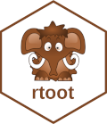

```{r setup, include = FALSE}
knitr::opts_chunk$set(dpi = 200, echo = FALSE, width = 80)
options(width = 80)
data_path <- "E:/My Drive/VOSON-BLOG-DATA/2023-07-27-mastodon-conversation-networks/"
collect_data <- FALSE

library(dplyr)
library(rtoot)
library(httr)
library(rvest)
library(tidyr)
library(DT)
```

## Introduction

Mastodon is a microblogging platform that offers an alternative to traditional social media giants by embracing an open and distributed network model. Unlike other social media platforms that are centralised in terms of the being the property and governed by a single business entity, Mastodon servers (also called `instances`) are typically owned and operated by the users. The server instances collectively form the Mastodon network which is part of the `federated universe` or [fediverse](https://docs.joinmastodon.org/#fediverse), and uses an open-source network protocol called `ActivityPub` to inter-communicate between services and also user software clients.

Pitched as a free and open alternative to Twitter, Mastodon allows users to sign-up to an instance of their choosing, joining autonomous local communities with their own moderation and policies. Server instances are typically established around a [community or area of interest](https://joinmastodon.org/servers), for example `historians.social` an instance created for academic historians, and `federated.press` a server centered around journalism. Users can interact with the community on their server, or more widely with users on other servers. Mastodon has its own flavour of common features, users can `follow` others, make and `reply` to posts (`toots`), `re-blog` and `boost` posts (similar to retweeting and combined liking) and also use `hashtags`. Users can either find global content through the `federated timeline`, which is a stream of messages eminating from server instances that their community server is federated with, or local content through their own community servers `local timeline`.

Much like Twitter, Mastodon has a REST data API that has data endpoints and OAuth authentication to support the operation of 3rd-party applications. Unlike Twitter however, authentication and data collection occur at the individual server instance level and can have varying support for public or private access to data depending on the server providers configuration and policies. Because of the open and transparent nature of the servers and networks, data collection can be performed from multiple and alternative access points. The fediverse presents a significantly lower barrier to collecting public data than other restrictive and commercial social media platforms.

This blog post will introduce a process for simple data collection and network creation for Mastodon conversation threads in R.

## The rtoot package

{style="float:right;width:120px !important;height:139px !important;"} The [rtoot](https://github.com/schochastics/rtoot) R package developed by [@SCHOCHCHAN2023] allows R code to interact with [Mastodon API](https://docs.joinmastodon.org/client/intro/) enpoints and perform various functions. The package allows the creation of either a `public` or `private` bearer token used to authenticate requests to the instance server API. A public bearer token is suitable for reading public data, whereas a private token would be used to perform user scope operations such as posting toots. These tokens can be used by both apps or scripts and no credentials (or even user account) are required to create a public scope token making it easy for researchers to collect network data. In fact the OAuth process is not even required to access public Mastodon data but will be presented as reference as it is part of a standard practice for accessing social media API endpoints.

The following code snippet creates an OAuth bearer token with public access scope for the `mastodon.social` instance. At time of writing tokens generally do not expire, so this step only needs to be performed once if you save the token.

```{r auth, include = FALSE}
# auth_setup(instance = "mastodon.social", type = "public", name = "mast_soc_public", path = "~/.rtoot_auth")
rtoot_token <- readRDS("~/.rtoot_auth/mast_soc_public.rds")
```

```{r auth_, echo = TRUE, eval = FALSE}
library(rtoot)

# create a public access bearer token, name and save it for future use
auth_setup(
  instance = "mastodon.social",
  type = "public",
  name = "mast_soc_public",
  path = "~/.rtoot_auth")

# Token of type "public" for instance mastodon.social is valid
# <mastodon bearer token> for instance: mastodon.social of type: public

# read saved bearer token
rtoot_token <- readRDS("~/.rtoot_auth/mast_soc_public.rds")

# bearer token value
rtoot_token$bearer
# [1] "fLb..............................spY"

token <- rtoot_token$bearer
```

## Collecting data

This section will look at collecting data for a Mastodon conversation thread that will enable the construction of different types of networks. The [following public post](https://mastodon.social/@arstechnica/110781427821159121) was made on July 27, 2023 by the [Ars Technica](https://mastodon.social/@arstechnica) account promoting a story on their blog site concerning the rebranding of Twitter as 'X'.

```{r, echo=FALSE, out.width="60%", fig.cap="Ars Technica news story toot on mastodon.social."}
knitr::include_graphics("arstechnica_toot.png")
```

To collect the relevant posts related to the thread, we need to provide the desired server instance and toot identifier as parameters to the collection functions. These components can be extracted from a post URL as follows.

```{r url, echo = TRUE}
library(httr)

# thread url
toot_url <- "https://mastodon.social/@arstechnica/110781427821159121"

# extract toot id and server instance from url
toot_server = parse_url(toot_url)$hostname    # mastodon.social
toot_id <- basename(parse_url(toot_url)$path) # 110781427821159121
```

The `rtoot` function [`get_status`](https://schochastics.github.io/rtoot/reference/get_status.html) can then be used to collect toots, and the [`get_context`](https://schochastics.github.io/rtoot/reference/get_context.html) function for threads (a thread is referred to as a `context` by the API). The original post is not returned by `get_context` so this must be collected seperately using `get_status`.

```{r get_data, include = FALSE}
toot <- readRDS(paste0(data_path, "toot.rds"))
thread <- readRDS(paste0(data_path, "thread.rds"))
```

```{r get_data_, echo = TRUE, eval = FALSE}
# get original post and its thread
toot <- get_status(toot_id, toot_server, token)
thread <- get_context(toot_id, toot_server, token)
```

```{r get_data_1, echo = TRUE}
# original post
toot

# thread object
names(thread)

# number of toots above the original post
nrow(thread$ancestors)

# number of toots below the original post
nrow(thread$descendants)

# rate-limit
attr(thread, "headers")
```

Here we can see the structure of the original post and thread objects. The original post is a dataframe with 29 columns of post metadata, some containing nested list data, and only 1 observation. The thread object has two dataframes, one for posts above (`ancestors`) that will always have 0 observations if an original post was specified, and below the post (`descendants`) that contains all of the reply posts. The API rate-limit is also included as an attribute of data objects returned by `rtoot` functions and can be used to monitor and manage the collection of larger data sets.

All of the post and user profile metadata (as nested data) is returned with the above function calls, so no further collection steps are needed to construct rich networks with many options for node and edge attributes.

## Data wrangling

The collected data can now be combined into dataframes and cleaned up to make it easier to work with. This can be done in a number of ways that will largely depend on the types of analysis that are to be performed. In this blog post the dataframes will be organised to assist in generating common social network types with metadata.

The following steps combine all of the posts into a single dataframe, and then unnest and extract the user metadata. Users are the authors of the posts that constitute the collected thread.

::: {.bs-callout .bs-callout-info}
Text analysis is often useful in social network analysis, and it should be noted that the Mastodon API only returns text content in HTML format and will usually require some cleaning. In this case the HTML contains all of the style tags for displaying the data in a web page, as well as the text, and this is often undesirable for token based text analysis as tags will also be processed. A simple technique is provided for removing unecessary tags and replacing others to improve the text quality using the `rvest` package `html_text2` function. It removes HTML tags but also has the advantage of retaining punctiation, emoji's and some user intended whitespace formatting.
:::

The user profile description (present in the `note` field of user metadata) and post text (`content` field of post metatdata) will be be cleaned up using this method.

```{r data_wrangle, echo = TRUE}
library(dplyr)
library(rvest)
library(tidyr)

# combine collected toot data
toots <- toot |> bind_rows(thread$descendants, thread$ancestors)

# extract user metadata from nested account column
users <- toots |> 
  select(account) |> 
  unnest_wider(account) |> 
  distinct(id, .keep_all = TRUE)

# remove html tags from the user note field
# rowise is used here because the html functions are not vectorized
users <- users |> 
  mutate(note = ifelse(nchar(note) < 1, "<span></span>", note)) |>
  rowwise() |>
  mutate(note = html_text2(read_html(note))) |>
  ungroup()

# number of users
nrow(users)

# user metadata
colnames(users)
```

Here we can see some of the metadata for the original poster `@arstechnica` in our user data.

```{r data_wrangle_2, echo = TRUE, eval = FALSE, code_folding="Show table code"}
library(reactable)

tbl_data <- users |>
  slice_head(n = 1) |>
  mutate(avatar = paste0("")) |>
  relocate(avatar) |>
  select(avatar, id, username, display_name, created_at, note,
         starts_with(c("follow", "status")))

reactable(tbl_data,
  columns = list(avatar = colDef(name = "avatar", html = TRUE)),
  bordered = TRUE, striped = TRUE, resizable = TRUE,
  wrap = TRUE, searchable = FALSE, compact = TRUE,
  pagination = FALSE, height = 200,
  style = list(fontFamily = "Arial", fontSize = "0.875rem"),)
```

```{r, echo=FALSE, out.width="80%", fig.cap="Ars Technica user metadata."}

```

```{r data_wrangle_1, echo = TRUE}
# convert html content to formatted text
toots <- toots |>
  rowwise() |>
  mutate(text = html_text2(read_html(content))) |>
  ungroup()

# available post metadata
colnames(toots)
```

We now have two dataframes, one for thread posts and their metadata called `toots` and one for users and their metadata called `users` that can be cross-referenced by user ID.

## Create networks

This section is about generating networks from the collected conversation thread data. To do this we need to build edge lists using the relational data fields present in the collection. These are the post and user ID fields: `id` (post id), `account_id` (author or user id), and the relational fields: `in_reply_to_id` (parent post id) and `in_reply_to_account_id` (parent post author user id).

Three network types will be created, a thread `activity` network, a user `actor` network and a community `affiliation` style network.

### 1. Activity network

The `activity` network represents the post-reply tree structure of the conversation thread. Nodes are the Mastodon posts that make up the thread and the edges signify directed replies, in this case the relationship between posts in a conversation are of only one type: `reply`. It should be noted that in a Mastodon conversation network a post can only be a reply to one post, meaning it can only ever have zero or one outbound reply edge, creating network branch structures.

In the following snippet the edge list is created in the first three lines of code and is sufficient to create a network graph, the remaining code adds some node metadata as attributes and styles a network graph plot.

```{r activity, echo = TRUE}
# activity network edge list
activity_edges <- toots |>
  select(from = id, to = in_reply_to_id) |>
  filter(!is.na(to))

# set edge types
activity_edges$edge_type <- "reply"

# activity network nodes and metadata
activity_nodes <- toots |>
  hoist(account, account_id = "id") |>
  hoist(tags, tag = list("name"), tag_url = list("url")) |>
  hoist(mentions, mention_id = list("id"), mention_name = list("username"))

library(ggraph)
library(tidygraph)
library(stringr)

# create a labels from post ids
activity_nodes$label <- paste0(str_sub(activity_nodes$id, 1, 2), 
                               "..",
                               str_sub(activity_nodes$id, -3, -1))

# set node types
activity_nodes <- activity_nodes |>
  mutate(node_type = if_else(id == toot_id, "op", "post"))

# create the network graph
g <- tbl_graph(nodes = activity_nodes, edges = activity_edges, directed = TRUE)
```

```{r net1, echo = TRUE, fig.height = 5, fig.cap = "Conversation thread activity network. Post ID's as labels.", code_folding="Show plot code"}
ggraph(g, layout = "kk") +
  geom_edge_arc(aes(edge_colour = factor(edge_type)),
                strength = 0,
                arrow = grid::arrow(length = unit(0.1, "inches")),
                start_cap = circle(1.5, 'mm'),
                end_cap = circle(1.5, 'mm')) +
  scale_edge_colour_manual(name = "edges", values = c(reply = "darkgray")) +
  geom_node_point(aes(colour = factor(node_type))) +
  scale_color_manual(name = "nodes",
                     values = c(post = "magenta", op = "blue")) +
  geom_node_text(nudge_y = -0.4, aes(label = label), size = 2.4, alpha = 0.25)
```

The network graph represents the structure of the posts in the thread or the posting activity. It reveals many single replies surrounding the original post or `op` node, and 11 slightly longer reply chains with some minimal branching indicating where reply posts have multiple replies.

### 2. Actor network

The `actor` network represents the relationship between users in the conversation thread. Nodes are the users who authored the posts that make up the thread, and the edges again signify a `reply` but this time an abstracted reply relationship to a user instead of a post. In contrast to the activity network, users can have many inbound and outbound ties between one another, the more ties between two users potentially representing the more they have conversed.

In the following snippet the edge list is again created in the first code block and is sufficient to create a network graph. User metadata is assigned through the node list which is used to add further meaning to the nodes in the graph. The remaining code styles the actor network graph plot.

```{r actor, echo = TRUE}
# actor network edge list
actor_edges <- toots |>
  hoist(account, account_id = "id", account_name = "username") |>
  select(from = account_id, to = in_reply_to_account_id) |>
  filter(!is.na(to))

actor_nodes <- users

# set edge and node types
actor_nodes$node_type <- "user"
actor_edges$edge_type <- "reply"

# create a labels from usernames
actor_nodes$label <- paste0("@..", str_sub(actor_nodes$username, -4, -1))

# create the network graph
g2 <- tbl_graph(nodes = actor_nodes, edges = actor_edges, directed = TRUE)
```

```{r net2, echo = TRUE, fig.height = 5, fig.cap = "Conversation thread actor network. User display names as labels.", code_folding="Show plot code"}
library(igraph)

actor_nodes <- actor_nodes |>
  mutate(node_type = if_else(acct == "arstechnica", "op", node_type)) |>
  mutate(label = if_else(acct == "arstechnica", "@arstechnica", label))

g2 <- graph_from_data_frame(actor_edges, vertices = actor_nodes, directed = TRUE)

E(g2)$weight <- 1
g2 <- simplify(g2, edge.attr.comb = list(weight = "sum"))

E(g2)$edge_type <- "reply"

g2 <- as_tbl_graph(g2)

ggraph(g2, layout = "dh") +
  geom_edge_link(aes(width = weight, colour = factor(edge_type)), alpha = 0.8,
                 arrow = grid::arrow(length = unit(0.1, "inches")),
                 start_cap = circle(1.5, 'mm'),
                 end_cap = circle(1.5, 'mm')) +
  scale_edge_width_continuous(range = c(0.8, 2), breaks = 1:5) +
  scale_edge_colour_manual(name = "edges", values = c(reply = "gray")) +
  geom_node_point(aes(colour = factor(node_type), size = degree(g2, V(g2)))) +
  scale_size(name = "degree", range = c(1, 5), breaks = c(0:3,40)) +
  scale_color_manual(name = "nodes", values = c(user = "purple", op = "blue")) +
  geom_node_text(nudge_y = -1, aes(label = label), size = 3, alpha = 0.35)
```

The actor network graph shows that there is little back and forth interaction between users in this conversation thread with only one user replying to another user more than once and no visible reciprocated edges.

```{r net2a, echo = TRUE, fig.cap = "Conversation thread actor network. User display names as labels. OP user and isolates removed.", code_folding="Show plot code"}
g2a <- graph_from_data_frame(actor_edges, vertices = actor_nodes, directed = TRUE)

op_id <- actor_nodes |> filter(acct == "arstechnica") |> pull(id)
g2a <- delete_vertices(g2a, op_id)
g2a <- induced_subgraph(g2a, V(g2a)[which(degree(g2a, V(g2a)) >= 1)])

E(g2a)$edge_type <- "reply"

g2b <- as_tbl_graph(g2a)

ggraph(g2b, layout = "kk") +
  geom_edge_arc(strength = 0.2, aes(colour = factor(edge_type)), alpha = 1,
                arrow = grid::arrow(length = unit(0.1, "inches")),
                start_cap = circle(1.5, 'mm'),
                end_cap = circle(1.5, 'mm')) +
  scale_edge_colour_manual(name = "edges", values = c(reply = "gray")) +
  geom_node_point(aes(colour = factor(node_type))) +
  scale_color_manual(name = "nodes", values = c(user = "purple", op = "blue")) +
  geom_node_text(nudge_y = -0.3, aes(label = label), size = 3, alpha = 0.45)
```

Removing the original post author reveals that two users replied twice (to different users), two users received 2 replies and one received 6 replies, however there is clearly no reciprocation (multiple edges) or back and forth discussion between users in this thread.

### 3. Affiliation network

A variation on the actor network, an `affiliation` network can be created to represent Mastodon server community ties within the conversation thread. Nodes in this network are the server instances or communities that users belong to. Once again the edges signify a `reply` but one that could be conceptualised more as a response from a particular community to another community via their affiliated members. This kind of network is possible to generate from Mastodon data because of the community affiliation created by the user when they choose a fediverse server instance to register their account to.

```{r community, echo = TRUE}
# parse and create a column for user server instances
domain_nodes <- users |>
  select(id, url) |>
  rowwise() |>
  mutate(acct_instance = parse_url(url)$hostname) |>
  select(-url)

# create the server edge list from the actor edge list
domain_edges <- actor_edges |>
  left_join(domain_nodes |>
              rename(from_instance = acct_instance), by = c("from" = "id")) |>
  left_join(domain_nodes |>
              rename(to_instance = acct_instance), by = c("to" = "id")) |>
  select(from = from_instance, to = to_instance)

# create a column for the number of users from each instance
domain_nodes <- domain_nodes |>
  count(acct_instance) |> ungroup() |> rename(id = acct_instance)

# output the number of server instances or nodes
domain_nodes |> nrow()

# create the network graph
g3 <- tbl_graph(nodes = domain_nodes, edges = domain_edges, directed = TRUE)
```

The servers with more than one user that posted in the conversation thread can be seen in the following output. There were only 5 instances represented with 2 or more users out of 30.

```{r community2, echo = TRUE}
domain_nodes |> arrange(desc(n)) |> filter(n > 1) |> select(id, n)
```

```{r net3, echo = FALSE, fig.height = 5, fig.cap = "Conversation thread actor affiliation network. Server instance names as nodes", code_folding="Show plot code"}
g3 <- graph_from_data_frame(domain_edges, vertices = domain_nodes, directed = TRUE)

g3 <- as_tbl_graph(g3)

n_sizes <- sort(unique(V(g3)$n))
ggraph(g3, layout = "fr") +
  geom_edge_arc(strength = 0.2, alpha = 0.45, width = 0.6,
                arrow = grid::arrow(length = unit(0.1, "inches"), type = "closed"),
                start_cap = circle(2, 'mm'),
                end_cap = circle(3, 'mm'), color = "maroon") +
  geom_node_point(size = 1, alpha = 0) +
  geom_node_text(aes(label = name, size = n), alpha = 0.5, color = "black") +
  scale_size_continuous(name = "n users", range = c(3, 8), breaks = n_sizes)
```

This graph presents an interesting view of server relations within the conversation thread, however it also shows again that there was somewhat limited interaction between users, this time as grouped by affiliated server. Two instances of reciprocated edges can be seen in this network but further analysis would be needed to determine any group relationships.

This article is intended as a simple introduction to using the `rtoot` package, collecting Mastodon public conversation threads and generating networks using R. Mastodon makes it much easier to collect social network data as compared with other social media platforms. With increased interest and usage due to disruption on other microblogging services, it could become a very useful and accessable resource for researchers interested in Social Network Analysis and studying interaction, communities, and information diffusion online.
