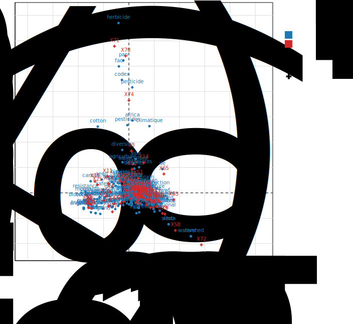

```{r setup, include=FALSE}
knitr::opts_chunk$set(echo = TRUE)
```

## Loading dataset

Loading data set from .graphml format and turn it into a table (dataframe) format

```{r}
library(igraph)
library(dplyr)
#library(stringr)
library(knitr)

g <- read_graph("enviroActivistWebsites_2006.graphml", format="graphml")

#create a data frame containing the meta keywords
df <- data.frame(Vertex=V(g)$name, Type=V(g)$vosonCA_Type,
                 metaKeywords=V(g)$vosonTxt_metaKeywords, stringsAsFactors=FALSE)

#only those websites with meta keywords
df <- df %>% filter(metaKeywords!="")
```

## Setup dataset using R.Temis

We are using R.temis package to perform a correspondence analysis. This package supports specific file format such as `.csv` and `.txt` to load data and create corpus from it.

Before creating a corpus from a text column of the table, make sure that text column is located on the left side of the table. As this package can only creates a corpus from a specific type of file, we create a data table in a .csv format using `write.csv` function. This data is then to be used to create a corpus.

```{r}
#Column one must be text column
df <- df %>% relocate(metaKeywords)
#df <- df %>% select(metaKeywords, Vertex, Type)
#colnames(df)[1] <- "text"
#save to csv to be able to create corpus using R.temis tool
write.csv(df, "enviro.csv", row.names = F)
```

Make sure that that this .csv file is stored the working directory folder as we will import a corpus from this file. After a corpus created, turn it into document term metric format (dtm) using `build_dtm` function.

```{r}
library(R.temis)
cor <- import_corpus("enviro.csv", format= "csv", language = "en")
cor
View(meta(cor))
#apply corpus as character
View(sapply(cor, as.character))

#create document term matrix
dtm <- build_dtm(cor, remove_stopwords = TRUE)
dtm


```

Now inspect dtm using `inspect` syntax to see some information about corpus or document including its basic statistical units such as the number of documents and cooccurrence (or not coocur) between the terms.

```{r}
inspect(dtm)
inspect(cor[10])
```

The output reports that the corpus contains 81 rows indicating the number of document and 953 columns indicating the terms. It also contains 1574 occurrences of the terms as this number indicates the presence of boxes with non-zero values.

Then, we want to get some information regarding the lexicon associated with the corpus. Here we use `dictionary` function to create a glossary in that it serves as a dictionary that is used to work with the corpus. It is at this stage with this line of syntax that we can remove stop words and may perform lemmatization of the corpus.

In this case, we choose not to lemmatize the text in our data to make the original terms used in the corpus remain.

```{r}
dic <- dictionary(dtm, remove_stopwords = T)
View(dic)

#export dictionary to csv file format. This is commonly used for lemmatization
#write.csv(dic, file="dic2.csv")
#dic_updated <- read.csv("dic.csv", row.names = 1)
```

We delete some words. Here, terms about the environment and other terms that are considered meaningless are removed from the dtm.

```{r}
#combine lemmatized terms
#dtm <- combine_terms(dtm, dic_updated)


##---Removing or merging terms after combine_terms(dtm) function otherwise will return error
#remove first set of stopwords
stopwords2 <- c(stopwords("english"),
                c('environment','environmental','environmentalism','environmenta','environnement')
)
dtm <- dtm[, !colnames(dtm) %in% stopwords2]

#Removing some words in dtm that were part of org name e.g. GM Watch, remove "watch", "friends" (of the earth)
dtm <- dtm[, !colnames(dtm) %in% c('_x000d_','indonesia','home','advocacy','free','group','new','headlines','watch','bio','information','friends','activism','bank','council','front','network','world','download','fund','issues','news','groups')]

```

## Data exploration

The next step is to explore our data. We use techniques that can help us 'read' our data through visualising them or using an informative table. First, we create a wordcloud to identify proportion of individual terms visually. Function such as 'concordances' returns parts of texts where a given term is used. This technique help us reading the context of a particular text in the corpus. Other functions including `cooc_terms`, `frequent_terms` and `term_freq` provide descriptive information terms or documents in our corpus.

```{r}
#wordcloud
set.seed(1)
word_cloud(dtm, color="blue", n=50, min.freq=3)

#terms_graph(dtm)
#concordance

concordances(cor, dtm, "earth")
#coocurence of a specific term
cooc_terms(dtm, "earth")

#freq terms
frequent_terms(dtm)
#frequency of a specific term
term_freq(dtm, "earth", meta(cor)$Type)
#distribution variables
library(questionr)
tab <- freq(meta(cor)$Type)
tab
```

We are interested to know the distribution of terms per documents based on a specific variable (Type). Lexical summary function shows a table that display the number of terms, proportion of distinct terms per document or the entire corpus. In this function, unit is set to \`global' to present data for the entire corpus, otherwise it display data in aggregate (average number).

```{r}
#lexical assessment
lexical_summary(dtm, cor, "Type", unit = "global")
```

Here, there are 1953 terms in the corpus and 926 different words. It shows that Global type organisation has the largest number of terms (861) but the least percentage of the unique of terms (58.8%).

# Identify specific terms by modalities of a qualitative variable

Identifying specific terms by modality or also known calculating specific words makes it possible to statistically indicate which terms are over-employed or 'under-employed for each sub corpus. Again, we use Type of organisation as a variable to identify and calculate the specifics.

```{r}
#specific terms by modality or calculation of specifics
#by default, R.temis only keeps “words” with a frequency greater than 2.
specific_terms(dtm, meta(cor)$Type)
```

The term 'genetic' represents 3.4% of all occurrences of words mentioned by Bio organisations and 95.2% of the word 'genetic' are cited by Bio organisations.

This test can also be used to iteratively check terms that are manually identified in the initial stage of data categorization, such as labelling which organisations are fit into 'Global', 'Bio', or 'Toxic'.

# Correpondence analysis

Correspondence analysis allows to structure all or specific terms in the corpus according to chosen characteristics or variables. In this case based on meta keywords that are presence in organisation websites. Variable Type is chosen to map position of words based on the different types of organisations.

Sparsity is set to 0.98 (or it can be said 98% sparsity) to make terms which are absent in more that 2% of the documents are omitted.

Interpretation components for correspondence analysis are stored in an object 'ca' which can be run with `explore` function direct us to R Shiny interface to work with including plotting and gaining information with data table with correspondence analysis using R.temis package.

```{r}
#CA on TLA

#ca <- corpus_ca(cor, dtm, variable = "Type",
#                    sparsity=0.98)
ca <- corpus_ca(cor, dtm,
                    sparsity=0.98)

#load necessary package
#library(sass)
#library(textshaping)
#open in shiny
explor(ca)

#user can select on dendogram the number of clusters
corpus_clustering(ca, n = 0)

#optimal number of clusters selected
corpus_clustering(ca, n = -1)

#doesn't work
#corpus_clustering(ca, n = -1, cluster.CA="rows")

#This is what is being run underneath
FactoMineR::HCPC(ca, -1)

#to cluster on columns
FactoMineR::HCPC(ca, -1, cluster.CA="columns")

```

Features to interpret result with correspondence analysis such as eigenvector, contributions, coordinates are displayed in Shiny. For plotting, select `Plot` tab on Shiny interface to display the graph. This is how the plot looks like using R.temis:



Note: To show only terms (column element) in the plot, uncheck `suppementary element` in the Shiny.
